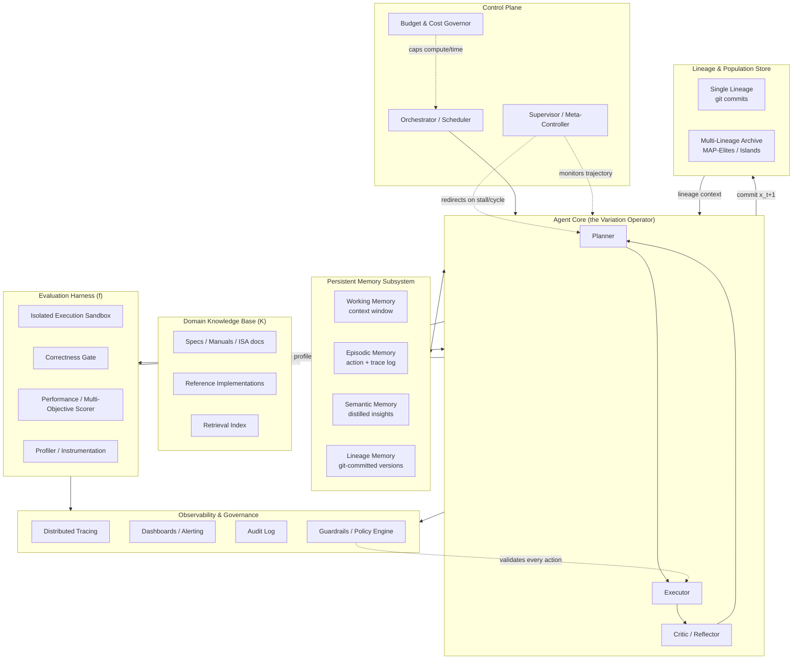
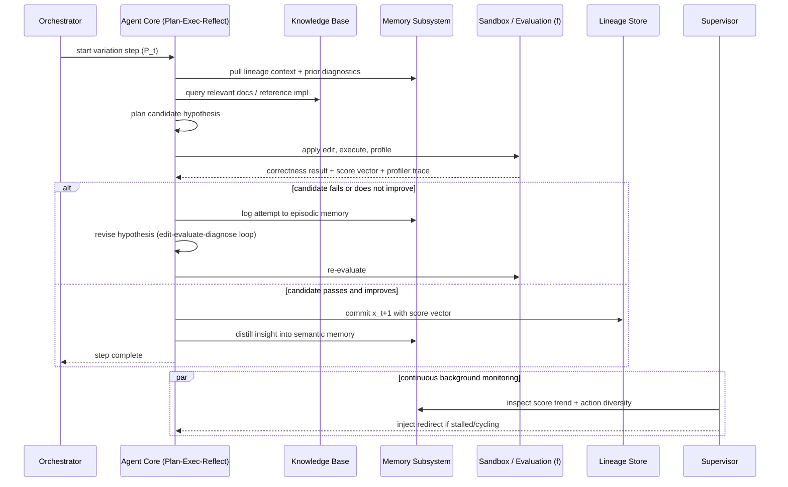
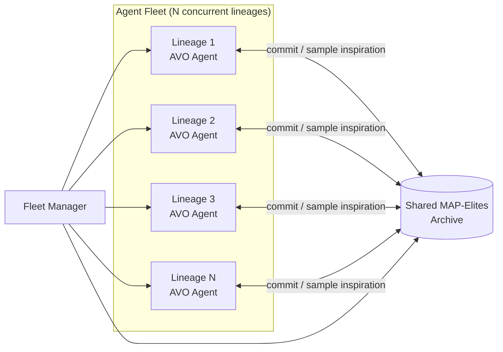
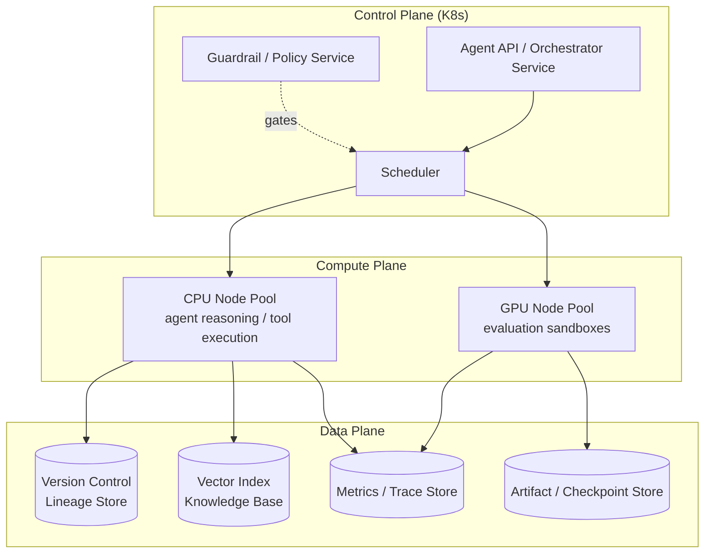

# AVO — Agentic Variation Operators
## Full Architecture Design for a High-End Autonomous Agentic System

**Version:** 1.0
**Classification:** Technical Architecture Reference
**Grounding:** This design is grounded in and extends the real AVO research published by NVIDIA — *"AVO: Agentic Variation Operators for Autonomous Evolutionary Search"* (arXiv:2603.24517, Chen, Ye, Xu et al., NVIDIA, March 2026) and the follow-up system report *"NVIDIA AVO Reaches 100% on ARC-AGI-3"* (NVIDIA Developer Blog, August 2026). Sections 1–7 formalize what NVIDIA actually built and measured. Sections 8–17 generalize that architecture into a production-grade, multi-domain, enterprise-scale system design.

---

## 0. What AVO Actually Is (Grounding Summary)

Classical evolutionary code-search systems (FunSearch, AlphaEvolve, EvoPrompting, ReEvo) confine a language model to a single narrow role: **candidate generation**. A rigid, hand-coded pipeline still owns parent sampling, evaluation, population management, and iteration order. The LLM is called once per candidate and returns exactly one output with no ability to inspect documentation, run tests, read profiler output, or revise its own approach before the candidate is scored.

**Agentic Variation Operators (AVO)** replace that entire pipeline with a single autonomous agent run. Instead of:

```
Vary(P_t) = Generate(Sample(P_t))        # classical EVO
```

AVO defines:

```
Vary(P_t) = Agent(P_t, K, f)             # agentic variation operator
```

where:
- `P_t` — the accumulated lineage of committed solutions and their scores
- `K` — a domain knowledge base (specs, docs, reference implementations)
- `f` — a multi-dimensional scoring/evaluation function

The agent — not the framework — now decides *what to inspect, what to change, when to test, and when to commit*. Sampling, generation, and evaluation are fused into one continuous, self-directed loop with persistent memory, rather than three framework-controlled stages.

**Empirical validation (NVIDIA, real results):**
- Applied to multi-head attention (MHA) kernel optimization on NVIDIA Blackwell B200 GPUs, a single AVO lineage ran autonomously for **7 days**, explored **500+ optimization directions**, and committed **40 kernel versions**, ultimately producing kernels that beat cuDNN by up to **3.5%** and FlashAttention-4 by up to **10.5%**.
- The evolved kernel transferred to grouped-query attention (GQA) with only **~30 minutes** of additional autonomous adaptation, yielding up to **7.0%** over cuDNN and **9.3%** over FlashAttention-4.
- The *same* agent architecture, with only its tool/interface layer swapped, was later pointed at **ARC-AGI-3** (an unfamiliar-environment interactive reasoning benchmark) and reached a **100.00 RHAE score** across all 25 public-set environments (183 levels), using ~12% fewer environment actions than a comparable direct-interaction harness (VISTA) on the same model.
- NVIDIA's own conclusion: long-horizon agent capability is a property of the **full system** — memory, tools, feedback, and recovery — not of the underlying model alone.

That last point is the design thesis this document builds from.

---

## 1. Executive Summary

This document specifies a full-stack architecture for deploying Agentic Variation Operators as the core mechanism of a high-end, production-grade agentic system. The system is designed to:

1. Elevate an LLM-based agent from a single-shot generator to a **self-directed variation operator** that owns sampling, generation, and evaluation.
2. Sustain **multi-day, unattended, long-horizon autonomous operation** through persistent memory and a supervisory meta-controller.
3. Generalize across **arbitrary domains** (kernel/code optimization, interactive reasoning environments, scientific discovery, infrastructure tuning) via a pluggable task-adapter interface.
4. Scale from a **single lineage** (one agent, one improving artifact) to a **fleet of concurrent lineages** operating island-model or MAP-Elites-style evolutionary search across a shared archive.
5. Provide the reliability, sandboxing, observability, and governance required to run this safely and economically at enterprise scale.

---

## 2. Core Formalism

### 2.1 Classical Evolutionary Search

```
P_{t+1} = Update( P_t, (x_{t+1}, f(x_{t+1})) )
x_{t+1} = Vary(P_t)
Vary(P_t) = Generate( Sample(P_t) )
```

`Sample` is a fixed heuristic (fitness/diversity-based, e.g. MAP-Elites island archives, Boltzmann selection). `Generate` is a single LLM call conditioned on sampled parents. The LLM never sees evaluation internals, never chooses what to test, and never revises mid-candidate.

### 2.2 Agentic Variation Operator

```
Vary(P_t) = Agent(P_t, K, f)
```

The agent receives the **entire lineage**, the **knowledge base**, and **direct access to the scoring function itself** (not just its output). A single call to `Agent(...)` may internally perform dozens to hundreds of actions: reading prior versions, diffing profiler traces, consulting documentation, editing code, compiling, executing, diagnosing failures, and revising — before it ever commits `x_{t+1}`.

### 2.3 Scoring Vector

```
f(x_i) = (f_1(x_i), f_2(x_i), ..., f_n(x_i))
```

Each `f_j` scores a candidate against one test configuration/objective. A candidate that fails a correctness/safety gate receives `f_j(x_i) = 0` regardless of any secondary metric (throughput, cost, elegance) — **correctness is a hard gate, not a soft objective**, in every domain this architecture targets.

### 2.4 Design Invariant

> **AVO is orthogonal to population structure.** The operator can be embedded in a single-lineage continuous-evolution loop (as validated by NVIDIA), an island-based archive, or a MAP-Elites map. Section 8 generalizes to the multi-lineage case.

---

## 3. System Architecture — Layered View



---

## 4. Component Deep Dive

### 4.1 Agent Core — the Variation Operator itself

The heart of the system. Structured as a **Plan → Execute → Reflect** loop (not a single forward pass):

- **Planner** — decomposes the current objective into a candidate strategy: which prior versions in `P_t` to inspect, which sections of `K` are relevant, what hypothesis to test next. Early in a run this favors *structural* exploration (informed by reference material); late in a run it shifts to *fine-grained* tuning informed by accumulated profiling patterns — this shift should be emergent, not scripted.
- **Executor** — carries out concrete actions through the Tool Layer (Section 4.2): read files, edit code/config, run the evaluation harness, query documentation, inspect prior lineage diffs.
- **Critic/Reflector** — interprets the result of each action (test pass/fail, profiler delta, compiler error) and decides whether to iterate further on the current attempt, abandon it, or commit.

A single "variation step" (production of one committed `x_{t+1}`) may involve **dozens to hundreds of internal tool calls**. This is a deliberate design choice: the unit of work the framework schedules is a *committed candidate*, not a *model call*.

### 4.2 Tool Layer

Domain-agnostic core tools, exposed uniformly regardless of what domain the agent operates in:

| Tool class | Examples |
|---|---|
| Code/artifact manipulation | read/write/diff files, apply patches, refactor |
| Execution | run shell/build commands, launch sandboxed processes |
| Domain instrumentation | compiler invocation, profiler capture, hardware counters |
| Knowledge access | documentation search, RAG retrieval over `K`, prior-lineage diff/compare |
| Environment interaction (non-code domains) | send action to environment, receive observation (e.g. interactive-reasoning tasks) |
| Version control | commit, tag, branch, rollback |

Tools are registered through a single adapter interface (Section 7) so the **same agent core** can be re-pointed at a completely different domain by swapping only the tool bindings — this is exactly the mechanism that let the identical NVIDIA agent move from CUDA kernel engineering to an unfamiliar interactive-reasoning benchmark with no change to the agent's reasoning machinery.

### 4.3 Persistent Memory Subsystem

Four memory tiers, because a single context window cannot hold a multi-day, 500-direction search:

1. **Working memory** — the active context window: current hypothesis, most recent tool outputs, immediate plan.
2. **Episodic memory** — full append-only log of every action, compiler/profiler output, and reasoning trace across the entire run. This is what lets the agent "remember" why direction #217 failed on day 3 when it reconsiders something similar on day 6.
3. **Semantic memory** — periodically distilled, compressed insights extracted from episodic memory (e.g., "branchless rescaling beats conditional skip when warp divergence dominates") — prevents unbounded context growth while preserving the *lesson*, not the raw transcript.
4. **Lineage memory** — the durable, versioned record of every **committed** candidate and its score vector, persisted as immutable commits (git or equivalent). This is the ground truth the agent conditions on for future variation steps and the audit trail for governance.

**Persistence discipline:** only candidates that (a) pass every correctness gate and (b) match or beat the current best score are persisted to lineage memory. Failed or non-improving attempts remain visible in episodic memory (so the agent doesn't repeat them) but never pollute the committed lineage.

### 4.4 Domain Knowledge Base (`K`)

A retrieval-augmented store of everything a domain expert would consult: technical specifications, ISA/API documentation, prior state-of-the-art reference implementations, design guides, and postmortems. The agent has **full agency** over when and what to query — `K` is not injected wholesale into the prompt; it is pulled on demand, mirroring how the NVIDIA MHA-kernel agent pulled CUDA/PTX/Blackwell docs and FlashAttention-4 source only when its own reasoning called for it.

### 4.5 Evaluation Harness (`f`)

The most safety-critical component, because it is the sole arbiter of what enters the lineage.

- **Isolated sandbox** — every candidate is built/run in an ephemeral, resource-capped, network-restricted environment with no access to production systems or the orchestrator's credentials.
- **Correctness gate** — deterministic reference-based verification (unit tests, numerical-equivalence checks, invariant checks). Any failure ⇒ score vector is zeroed regardless of secondary metrics. This gate is non-negotiable and cannot be talked around by the agent.
- **Multi-objective scorer** — produces the vector `f(x_i) = (f_1, ..., f_n)` across all target configurations (e.g., multiple sequence lengths, multiple environment levels, multiple workload shapes).
- **Profiler/instrumentation** — captures fine-grained execution evidence (hardware counters, timing breakdowns, action traces) and feeds it back to the agent as *diagnostic* signal, not just a scalar reward — this is what enables hypothesis-driven micro-optimization rather than blind search.

### 4.6 Lineage & Population Manager

- **Single-lineage mode** (validated configuration): one continuously improving chain `x_0 → x_1 → ... → x_t`, each step a git commit tagged with its full score vector. Simple, auditable, and sufficient to isolate the effect of the operator itself.
- **Multi-lineage / archive mode** (enterprise extension, Section 8): a MAP-Elites-style or island-based archive where many AVO agents run concurrent lineages against a shared or partitioned population, periodically cross-pollinating high-performing candidates as "inspiration" material fed into `K` for other lineages.

### 4.7 Supervisor / Meta-Controller

A second, lighter-weight process that **never edits artifacts directly** — it only observes the trajectory and can redirect the main agent. It exists to counter two long-horizon failure modes:

- **Stall** — the agent exhausts its current line of exploration and stops making progress.
- **Unproductive cycling** — the agent repeatedly attempts variations of the same failed idea.

On detecting either condition (via trend analysis over the score trajectory and action-diversity metrics in episodic memory), the supervisor reviews the full trajectory and injects a small set of fresh candidate directions, then returns control to the main agent. This conditional, trajectory-level intervention is what allowed NVIDIA's real run to sustain forward progress across 7 uninterrupted days without human involvement.

### 4.8 Sandbox & Execution Isolation

- Per-attempt ephemeral containers/VMs with strict CPU/GPU/memory/time quotas.
- No implicit network egress; explicit allow-list only for documentation/package retrieval if required.
- Filesystem writes scoped to a disposable workspace; only the evaluation harness and version-control commit path can promote an artifact into lineage memory.
- Automatic snapshot before every mutating action to guarantee rollback.

### 4.9 Orchestration & Control Plane

- **Orchestrator** — schedules variation steps, allocates sandbox/compute resources, manages the run's overall lifecycle (start, checkpoint, pause, resume, terminate).
- **Budget & cost governor** — hard ceilings on wall-clock time, token spend, and compute-hours per lineage; soft alerts as thresholds approach; supports pre-emptive shutdown with clean checkpointing.
- **Fleet manager** (enterprise scale) — coordinates many concurrent lineages/agents across a shared cluster, load-balances sandbox capacity, and manages the shared archive.

### 4.10 Observability & Governance

- **Distributed tracing** across planner/executor/critic actions, tool calls, and evaluation runs — every commit must be reconstructible end-to-end.
- **Dashboards** — live view of score trajectory, exploration breadth (unique directions attempted), commit cadence, and supervisor interventions (mirrors the kind of evolution-trajectory chart NVIDIA published showing discrete performance jumps at specific committed versions).
- **Audit log** — immutable record of every commit, every evaluation result, every supervisor intervention, and every policy-engine decision — required for compliance in regulated deployments.
- **Guardrail / policy engine** — a preventative layer, separate from the correctness gate, that vets *actions* (not just outputs) against safety policy before execution: no destructive filesystem operations outside the sandbox, no credential access, no disabling of the evaluation harness itself, no self-modification of the guardrail layer.

---

## 5. Anatomy of a Single Variation Step (Algorithm)

```text
FUNCTION AgenticVariationStep(P_t, K, f, supervisor_state):
    context ← AssembleContext(P_t, K, supervisor_state)   # lineage + relevant KB slices
    attempt_log ← []

    LOOP until commit_decision or step_budget_exhausted:
        plan ← Planner(context, attempt_log)
        FOR action IN plan.actions:
            IF NOT Guardrail.permits(action): SKIP action; LOG violation
            result ← Executor.run(action)                  # edit / build / run / query
            attempt_log.append(result)

        IF plan.requests_evaluation:
            score, correctness, profile ← f.evaluate(candidate, sandbox=True)
            attempt_log.append({score, correctness, profile})

            diagnosis ← Critic.reflect(attempt_log, score, correctness, profile)

            IF correctness == PASS AND score ≥ BestScore(P_t):
                commit_decision ← COMMIT(candidate, score)
            ELSE:
                context ← Critic.revise_strategy(context, diagnosis)
                CONTINUE   # edit-evaluate-diagnose cycle repeats

    IF commit_decision:
        x_{t+1} ← candidate
        P_{t+1} ← Update(P_t, (x_{t+1}, f(x_{t+1})))
        LineageMemory.commit(x_{t+1}, score, attempt_log_summary)
        SemanticMemory.distill(attempt_log)
        RETURN P_{t+1}
    ELSE:
        RETURN P_t   # step yielded no improving, correct candidate; supervisor may intervene next
```

```text
FUNCTION Supervisor.monitor(run_state):
    trend ← ScoreTrajectory(run_state, window=N)
    diversity ← ActionDiversity(run_state.episodic_memory, window=N)

    IF trend.is_flat() OR diversity.is_repetitive():
        candidate_directions ← Supervisor.review_full_trajectory(run_state)
        InjectDirections(run_state.agent_context, candidate_directions)
        LOG intervention
    ELSE:
        NO-OP   # main agent retains full autonomy
```

---

## 6. End-to-End Sequence (One Variation Step)



---

## 7. Multi-Domain Generalization Layer

The single most important architectural property demonstrated empirically is that **the agent core does not change across domains — only the tool/interface adapter does.** The same reasoning machinery that optimized CUDA attention kernels was, unmodified at the reasoning layer, pointed at an unfamiliar interactive-reasoning benchmark and re-derived rules, objectives, and efficient action sequences purely from environment feedback.

### 7.1 Task Adapter Interface

```text
interface TaskAdapter:
    observe() -> Observation                  # e.g. profiler output, or a rendered/text env state
    act(action: Action) -> Observation         # e.g. apply code edit + rebuild, or send env action
    evaluate(candidate) -> ScoreVector          # correctness + N-dimensional objective
    knowledge_base() -> KKB                     # domain-specific docs/spec/reference corpus
    commit_semantics() -> CommitPolicy          # what counts as a "committed" unit of progress
```

### 7.2 Reference Adapters

| Adapter | Observation channel | Action space | Evaluation |
|---|---|---|---|
| **Kernel/Code Optimization** | source diff, compiler output, profiler trace | edit code, recompile, run benchmark | correctness vs. reference + throughput (TFLOPS) |
| **Interactive Reasoning Environments** | raw grid/state observation (text or visual) | discrete environment actions | task completion + action-efficiency metric (e.g., RHAE-style) |
| **Infrastructure/Systems Tuning** | config diff, telemetry, load-test results | change config/topology, redeploy | SLO compliance + cost/latency objective |
| **Scientific/Algorithmic Discovery** | intermediate proof/program state, solver output | edit program/proof step | correctness proof + solution quality metric |

### 7.3 What Transfers vs. What Doesn't

- **Transfers unmodified:** planner/executor/critic loop structure, memory tiering, supervisor stall/cycle detection, guardrail policy engine, lineage commit semantics.
- **Domain-specific, swapped per deployment:** the tool bindings, the knowledge base contents, the evaluation harness internals, and the definition of the score vector.

This is the core lesson to design for: **generality comes from the machinery that lets reasoning and feedback compound over time, not from domain-specific scaffolding.**

---

## 8. Scaling to Enterprise-Grade Deployment

### 8.1 From Single Lineage to Concurrent Fleet



- Each lineage is an independent AVO agent with its own working/episodic memory, operating against a **shared archive** rather than a single private lineage.
- The archive periodically surfaces high-scoring candidates from *other* lineages into a given agent's knowledge base as inspiration material — turning `Sample` back into an explicit, tunable diversity mechanism at the population level, while `Vary` for each individual lineage remains fully agentic.
- Fleet manager balances sandbox/GPU capacity, prevents redundant exploration (via cross-lineage semantic-memory sharing), and can retire under-performing lineages early.

### 8.2 Model-Agnostic Backend

The agent core should be implemented against an abstract "reasoning backend" interface so it can run against different frontier models (e.g., Claude Opus-class models for reasoning-dense, action-efficient trajectories; other frontier models optimized for wall-clock throughput), matching the empirical finding that different model backends show complementary strengths — one favoring fewer actions, another favoring faster wall-clock completion — on identical tasks under the identical AVO harness.

### 8.3 Infrastructure Reference Diagram



### 8.4 Cost & Budget Governance

- Per-lineage compute/token budget with graceful checkpoint-and-suspend on exhaustion (never a hard kill mid-commit).
- Diminishing-returns detector: if geomean score improvement per unit compute drops below a threshold over a rolling window, automatically flag the lineage for review rather than burning budget indefinitely — this mirrors the empirically observed pattern where early versions deliver the largest gains and later versions yield smaller, compounding refinements.
- Chargeback/telemetry tagging per lineage, per adapter, per business unit for enterprise cost accounting.

---

## 9. Reliability & Long-Horizon Mechanisms

| Risk | Mechanism |
|---|---|
| Context window overflow on multi-day runs | Tiered memory (Section 4.3): compress episodic → semantic; keep working memory small and current |
| Silent regression | Commit gate requires match-or-beat of best committed score, not just "improvement over parent" |
| Infinite unproductive loop | Supervisor stall/cycle detection with bounded intervention budget |
| Infrastructure failure mid-run | Every commit is an atomic, durable checkpoint; run resumes from last commit, not from scratch |
| Evaluation harness drift (HW/driver/thermal variance) | Periodic re-baselining against fixed reference measurements; store environment fingerprint with every score |
| Catastrophic agent action | Sandbox isolation + guardrail policy engine (Section 4.10), independent of the agent's own judgment |

---

## 10. Security & Governance Architecture

1. **Least-privilege sandboxing** — no evaluation sandbox has credentials to production systems, the orchestrator, or other lineages' workspaces.
2. **Separation of duties** — the agent that proposes changes cannot itself modify the correctness gate, the guardrail policy, or the audit log.
3. **Immutable audit trail** — every action, tool call, evaluation, and commit is logged to an append-only store, independent of the agent's own memory, for post-hoc review and compliance.
4. **Human-in-the-loop escalation points** — configurable checkpoints (e.g., before promoting an artifact from lineage store to production) where autonomous operation pauses for review, even though day-to-day variation steps run unattended.
5. **Egress and tool allow-listing** — the tool layer only exposes actions explicitly approved for a given deployment; new tool capabilities require a policy-engine review before being made available to the agent.

---

## 11. Interface Specifications (Illustrative Schemas)

```json
// Variation step request
{
  "lineage_id": "string",
  "current_best": { "candidate_ref": "string", "score_vector": [/* f_1..f_n */] },
  "knowledge_base_ref": "string",
  "budget": { "max_wall_clock_s": 0, "max_tool_calls": 0, "max_tokens": 0 },
  "adapter": "kernel-opt | reasoning-env | infra-tuning | custom"
}

// Variation step result
{
  "committed": true,
  "candidate_ref": "string",
  "score_vector": [/* f_1..f_n */],
  "correctness": "PASS | FAIL",
  "attempts_explored": 0,
  "supervisor_interventions": 0,
  "trace_ref": "string"
}

// Supervisor intervention event
{
  "lineage_id": "string",
  "trigger": "stall | unproductive_cycle",
  "window_analyzed": 0,
  "injected_directions": ["string", "..."],
  "timestamp": "ISO-8601"
}
```

---

## 12. Metrics & Evaluation Methodology

- **Correctness pass rate** — fraction of attempted candidates passing the hard gate.
- **Geomean score trajectory** — running-best aggregate score across all evaluated configurations, tracked per commit (the canonical "evolution trajectory" view).
- **Exploration breadth** — count of distinct optimization/action directions attempted internally, not just committed versions (NVIDIA's run showed >500 internal directions behind 40 commits — a >12:1 exploration-to-commit ratio worth tracking).
- **Action/efficiency metric** — for interactive-environment adapters, an RHAE-style measure combining completion with per-step efficiency relative to a baseline.
- **Time-to-first-improvement and marginal-gain decay** — used to detect the diminishing-returns regime and trigger budget review.
- **Supervisor intervention rate** — frequency and effectiveness of stall/cycle redirection, an indicator of harness health independent of the underlying model.
- **Transfer efficiency** — wall-clock/compute required to adapt a matured lineage to a related task variant (the reference system adapted MHA-derived optimizations to GQA in ~30 minutes — a strong signal of genuine, generalizable reasoning rather than overfit search).

---

## 13. Reference Case Studies (Empirical, from NVIDIA's Published Work)

**Case 1 — GPU Kernel Micro-Architecture Optimization.** A single-lineage AVO agent ran continuously for 7 days on B200 GPUs, discovering three representative classes of optimization purely through autonomous reasoning: branchless accumulator rescaling with lighter memory fencing (largest single gain, +8.1% geomean on non-causal attention), correction/MMA pipeline overlap to eliminate warp idle time, and register-budget rebalancing across warp groups guided by profiler-observed spilling. Each required jointly reasoning about synchronization, pipeline scheduling, and register allocation simultaneously — not single-parameter tuning.

**Case 2 — Cross-Task Transfer.** The MHA-optimized lineage was re-tasked to grouped-query attention with no human guidance on what needed to change; the agent completed a correct, faster-than-baseline adaptation in about 30 minutes, demonstrating that the discovered optimizations reflected generalizable hardware reasoning rather than memorized, task-specific tricks.

**Case 3 — Cross-Domain Transfer.** The identical agent architecture, with only its tool/observation adapter changed, was deployed against ARC-AGI-3 — an interactive benchmark with no stated rules or goals — and completed the full 25-environment public set (183 levels) at a perfect efficiency-adjusted score, using fewer environment actions than a comparable specialized harness on the same underlying model. This is the strongest evidence that the *architecture*, not domain-specific scaffolding, is what generalizes.

---

## 14. Roadmap / Future Extensions

1. **Learned supervisor** — replace heuristic stall/cycle detection with a learned meta-controller trained on trajectory histories across many lineages.
2. **Cross-lineage knowledge distillation** — automatically promote high-value semantic-memory insights from one lineage's archive entry into another lineage's knowledge base, closing the loop between individual agentic search and population-level evolutionary search.
3. **Self-extending tool layer** — allow the agent (under guardrail review) to propose and register new tools/instrumentation when it identifies a recurring need, subject to human or policy-engine approval before activation.
4. **Multi-agent collaborative variation** — multiple agents proposing and critiquing each other's candidates within a single variation step (a "debate"-style critic ensemble) before committing, for domains where evaluation is expensive or partially subjective.
5. **Formal verification integration** — for high-assurance domains, pair the correctness gate with machine-checked proof obligations rather than test-based checks alone.
6. **Portfolio-level budget optimization** — dynamically reallocate compute across a fleet of lineages based on real-time marginal-gain-per-dollar estimates.

---

## 15. Summary Design Principles

1. **Elevate the agent from generator to operator.** Sampling, generation, and evaluation belong inside the agent's loop, not around it.
2. **Persistent memory is the substrate of long-horizon capability.** Multi-day autonomy is a memory-architecture problem as much as a reasoning problem.
3. **Supervision, not micromanagement.** A lightweight meta-controller that intervenes only on stall/cycling preserves agent autonomy while preventing wasted compute.
4. **Correctness is a gate, never a weighted objective.** No performance gain is allowed to trade off against a failed correctness check.
5. **Generality lives in the harness, not the prompt.** The same planner/executor/critic/supervisor stack should transfer across domains by swapping only the adapter layer.
6. **Treat the full system as the unit of capability.** Model choice matters, but memory, tools, feedback, and recovery are what convert model capability into sustained autonomous progress.

---

## 16. References

1. Chen, T., Ye, Z., Xu, B., et al. (NVIDIA). *AVO: Agentic Variation Operators for Autonomous Evolutionary Search.* arXiv:2603.24517 (March 2026). https://arxiv.org/abs/2603.24517
2. NVIDIA Developer Blog. *NVIDIA AVO Reaches 100% on ARC-AGI-3, Demonstrating a Frontier-Level General-Purpose Architecture for Long-Horizon Autonomous Agents.* (August 2026). https://developer.nvidia.com/blog/nvidia-avo-reaches-100-on-arc-agi-3-demonstrating-a-frontier-level-general-purpose-architecture-for-long-horizon-autonomous-agents/
3. Novikov, A. et al. (Google DeepMind). *AlphaEvolve: A Coding Agent for Scientific and Algorithmic Discovery.* arXiv:2506.13131.
4. Romera-Paredes, B. et al. *Mathematical Discoveries from Program Search with Large Language Models (FunSearch).* Nature 625, 468–475 (2024).
5. Dao, T. et al. *FlashAttention* / *FlashAttention-2* / *FlashAttention-3* / *FlashAttention-4* (algorithm and kernel co-design lineage referenced as baseline in AVO's evaluation).
6. ARC Prize. *ARC-AGI-3 Benchmark and RHAE Scoring Methodology.* https://arcprize.org/arc-agi/3

---

*This document is an independent architecture synthesis intended for engineering design purposes. Sections 0, 2, 7 (empirical claims), and 13 summarize published NVIDIA research; all other sections are original generalized system-design extensions and do not represent NVIDIA product specifications.*
