# AVO High-End Agentic System Architecture

> **Design status:** Reference architecture synthesized from public NVIDIA AVO research and adjacent frontier-agent systems, with additional engineering proposals for a production-grade, general-purpose autonomous agent.
>
> **Important scope note:** This document is **not NVIDIA's private implementation**. It reconstructs the publicly described AVO concepts and extends them into a more general architecture suitable for a high-end self-hosted or cloud agentic harness.

---

## 1. Executive Summary

**Agentic Variation Operators (AVO)** changes the role of an LLM inside evolutionary search. Earlier LLM-assisted evolutionary systems typically use a fixed pipeline in which a framework samples parent solutions, asks a model to generate a candidate, evaluates it, and updates the population. NVIDIA's AVO instead defines the entire variation step as an autonomous agent:

```text
Vary(P_t) = Agent(P_t, K, f)
```

where `P_t` is the accumulated solution lineage, `K` is domain knowledge, and `f` is the evaluator. The agent decides what previous solutions to inspect, what knowledge to consult, what modifications to make, which tests to run, how to diagnose failures, and when to commit an improvement. The published NVIDIA experiment used a general-purpose coding agent with tools, persistent memory, and a supervisor, operating over a long horizon on GPU attention kernels. NVIDIA reports seven days of autonomous evolution, 500+ explored optimization directions, and 40 committed versions, with up to 3.5% improvement over cuDNN and 10.5% over FlashAttention-4 in the evaluated MHA configurations. The same architecture was later used on the ARC-AGI-3 public set, where NVIDIA reported 100.00 RHAE across all 25 public environments and 183 levels. [1][2]

This document proposes an **AVO-X architecture**: a generalized agentic evolution and execution harness in which the AVO idea becomes the core execution primitive of a much broader autonomous system. AVO-X treats an agent not as a one-shot responder, but as a persistent optimization process with:

- goal interpretation and objective contracts;
- dynamic planning and replanning;
- adaptive parent/trajectory selection;
- multi-agent exploration;
- tool and skill discovery;
- structured memory;
- sandboxed execution;
- evidence collection and provenance;
- multi-dimensional evaluation;
- candidate lineage and rollback;
- stagnation and novelty detection;
- evaluator/critic/verification loops;
- automatic skill extraction and improvement;
- safe self-modification of prompts, policies, workflows, tools, and configuration;
- capability benchmarking and regression gates;
- cost/latency/resource optimization;
- continuous asynchronous operation;
- human checkpoints only when risk, ambiguity, or authority boundaries require them.

The central design principle is:

> **Do not hard-code the agent's path when the system can instead expose a safe search space, strong evaluators, persistent state, and bounded authority, then allow the agent to discover the best path.**

At the same time, unrestricted autonomy is not the goal. The architecture separates **reasoning authority**, **execution authority**, **mutation authority**, and **publication authority**. The agent can explore widely inside a sandbox, but irreversible or high-impact operations pass through policy gates.

---

## 2. What AVO Is — and What It Is Not

### 2.1 AVO in the published NVIDIA formulation

The AVO paper describes classical evolutionary search as maintaining a population of candidate/score pairs and repeatedly applying a variation operator:

```text
P_{t+1} = Update(P_t, (x_{t+1}, f(x_{t+1})))
x_{t+1} = Vary(P_t)
```

Earlier LLM-based systems commonly decompose variation into:

```text
Vary(P_t) = Generate(Sample(P_t))
```

AVO replaces that decomposition with:

```text
Vary(P_t) = Agent(P_t, K, f)
```

This is the conceptual breakthrough. The agent is no longer only a candidate generator. It owns the micro-loop of inspection, hypothesis generation, implementation, evaluation, diagnosis, and revision. NVIDIA explicitly states that the operator is compatible in principle with single-lineage, island-based, or archive-based population structures, while its published experiment isolates the operator in a single-lineage setting. [1]

### 2.2 What AVO does not imply

AVO should not be conflated with:

- unrestricted recursive self-improvement;
- model-weight self-training;
- AGI by itself;
- a generic "reflection prompt";
- a conventional workflow graph;
- a multi-agent swarm by itself;
- a replacement for an evaluator;
- proof that every task has a useful scalar fitness function.

The strongest general lesson is architectural: **long-horizon competence emerges from the interaction of a capable model with state, tools, environment feedback, memory, evaluation, and recovery.** NVIDIA's later ARC-AGI-3 report makes that point directly, emphasizing that the surrounding system—not only the underlying model—determines how well model capability is converted into sustained autonomous progress. [2]

---

## 3. Research-Derived Design Principles

The architecture below combines the following ideas from public work:

### 3.1 NVIDIA AVO

NVIDIA's AVO establishes the core pattern: persistent lineage + domain knowledge + execution feedback + an autonomous variation loop + supervisor-based stagnation intervention. The agent can inspect multiple prior implementations, consult documentation, modify code, execute scoring, diagnose failures, and repeat until a satisfactory candidate is found. Only candidates satisfying correctness and benchmark criteria are committed to the lineage. [1]

### 3.2 AlphaEvolve

Google DeepMind's AlphaEvolve combines LLM-generated programs with automated evaluators and an evolutionary program database. It uses multiple models to balance breadth and depth and applies the evolutionary database to determine which programs contribute to later prompts. This reinforces the value of **population-level search, evaluator grounding, and model specialization**. [3][4]

### 3.3 Long-horizon coding agents and harness engineering

OpenAI's public agent work emphasizes that useful agents need more than a strong model: they need tools, controlled execution, memory, context management, sandboxing, subagents, and infrastructure capable of operating for long sessions. OpenAI's harness-engineering report also demonstrates an important design principle: knowledge should be structured as a navigable system of source-of-truth documents rather than a gigantic prompt. [5][6]

### 3.4 Hermes-style persistent skills and memory

Hermes Agent publicly exposes a broad tool registry, persistent memory, session search, skills, multiple execution backends, plugins, scheduled tasks, and multi-platform entry points. Its skill documentation distinguishes **procedural memory** (how to do something) from **factual/personal memory** (what is known), while its architecture emphasizes profile isolation, context compression, provider resolution, tool registries, and persistent session state. These are useful patterns for a self-improving AVO harness. [7][8][9]

### 3.5 DeerFlow-style harness decomposition

DeerFlow presents a runtime harness with a lead agent, middleware, sandbox, subagent registry/executor, MCP integration, extensions, skills, memory, model factory, and thread state. This reinforces the value of keeping the agent core small while making capabilities modular and dynamically loadable. [10][11]

### 3.6 Reflexion and lifelong skill learning

Reflexion demonstrates that textual feedback can be stored as episodic memory and reused to improve future decisions without changing model weights. Voyager similarly combines an automatic curriculum, an executable skill library, environmental feedback, error-driven iteration, and self-verification. These works motivate **experience memory and reusable skills as first-class learning substrates**. [12][13]

---

## 4. Design Goals

AVO-X should be optimized for:

1. **General-purpose execution** — software engineering, research, data analysis, automation, planning, content generation, system administration, scientific exploration, business workflows, and tool-mediated digital work.
2. **Long-horizon reliability** — hours to days of work with checkpoints, resumability, and context continuity.
3. **Adaptive autonomy** — the system dynamically chooses planning depth, tools, agents, verification level, and model tier.
4. **Evidence-first correctness** — important claims and actions are tied to observations, tests, artifacts, or trusted sources.
5. **Search over solution trajectories** — preserve alternatives, not only the current best path.
6. **Continuous improvement** — improve procedures, prompts, tools, memory, evaluator strategies, and policies without silently weakening safety boundaries.
7. **Fault tolerance** — recover from tool errors, bad assumptions, context loss, partial execution, model failure, and environmental changes.
8. **Cost awareness** — use the cheapest configuration that meets a task's quality/risk target.
9. **Security by construction** — least privilege, sandboxing, explicit authority boundaries, provenance, and auditability.
10. **Model agnosticism** — support frontier APIs, local models, specialist models, and heterogeneous model routing.
11. **Observability** — every meaningful state transition, tool action, evaluation result, and mutation is traceable.
12. **Extensibility** — new tools, skills, models, evaluators, environments, and policies should be installable without rewriting the core.

---

## 5. Non-Goals

AVO-X should **not** attempt to:

- autonomously rewrite security policies without a gate;
- self-authorize access to secrets or privileged infrastructure;
- hide failed experiments;
- replace ground-truth evaluators with the model's own assertions;
- optimize a benchmark by changing the benchmark or its measurement harness;
- treat every learned memory as fact;
- modify foundation-model weights as an implicit side effect of normal operation;
- continue working after the objective is provably satisfied unless explicitly placed in maintenance or improvement mode.

---

# 6. System-Level Architecture

## 6.1 Top-level diagram

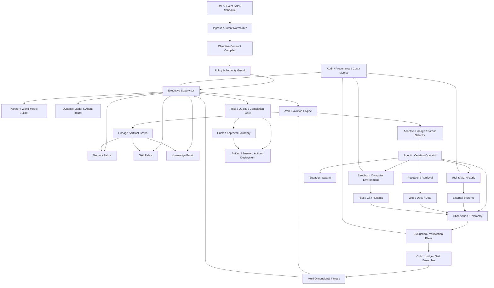

## 6.2 The key architectural shift

The system should be understood as a **nested control system**:

```text
Level 0 — Model inference
    LLM/VLM produces decisions.

Level 1 — Agent loop
    Decide → act → observe → update → continue.

Level 2 — AVO variation
    Explore multiple possible strategies/implementations.

Level 3 — Supervisor
    Detect stagnation, risk, context failure, or low expected progress.

Level 4 — Meta-optimization
    Improve the tools, skills, prompts, routing, evaluator strategy,
    memory retrieval, and search policy.

Level 5 — System governance
    Enforce safety, authority, resource, and publication boundaries.
```

The important constraint is that higher levels can **propose** improvements to lower levels, but they should not gain unlimited authority merely because they are optimizing performance.

---

# 7. Core AVO-X Data Model

## 7.1 Objective Contract

Every run begins by compiling the user's natural-language intent into a machine-checkable objective contract:

```yaml
objective:
  id: obj_01
  goal: "Produce a production-ready architecture document"
  success_criteria:
    - completeness >= 0.95
    - factual_claims_verified = true
    - requested_artifact_exists = true
    - no unresolved_high_risk_errors = true
  constraints:
    time_budget: 4h
    token_budget: auto
    monetary_budget: auto
    allowed_domains: [web, local_files]
  authority:
    read: [workspace, public_web]
    write: [workspace]
    execute: [sandbox]
    publish: none
  evidence_policy:
    citation_required_for_external_claims: true
  termination:
    completion: all_success_criteria
    hard_stop:
      - authority_violation
      - security_policy_violation
      - unrecoverable_environment_error
```

The objective contract is not a prompt. It is the **control-plane representation of intent**.

## 7.2 Candidate

```text
Candidate
├── candidate_id
├── parent_ids[]
├── branch_id
├── artifact_refs[]
├── strategy_signature
├── assumptions[]
├── actions[]
├── evidence_refs[]
├── evaluator_results[]
├── fitness_vector
├── confidence
├── risk_level
├── resource_cost
├── novelty_score
├── reproducibility_score
├── provenance
├── status
└── timestamps
```

## 7.3 Fitness vector

Avoid reducing all objectives to one scalar too early.

```text
F(x) = {
  correctness,
  task_completion,
  quality,
  safety,
  evidence_strength,
  robustness,
  generalization,
  novelty,
  maintainability,
  latency,
  cost,
  resource_efficiency,
  reproducibility
}
```

A Pareto frontier can then preserve candidates that are:

- fastest;
- safest;
- most accurate;
- cheapest;
- most robust;
- most novel;
- best overall under the current objective weights.

---

# 8. The AVO Evolution Engine

## 8.1 Canonical loop

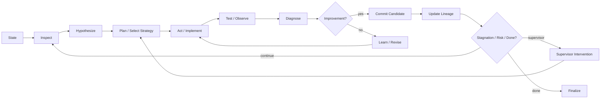

## 8.2 Variation operator state machine

```text
INIT
  ↓
RECONNAISSANCE
  ↓
STATE_BUILD
  ↓
OPTION_GENERATION
  ↓
STRATEGY_SELECTION
  ↓
IMPLEMENTATION
  ↓
OBSERVATION
  ├── success → SCORE
  ├── failure → DIAGNOSE → REPAIR
  └── uncertainty → INVESTIGATE
  ↓
COMPARE
  ↓
COMMIT / REJECT / BRANCH
  ↓
LEARN
  ↓
CONTINUE / ESCALATE / STOP
```

## 8.3 Why an internal loop matters

A single model call can generate an idea. A high-end AVO system must be able to:

1. inspect relevant state;
2. form a hypothesis;
3. execute a small experiment;
4. observe real evidence;
5. update the hypothesis;
6. implement a stronger candidate;
7. verify it;
8. preserve the result;
9. reuse the lesson later.

That is the minimum useful abstraction for long-horizon autonomy.

---

# 9. Adaptive Parent and Trajectory Selection

The published NVIDIA work demonstrates single-lineage evolution but notes compatibility with archive- and island-based structures. A high-end implementation should exploit that flexibility. [1]

## 9.1 Archive structure

```text
Global Archive
├── best_by_objective
├── best_by_domain
├── best_by_cost
├── best_by_robustness
├── novelty_frontier
├── failure_archive
├── reusable_patterns
└── abandoned_but_promising
```

## 9.2 Selection policy

Parent selection should be adaptive, using a mixture of:

```text
exploitation = 0.35
novelty       = 0.20
uncertainty   = 0.15
historical_success = 0.15
cross-domain_transfer = 0.10
cost_efficiency = 0.05
```

These are reference defaults, not fixed constants. The supervisor should tune them based on observed search behavior.

## 9.3 Failure archive

Failed attempts are not necessarily garbage. Preserve:

- what was attempted;
- which assumptions failed;
- which tests invalidated it;
- the observed failure mode;
- the cost incurred;
- whether the idea could succeed under different constraints.

The failure archive is crucial for avoiding repeated mistakes.

---

# 10. Branching, Islands, and Swarm Evolution

A production-grade AVO engine should evolve beyond one lineage when the task benefits from exploration.

## 10.1 Island model

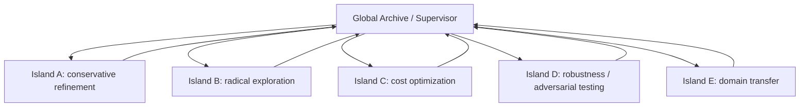

Each island has:

- its own local memory;
- strategy distribution;
- parent-selection behavior;
- local evaluator budget;
- local stagnation threshold.

The global supervisor can periodically exchange:

- best candidates;
- high-value mutations;
- failure patterns;
- reusable skills;
- discovered invariants.

## 10.2 Swarm roles

Possible agents include:

| Role | Primary objective |
|---|---|
| Explorer | Search unfamiliar solution space |
| Implementer | Turn strategy into artifacts/code |
| Researcher | Gather external knowledge |
| Tester | Create and run validation experiments |
| Critic | Attack assumptions and identify failure modes |
| Optimizer | Improve performance/cost |
| Security auditor | Search for unsafe behavior |
| Reproducer | Confirm results independently |
| Historian | Compress and preserve trajectory knowledge |
| Transfer agent | Move successful ideas into adjacent domains |
| Synthesizer | Merge compatible discoveries |

The system should **spawn these roles dynamically**, not always run all roles.

---

# 11. Executive Supervisor

The supervisor is not simply another chatbot. It is a **control-plane agent**.

## 11.1 Responsibilities

- monitor search progress;
- detect stagnation;
- detect cycling;
- detect evaluator drift;
- detect repeated failures;
- detect context degradation;
- compare progress against expected progress;
- decide when to branch;
- decide when to change model tier;
- decide when to request human input;
- terminate completed goals;
- protect authority boundaries;
- schedule maintenance and learning tasks.

## 11.2 Stagnation detection

Track features such as:

```text
Δfitness over N iterations
unique strategy count
edit similarity
failure recurrence
cost per improvement
uncertainty trend
novelty trend
evaluator disagreement
```

Trigger supervision when:

```text
fitness_gain < threshold
OR
same_failure_pattern >= N
OR
strategy_entropy < minimum
OR
cost_per_gain > budget
OR
evaluator_conflict > threshold
OR
context_reliability < threshold
```

## 11.3 Intervention levels

```text
L0  Observe only
L1  Provide hint from memory
L2  Change parent selection
L3  Change strategy family
L4  Spawn critic/researcher
L5  Branch the search
L6  Change model/provider
L7  Rebuild execution plan
L8  Reset to best stable checkpoint
L9  Human checkpoint
L10 Abort
```

Minimal intervention should be preferred.

---

# 12. Planner and Dynamic Decomposition

The planner converts the objective into a living execution graph.

## 12.1 Plan graph

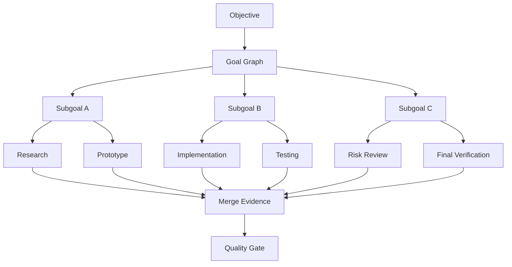

The plan is mutable. The agent may:

- add a task;
- remove an obsolete task;
- split a task;
- merge tasks;
- reorder dependencies;
- spawn parallel branches;
- revisit a completed task if new evidence invalidates it.

## 12.2 Plan quality

Measure:

- dependency correctness;
- completeness;
- unnecessary work;
- parallelism potential;
- blocked-task ratio;
- replan frequency;
- final outcome correlation.

A plan is an execution hypothesis, not a contract with reality.

---

# 13. Model and Agent Routing

A high-end system should not use the same model for every operation.

## 13.1 Capability router

```text
Task classifier
    ↓
Estimate:
  reasoning difficulty
  context size
  tool complexity
  risk
  latency sensitivity
  budget
    ↓
Select:
  frontier reasoning model
  coding model
  fast model
  vision model
  embedding/reranker
  small local model
  verifier model
```

## 13.2 Model portfolio

```text
FAST    → classification, extraction, routine tool calls
MID     → planning, drafting, routine implementation
FRONTIER → difficult reasoning, architecture, novel strategy
SPECIALIST → vision, code, math, retrieval, security
LOCAL   → cheap/private/continuous maintenance
```

The router itself should be measurable and evolvable.

## 13.3 Model switching criteria

Switch upward when:

- progress stalls;
- uncertainty is high;
- cross-check disagreement is high;
- the task has high impact;
- novel reasoning is required.

Switch downward when:

- work is repetitive;
- the task is well understood;
- confidence is high;
- cost pressure is high.

---

# 14. Memory Fabric

Memory should be a layered system rather than one giant text file.

## 14.1 Memory layers

```text
L1 Working Memory
    Current objective, active plan, immediate evidence.

L2 Episodic Memory
    Past trajectories, attempts, failures, successes.

L3 Semantic Memory
    Stable facts, concepts, trusted knowledge.

L4 Procedural Memory
    Skills, recipes, tool patterns, workflows.

L5 Strategic Memory
    Which strategies work under which conditions.

L6 Institutional Memory
    Project rules, architecture decisions, policies, conventions.

L7 Failure Memory
    Known traps, recurring errors, invalid approaches.
```

This extends the useful procedural-vs-factual distinction seen in Hermes-style skill/memory systems. [8]

## 14.2 Memory operations

```text
write
read
retrieve
summarize
compress
merge
invalidate
promote
archive
forget
```

## 14.3 Memory admission gate

Do not store everything.

A memory candidate should be scored on:

```text
utility × future_reuse × reliability × specificity
----------------------------------------------------
            storage / retrieval cost
```

Only memories above a threshold should be promoted to durable state.

## 14.4 Memory provenance

Every durable memory should carry:

- source;
- creation timestamp;
- confidence;
- supporting evidence;
- last validation;
- dependent memories;
- invalidation conditions.

---

# 15. Skill Fabric

Skills are executable procedural knowledge.

## 15.1 Skill lifecycle


Skills should include:

```yaml
name: deploy-nextjs
version: 3.2.0
triggers:
  - nextjs deployment
preconditions:
  - repository detected
inputs:
  - project_dir
procedure:
  - inspect_config
  - run_tests
  - build
  - deploy
verification:
  - deployment_health_check
failure_modes:
  - missing_env
  - build_failure
confidence: 0.91
provenance:
  source: learned
  episodes: [ep_124, ep_128]
```

## 15.2 Skill A/B testing

When improving a skill:

```text
Version A = current stable
Version B = proposed improvement

Run both on representative tasks.
Compare:
  completion
  failures
  cost
  latency
  human interventions
  regressions

Promote B only if statistically / operationally superior.
```

---

# 16. Knowledge Fabric

Knowledge retrieval should be source-aware and confidence-aware.

## 16.1 Knowledge hierarchy

```text
Tier 0: local authoritative artifacts
Tier 1: official documentation / specifications
Tier 2: primary research papers
Tier 3: trusted engineering references
Tier 4: community knowledge
Tier 5: unverified web content
```

The router should prefer higher-authority sources when the claim matters.

## 16.2 Progressive disclosure

Use a small stable index that points to deeper documents instead of injecting all knowledge into context. OpenAI's harness-engineering report describes a similar pattern using a compact AGENTS.md plus structured source-of-truth documents and executable quality checks. [5]

---

# 17. Tool and MCP Fabric

## 17.1 Tool registry

All tools should advertise:

```text
name
purpose
input_schema
output_schema
risk_level
required_permissions
network_access
filesystem_scope
cost
latency
reversibility
side_effects
idempotency
verification_method
```

## 17.2 Dynamic tool selection

The agent should discover tools by semantic need instead of being forced to load every tool description into every context.

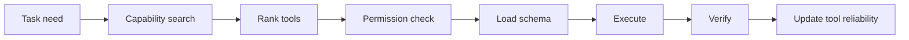

## 17.3 Tool reliability model

Maintain empirical reliability:

```text
success_rate
schema_failure_rate
timeout_rate
security_incidents
human_override_rate
output_quality
```

The router should prefer tools with higher measured reliability when capabilities overlap.

---

# 18. Secure Execution Plane

High-end autonomous systems need isolated execution environments because tool use turns model output into real-world action.

## 18.1 Sandbox abstraction

```text
Sandbox
├── filesystem
├── process runtime
├── package environment
├── network policy
├── secret broker
├── GUI/browser surface
├── device access
├── resource quota
└── audit stream
```

Potential backends include local isolated processes, containers, VM sandboxes, remote sandboxes, or specialized compute providers. Public agent systems such as Hermes and OpenAI's Agents SDK expose sandboxed execution as a core runtime primitive. [9][6]

## 18.2 Authority tiers

```text
A0  pure reasoning
A1  read-only local data
A2  sandbox write/execute
A3  external API reversible actions
A4  production mutations
A5  irreversible / financial / public actions
```

Agents should default to the minimum required tier.

## 18.3 Two-key pattern for high-impact actions

For dangerous actions:

```text
Agent intent
   ↓
Policy engine
   ↓
Independent verifier
   ↓
Approval token
   ↓
Execution
```

This separates reasoning from authority.

---

# 19. Evaluation and Verification Plane

AVO only works when feedback is meaningful. This is perhaps the most important system component.

## 19.1 Evaluator types

```text
Deterministic tests
Property tests
Unit tests
Integration tests
Simulation
Benchmark
Reference comparison
LLM judge
Human review
Security scanner
Static analyzer
Performance profiler
Reproducibility test
Adversarial evaluator
```

## 19.2 Hierarchical evaluation

```text
Level 1: Syntax / schema
Level 2: Basic correctness
Level 3: Task-specific tests
Level 4: Edge cases
Level 5: Adversarial tests
Level 6: Independent reproduction
Level 7: Real-world acceptance
```

The agent should only spend expensive evaluation budget after cheaper gates pass.

## 19.3 Correctness gating

The NVIDIA AVO formulation explicitly zeroes a candidate's score when correctness fails, regardless of throughput. [1]

Generalized policy:

```python
if not correctness_gate:
    fitness = INVALID
elif safety_gate == FAIL:
    fitness = INVALID
else:
    fitness = evaluate_quality()
```

Never let an attractive optimization hide a correctness or safety failure.

---

# 20. Evidence Matrix

For every important conclusion, maintain:

| Claim | Evidence | Source | Confidence | Independent Check | Status |
|---|---|---|---:|---|---|
| Requirement met | test output | CI | 0.99 | yes | PASS |
| External fact | official docs | primary source | 0.96 | no | VERIFIED |
| Performance gain | benchmark | profiler | 0.98 | yes | VERIFIED |
| Security property | audit result | scanner + review | 0.93 | yes | VERIFIED |

This reduces the chance that an agent confuses generated text with validated reality.

---

# 21. Research Mode

The architecture should support a native deep-research loop:

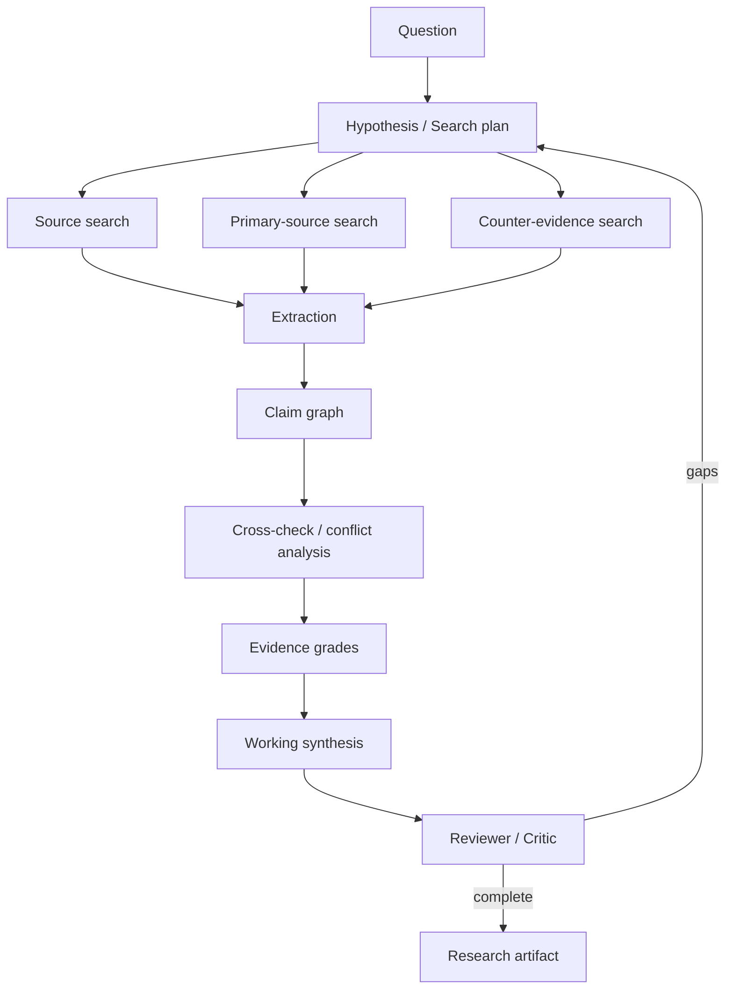

The research engine should distinguish:

```text
fact
inference
hypothesis
recommendation
uncertainty
```

Never silently collapse these categories.

---

# 22. Reflection, Critique, and Metacognition

The system should support multiple forms of reflection:

### Task reflection

"What went wrong?"

### Strategy reflection

"Was the overall approach appropriate?"

### Process reflection

"Did we waste time or use bad tools?"

### Memory reflection

"What should be retained for future tasks?"

### Evaluator reflection

"Did our tests actually measure success?"

### Architecture reflection

"Is the harness itself causing the failure?"

These levels prevent the common failure mode of repeatedly applying the same local fix while the real problem is strategic.

Reflexion's result that language-based feedback can improve future decisions without weight updates provides a research foundation for this memory-centered form of learning. [12]

---

# 23. Recursive Self-Improvement Layer

AVO and recursive self-improvement are related but distinct. AVO changes **search behavior over candidate solutions**; RSI can additionally improve the machinery that performs the search.

A safe RSI layer should therefore define a target hierarchy.

## 23.1 What may evolve automatically

### Low risk

- retrieval ranking;
- prompt templates;
- planning heuristics;
- skill descriptions;
- context compression policies;
- cache policy;
- model routing thresholds;
- test generation strategies;
- tool ranking.

### Medium risk

- orchestrator policies;
- subagent role definitions;
- evaluator ensembles;
- memory promotion thresholds;
- search population policies;
- workflow definitions.

### High risk

- security policies;
- authority grants;
- secret handling;
- deployment mechanisms;
- external side-effect permissions;
- irreversible publication logic.

High-risk components should require independent verification and normally human approval.

## 23.2 RSI loop

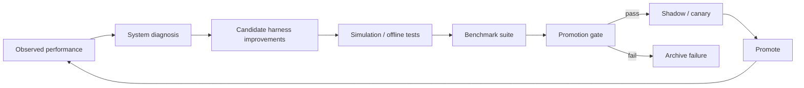

## 23.3 No self-modification without a benchmark

Every proposed harness change should have:

```text
baseline version
candidate version
representative workloads
safety suite
regression suite
cost profile
rollback point
promotion criteria
```

This turns RSI into evolutionary engineering rather than unbounded self-editing.

---

# 24. Meta-Evaluation: Improving the Evaluators

A critical failure mode is evaluator gaming.

The agent may optimize for the measurement instead of the true objective.

Countermeasures:

1. maintain multiple independent evaluators;
2. hide part of the benchmark suite;
3. periodically regenerate tests;
4. use adversarial evaluators;
5. compare offline and real-world outcomes;
6. penalize suspicious changes to the measurement path;
7. require evaluator integrity proofs / hashes where applicable;
8. isolate evaluator code from the candidate's write permissions.

The evaluator should be **harder to modify than the candidate**.

---

# 25. Candidate Provenance and Lineage Graph

Use a DAG rather than only a list.

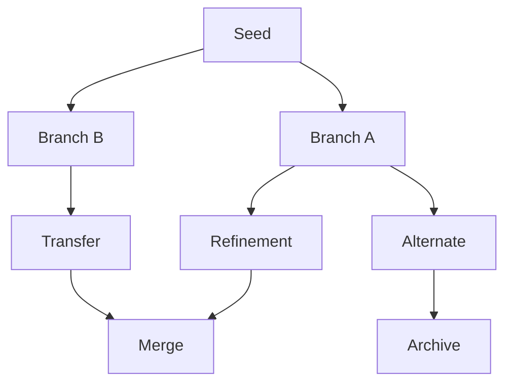

Every edge should record:

```text
parent
mutation / transformation
agent
model
prompt/skill version
tools used
environment
observations
evaluator results
resource usage
```

This makes experiments reproducible and allows the agent to learn which kinds of mutations produce reliable gains.

---

# 26. Candidate Mutation Taxonomy

The AVO agent should dynamically select from broad mutation classes.

```text
LOCAL_EDIT
REFACTOR
ALGORITHM_CHANGE
DATA_STRUCTURE_CHANGE
PARALLELIZATION
CACHE / MEMORY OPTIMIZATION
SCHEDULING
API CHANGE
ARCHITECTURE CHANGE
DEPENDENCY CHANGE
TEST-ONLY CHANGE
CONFIGURATION SEARCH
PROMPT CHANGE
SKILL CHANGE
ROUTING CHANGE
TOOL CHANGE
COMPOSITION
CROSS-LINEAGE TRANSFER
RADICAL RESTART
```

The system should not assume which mutation class is appropriate.

---

# 27. Novelty Engine

Optimization without novelty can converge prematurely.

Define a strategy signature:

```text
signature = hash(
  changed_components,
  action_sequence,
  tool_set,
  hypothesis_family,
  mutation_class,
  key assumptions
)
```

Estimate novelty using:

- semantic distance;
- structural distance;
- behavioral distance;
- tool-path distance;
- strategy-family distance.

When novelty collapses, the supervisor can force exploration.

---

# 28. Transfer Learning Without Weight Updates

The architecture should support transfer through artifacts:

```text
successful strategy
      ↓
abstract invariant
      ↓
domain-neutral skill
      ↓
new environment
      ↓
adaptation agent
      ↓
verification
```

NVIDIA's report that AVO's MHA optimization transferred to GQA with a short adaptation run illustrates the value of this kind of transfer. [1]

A reusable lesson should therefore store:

```text
When it worked
Why it worked
What assumptions were required
How to recognize a similar situation
What must be adapted
When not to use it
```

---

# 29. Context Engineering

Long-horizon context should never be equivalent to "keep everything in the prompt".

## 29.1 Context layers

```text
SYSTEM INVARIANTS
OBJECTIVE CONTRACT
CURRENT STATE
ACTIVE PLAN
RELEVANT MEMORY
RELEVANT SKILLS
RELEVANT KNOWLEDGE
RECENT OBSERVATIONS
SELECTED TRAJECTORY EVIDENCE
```

## 29.2 Compression policy

Compress when:

```text
context utilization > threshold
old turns have low future utility
state is already persisted
```

But preserve:

- unresolved assumptions;
- commitments;
- pending tasks;
- evaluator results;
- failures not yet understood;
- authority constraints;
- important evidence.

Open-source agent systems such as Hermes explicitly treat context compression and prompt stability as runtime concerns. [9]

---

# 30. Event-Sourced Agent State

Store the run as an event stream:

```text
GoalCreated
PlanCreated
PlanChanged
ToolDiscovered
ToolCalled
ObservationReceived
HypothesisCreated
CandidateCreated
EvaluationStarted
EvaluationFinished
FailureDetected
RepairAttempted
CandidateCommitted
CandidateRejected
MemoryPromoted
SkillCreated
SkillUpdated
SupervisorIntervened
ModelChanged
HumanApproved
GoalCompleted
```

This enables:

- replay;
- debugging;
- auditing;
- trajectory training;
- failure analysis;
- reproducible experiments;
- rollback.

---

# 31. Observability Plane

Every long-running agent should expose:

### Progress

```text
objective_completion
subgoal_completion
fitness_delta
best_score
stagnation_duration
```

### Reasoning/execution

```text
tool calls
model calls
subagent calls
plan changes
retries
```

### Resource

```text
tokens
compute
latency
network
storage
money
```

### Reliability

```text
failure rate
rollback rate
verification pass rate
human intervention rate
```

### Learning

```text
new skills
memory promotions
successful transfers
strategy novelty
```

---

# 32. Cost and Resource Optimization

Optimization should not only maximize task quality.

Define utility:

```text
U = quality
  - λ1 * cost
  - λ2 * latency
  - λ3 * risk
  + λ4 * reusable_value
```

The weights are objective-specific.

The system should be able to choose:

- fewer but stronger model calls;
- more cheap exploratory calls;
- local models for routine steps;
- expensive verification only on finalists;
- parallel subagents when latency matters;
- sequential execution when the task is highly coupled.

---

# 33. Reliability Engineering

## 33.1 Checkpoint frequency

Checkpoint after:

- meaningful artifact mutation;
- milestone completion;
- high-cost evaluation;
- successful discovery;
- before risky action.

## 33.2 Recovery ladder

```text
Retry
 ↓
Change parameters
 ↓
Change tool
 ↓
Change model
 ↓
Change strategy
 ↓
Restore checkpoint
 ↓
Branch
 ↓
Escalate to supervisor
 ↓
Human checkpoint
```

## 33.3 Idempotency

Every side-effecting action should declare whether it is idempotent and how to safely retry it.

---

# 34. Security Architecture

NVIDIA's broader 2026 discussion of the agent stack emphasizes that authority and access should be scoped and that runtime containment and action recording become increasingly important as agents gain capability. [14]

## 34.1 Security layers

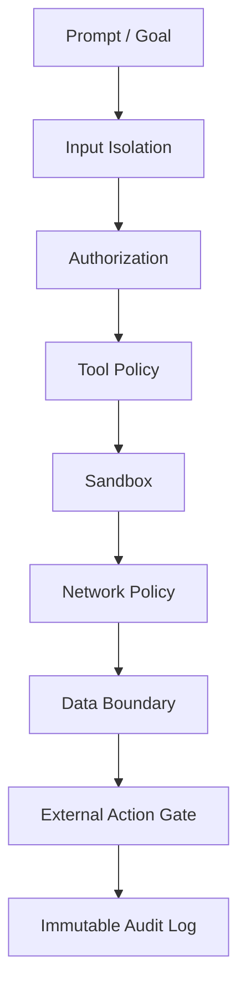

## 34.2 Prompt injection defense

Treat external content as **data**, not authority.

A webpage, email, repository file, database record, or tool output must never implicitly gain the authority of a system instruction.

Store provenance separately:

```text
content
source
trust tier
retrieval reason
sanitization status
```

## 34.3 Secret isolation

Never place long-lived secrets directly into model context unless absolutely required.

Prefer:

```text
agent → secret broker → scoped credential → tool
```

---

# 35. Artifact-Centric Completion

The objective is not "the model responded".

Completion should be tied to a concrete artifact or verified state transition.

Examples:

```text
software task → tested commit
research → cited report
analysis → verified dataset + result
deployment → health-checked service
automation → observed successful action
planning → executable plan + assumptions
```

Each artifact should include provenance and verification status.

---

# 36. Goal Completion and Stop Policy

The agent must be able to stop.

## 36.1 Stop conditions

```text
SUCCESS:
  all required acceptance criteria satisfied.

STABLE_SUCCESS:
  quality exceeds threshold with no material regression.

BLOCKED:
  missing authority / dependency / required human decision.

UNSAFE:
  action cannot satisfy policy constraints.

BUDGET_EXHAUSTED:
  resource limits reached.

STAGNANT:
  no expected progress after intervention ladder.

UNCERTAIN:
  evidence insufficient for safe completion.
```

## 36.2 Anti-loop invariant

Never continue solely because the system is capable of continuing.

```text
Goal achieved → finalize.
```

Continuous operation belongs in a separate maintenance/improvement mode.

---

# 37. Continuous Company / Bot Mode

For a system intended to run as an autonomous organization, add a persistent supervisor above individual tasks.

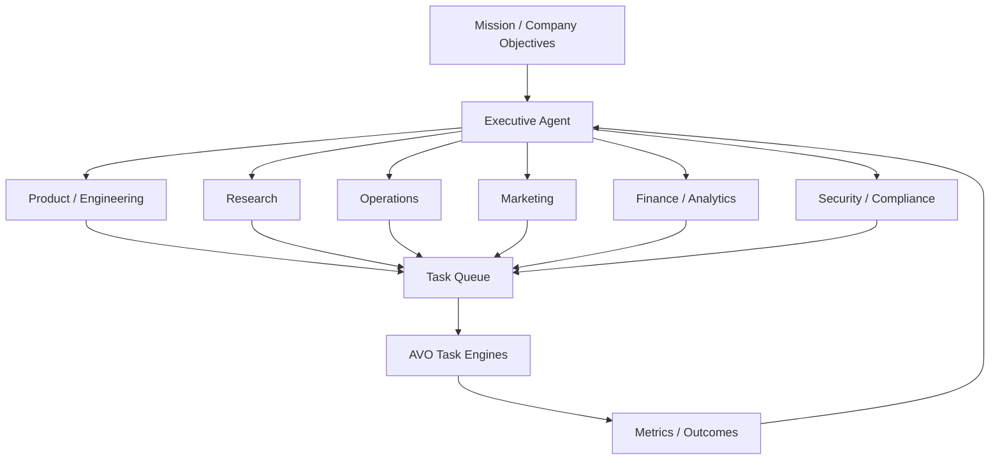

Each department is still an AVO-enabled search process rather than a static bot.

---

# 38. Scheduling and Opportunity Detection

The system should create work from signals, not only explicit prompts.

Signals:

```text
scheduled task
new repository commit
benchmark regression
new research paper
new customer event
system alert
performance decline
security finding
unresolved memory
stale skill
new tool capability
```

Each signal becomes a candidate objective with an expected value score.

---

# 39. Skill and Tool Evolution as AVO Problems

The same AVO abstraction can optimize the harness itself.

## 39.1 Skill evolution

```text
Skill_t
 ↓
Agentic variation
 ↓
Skill_{t+1}
 ↓
evaluation suite
 ↓
commit if improved
```

## 39.2 Tool evolution

```text
Tool interface
 ↓
wrapper variants
 ↓
benchmark
 ↓
reliability + latency + cost
 ↓
promotion
```

## 39.3 Planner evolution

```text
planning policy A
planning policy B
planning policy C
 ↓
representative task suite
 ↓
completion / cost / intervention metrics
 ↓
new planner champion
```

This is where AVO becomes more than optimization of application code: **the agentic harness itself becomes an evolutionary object**.

---

# 40. Meta-Lineage

Maintain two connected lineage graphs:

```text
WORK LINEAGE
  candidate artifacts and task solutions

HARNESS LINEAGE
  planner versions
  skill versions
  tool versions
  routing policies
  evaluator versions
  memory policies
  supervisor versions
```

A work result should be reproducible against the exact harness version that produced it.

---

# 41. Reproducibility Contract

Every significant result should record:

```text
model/provider/version
agent policy version
system prompt version
skill versions
tool versions
knowledge snapshot
environment image
dependency lockfile
seed / randomness
hardware class
benchmark version
evaluator version
lineage parent
```

Without this, a "successful autonomous discovery" is hard to reproduce or audit.

---

# 42. Evaluation Benchmark Suite for the Harness

Do not benchmark only model intelligence.

## 42.1 Capability dimensions

```text
Task completion
Long-horizon persistence
Tool reliability
Planning adaptability
Error recovery
Research quality
Code quality
Artifact quality
Memory usefulness
Skill reuse
Novelty
Transfer
Cost efficiency
Security
Reproducibility
Human intervention minimization
```

## 42.2 Canary workloads

Maintain a permanent suite such as:

```text
simple task
multi-step task
unknown-domain research
large repository modification
ambiguous objective
tool failure
network interruption
stale knowledge
prompt injection
conflicting evaluator
long context
resource pressure
```

Every harness update runs this suite before promotion.

---

# 43. Agent Trajectory Dataset

Every completed task can produce a structured trajectory:

```json
{
  "objective": {},
  "initial_state": {},
  "actions": [],
  "observations": [],
  "hypotheses": [],
  "candidates": [],
  "evaluations": [],
  "failures": [],
  "interventions": [],
  "final_artifact": {},
  "fitness": {},
  "lessons": [],
  "skill_deltas": []
}
```

These trajectories can support:

- offline evaluation;
- prompt improvement;
- skill induction;
- routing optimization;
- benchmark construction;
- training data generation;
- failure taxonomy development.

Do not blindly train on all trajectories. Filter by outcome and provenance.

---

# 44. Failure Taxonomy

Maintain explicit categories:

```text
F001 Wrong objective interpretation
F002 Missing requirement
F003 Bad plan
F004 Tool misuse
F005 Tool unavailable
F006 Environment failure
F007 Hallucinated fact
F008 Incorrect assumption
F009 Evaluator failure
F010 Benchmark gaming
F011 Context loss
F012 Memory pollution
F013 Repeated cycle
F014 Premature stopping
F015 Unnecessary continuation
F016 Security violation prevented
F017 Unsafe action attempted
F018 Regression after improvement
F019 Non-reproducible success
F020 Cost explosion
```

The supervisor should reason over the failure class, not only the immediate error text.

---

# 45. Advanced Search Strategies

An AVO-X engine can dynamically mix:

### Exploitation
Refine the current best.

### Exploration
Try a new strategy family.

### Recombination
Merge insights from multiple branches.

### Transfer
Apply a successful pattern from another task/domain.

### Counterfactual
Ask what assumption, if changed, would most alter the result.

### Adversarial search
Attack the current champion.

### Simplification
Seek a simpler implementation with the same outcome.

### Radical restart
Discard the current local optimum and explore from a different abstraction.

The supervisor should choose among these modes based on trajectory evidence.

---

# 46. Confidence and Uncertainty

The system should carry uncertainty explicitly.

```text
confidence_source:
  direct_test = high
  independent_reproduction = very_high
  model_judgment = medium
  single_web_source = medium
  speculative_reasoning = low
```

When uncertainty is high:

```text
search more
run another experiment
ask a specialist agent
seek an independent evaluator
or escalate
```

Do not manufacture certainty by repeatedly asking the same model.

---

# 47. Multi-Judge Evaluation

For subjective outputs, use an evaluator ensemble:

```text
Judge A — task correctness
Judge B — factuality
Judge C — security
Judge D — style / quality
Judge E — adversarial reviewer

→ aggregate
→ disagreement analysis
→ final decision
```

A disagreement score can itself become a trigger for deeper verification.

---

# 48. Adaptive Depth Controller

Not every task needs maximal planning.

The controller chooses depth based on:

```text
difficulty
risk
uncertainty
expected value
cost
reversibility
```

Reference modes:

```text
L0 direct
L1 plan + execute
L2 plan + verify
L3 research + execute + verify
L4 multi-agent
L5 evolutionary search
L6 extended autonomous run
```

The system should climb only as necessary.

---

# 49. AVO Execution Modes

## Mode A — Direct AVO

One agent owns the full variation loop.

Best for:

- small code optimizations;
- known evaluators;
- focused tasks.

## Mode B — Parallel AVO

Multiple branches explore in parallel.

Best for:

- large strategy spaces;
- expensive local minima;
- independent alternatives.

## Mode C — Hierarchical AVO

Supervisor → sub-supervisors → operators.

Best for:

- large projects;
- organizations;
- multiple domains.

## Mode D — Meta-AVO

The system evolves its own operational policy.

Best for:

- benchmarked harness improvements;
- long-running R&D;
- platform optimization.

---

# 50. Recommended Reference Stack

A practical implementation can be divided as follows:

```text
LANGUAGE / MODEL LAYER
├── Frontier reasoning models
├── Fast models
├── Coding models
├── Vision models
└── Local models

AGENT LAYER
├── Agent loop
├── planner
├── supervisor
├── critics
├── subagents
└── AVO operator

KNOWLEDGE LAYER
├── retrieval
├── vector / lexical indexes
├── source provenance
├── skills
└── institutional docs

EXECUTION LAYER
├── sandbox
├── shell
├── browser
├── filesystem
├── Git
├── MCP
└── external APIs

EVALUATION LAYER
├── tests
├── benchmarks
├── simulators
├── judges
├── security
└── reproducibility

STATE LAYER
├── event log
├── lineage graph
├── memory store
├── artifact store
├── metrics store
└── checkpoint store

GOVERNANCE LAYER
├── policy engine
├── authority manager
├── secret broker
├── approval gates
└── audit
```

---

# 51. Suggested Repository Architecture

```text
avo-x/
├── apps/
│   ├── cli/
│   ├── desktop/
│   ├── web/
│   ├── api/
│   └── gateway/
│
├── core/
│   ├── agent_loop/
│   ├── objective_contract/
│   ├── planner/
│   ├── supervisor/
│   ├── router/
│   ├── policies/
│   └── state_machine/
│
├── avo/
│   ├── operator/
│   ├── lineage/
│   ├── selection/
│   ├── archive/
│   ├── mutation/
│   ├── islands/
│   └── evolution.py
│
├── memory/
│   ├── working/
│   ├── episodic/
│   ├── semantic/
│   ├── procedural/
│   ├── strategic/
│   └── provenance/
│
├── skills/
│   ├── registry/
│   ├── loader/
│   ├── validator/
│   ├── evaluator/
│   └── evolution/
│
├── tools/
│   ├── registry/
│   ├── mcp/
│   ├── browser/
│   ├── terminal/
│   ├── filesystem/
│   └── integrations/
│
├── execution/
│   ├── sandbox/
│   ├── environments/
│   ├── network/
│   ├── secrets/
│   └── checkpoints/
│
├── evaluation/
│   ├── correctness/
│   ├── benchmarks/
│   ├── judges/
│   ├── security/
│   ├── adversarial/
│   └── reproducibility/
│
├── knowledge/
│   ├── retrieval/
│   ├── source_registry/
│   ├── crawlers/
│   └── provenance/
│
├── observability/
│   ├── tracing/
│   ├── metrics/
│   ├── cost/
│   └── audit/
│
├── rsi/
│   ├── proposals/
│   ├── benchmark/
│   ├── shadow/
│   ├── canary/
│   └── promotion/
│
├── schemas/
└── tests/
    ├── unit/
    ├── integration/
    ├── regression/
    ├── benchmark/
    ├── security/
    └── chaos/
```

---

# 52. Internal Protocols

Use typed contracts between components.

## Objective protocol

```typescript
interface Objective {
  id: string;
  goal: string;
  acceptance: AcceptanceCriterion[];
  constraints: Constraints;
  authority: AuthoritySpec;
  evidence: EvidencePolicy;
}
```

## Agent action protocol

```typescript
interface AgentAction {
  id: string;
  type: string;
  tool?: string;
  arguments: unknown;
  rationale_summary?: string;
  expected_effect?: string;
  risk: number;
  reversible: boolean;
}
```

## Observation protocol

```typescript
interface Observation {
  source: string;
  timestamp: string;
  content: unknown;
  provenance: Provenance;
  reliability: number;
}
```

## Evaluation protocol

```typescript
interface Evaluation {
  candidateId: string;
  checks: EvaluationCheck[];
  fitness: Record<string, number>;
  pass: boolean;
  evidence: string[];
  evaluatorVersion: string;
}
```

---

# 53. Agent Memory vs Search State

Keep them separate.

```text
Memory = reusable information
Search state = current experiment history
```

A prior failed experiment can remain in the lineage without becoming a global memory.

A validated general lesson can be promoted from lineage into procedural/strategic memory.

---

# 54. Search State Compression

For long runs, do not preserve every raw observation in every context.

Instead maintain:

```text
Current champion
Top alternatives
Critical failures
Key discoveries
Active hypotheses
Pending tests
Evaluator trends
Supervisor events
```

Raw data stays in external storage and is retrieved on demand.

---

# 55. Browser and Web-Agent Design

For web tasks, the browser is part of the environment.

Use:

```text
search
open
extract
navigate
interact
observe
verify
cite
```

The browser agent should preserve page-level provenance and avoid treating arbitrary page instructions as system authority.

---

# 56. Coding-Agent Design

For software engineering, optimize the agent-computer interface.

The SWE-agent research demonstrates that the interface through which an agent reads and edits repositories affects behavior and performance. [15]

Expose compact operations such as:

```text
search_files
read_file
apply_patch
run_tests
run_command
inspect_git
inspect_diff
profile
```

Avoid making the model reconstruct filesystem state through unnecessarily verbose tool responses.

---

# 57. Chaos and Recovery Testing

A high-end agent should be tested under failure.

Inject:

- tool timeout;
- invalid output;
- network drop;
- corrupted file;
- dependency failure;
- context compression;
- stale memory;
- conflicting sources;
- evaluator outage;
- subagent crash.

Measure whether the system:

```text
recovers
avoids data loss
avoids unsafe retries
preserves lineage
communicates uncertainty
```

---

# 58. Agent Health Score

Maintain a runtime health score:

```text
Health =
  w1 * recent_success
+ w2 * evaluator_agreement
+ w3 * recovery_success
+ w4 * memory_reliability
+ w5 * tool_reliability
- w6 * stagnation
- w7 * retry_rate
- w8 * unsafe_attempt_rate
```

A low health score triggers supervisor intervention or a strategy reset.

---

# 59. Dynamic Resource Allocation

At every control interval, estimate:

```text
expected_value_of_next_action
expected_cost
expected_information_gain
expected_risk
```

Then choose the next action by approximate utility:

```text
action_score =
    information_gain
  + expected_goal_progress
  + reusable_value
  - cost
  - risk
```

This provides a practical bridge between agentic planning and active search.

---

# 60. Information-Gain Actions

When the agent is uncertain, the best next action may not directly modify the target.

Examples:

- inspect profiler;
- read official documentation;
- run a small benchmark;
- reproduce an error;
- inspect previous lineage;
- ask a specialist subagent;
- compare two implementations;
- construct an adversarial test.

Thus the action policy should optimize for **expected information gain**, not just immediate output.

---

# 61. Multi-Objective Pareto Front

Maintain champions across objectives instead of a single winner.

```text
                    Quality
                       ↑
                       |       ● A
                       |    ●
                       | ● B
                       |     ● C
                       +----------------→ Cost efficiency
```

The supervisor selects the final candidate using the objective contract.

---

# 62. Strategic Memory Graph

Instead of only storing isolated tips, build relations:

```text
Problem pattern
   ↓
Hypothesis
   ↓
Strategy
   ↓
Action pattern
   ↓
Evidence
   ↓
Outcome
   ↓
Applicability conditions
```

This enables reasoning such as:

> "This failure resembles three previous failures where changing the execution strategy—not the implementation—resolved the issue."

---

# 63. Benchmark Integrity

The evaluation environment should be protected against the candidate.

Recommended isolation:

```text
Candidate environment
       │
       ├── read-only benchmark spec
       └── write: candidate workspace only

Evaluator environment
       │
       ├── hidden tests
       ├── reference implementation
       └── protected metrics
```

This is essential when the system is evolving code against its own evaluator.

---

# 64. Governance of Autonomous Evolution

Use four states for every proposed system change:

```text
PROPOSED
TESTING
CANARY
PROMOTED
```

A change can also be:

```text
REJECTED
ROLLED_BACK
DEPRECATED
```

Never jump directly from model-generated proposal to production for high-impact harness components.

---

# 65. Production Promotion Pipeline

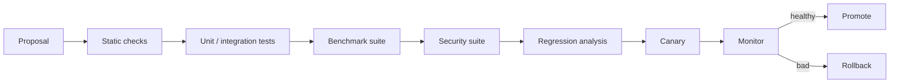

---

# 66. Human-in-the-Loop Policy

Humans should be inserted where judgment or authority is genuinely required, not merely because the system has reached a fixed step count.

Human checkpoints are appropriate when:

- authorization is ambiguous;
- a high-impact irreversible action is requested;
- evaluators disagree materially;
- a task crosses a legal/compliance boundary;
- there is insufficient evidence;
- the system's confidence is low after recovery attempts.

The human should receive:

```text
what the agent wants to do
why
expected effect
risk
alternatives
evidence
rollback path
```

---

# 67. Minimal Viable AVO-X

A powerful implementation does not need every feature on day one.

### Phase 1 — Core

```text
agent loop
objective contract
sandbox
tools
persistent state
lineage
correctness evaluator
supervisor
```

### Phase 2 — Evolution

```text
archive
branching
multi-objective scores
failure archive
novelty
subagents
```

### Phase 3 — Learning

```text
skills
memory graph
research mode
strategy memory
transfer
```

### Phase 4 — Meta-optimization

```text
harness AVO
planner evolution
router evolution
evaluator evolution
shadow promotion
```

### Phase 5 — Continuous autonomous operation

```text
scheduler
organization/bot mode
opportunity detector
self-maintenance
long-running infrastructure
```

---

# 68. High-End Reference Runtime

A production deployment can be split into these services:

```text
Control Plane
├── API Gateway
├── Supervisor
├── Scheduler
├── Policy Engine
└── Run Manager

Compute Plane
├── Agent Workers
├── Subagent Workers
├── Evaluation Workers
├── Browser Workers
├── Sandbox Workers
└── GPU / HPC Workers

State Plane
├── SQL state store
├── Object/artifact store
├── Vector/lexical retrieval store
├── Event log
├── Lineage graph
└── Metrics store

Knowledge Plane
├── crawlers
├── parsers
├── indexers
├── source registry
└── skill registry

Governance Plane
├── secrets broker
├── permissions
├── audit
├── approvals
└── security monitoring
```

---

# 69. Local-First / Self-Hosted Deployment Pattern

For a self-hosted system:

```text
Desktop / Server
├── Supervisor
├── Local model gateway
├── Agent workers
├── SQLite/Postgres
├── Object storage
├── Vector index
├── Docker/VM sandbox
└── Browser runtime
```

Optional cloud burst:

```text
local supervisor
   ↓
cloud frontier model only for hard tasks
   ↓
results return to local state
```

This preserves autonomy and privacy while still allowing frontier reasoning when needed.

---

# 70. Open Standards / Interoperability

Prefer stable interfaces around:

- MCP for tool interoperability;
- Agent Skills-compatible procedural knowledge where practical;
- JSON/JSON-RPC style event contracts;
- Git for artifact lineage;
- OCI/container images for execution environments;
- OpenTelemetry-style traces for observability.

The goal is to prevent the core AVO engine from becoming coupled to one provider.

---

# 71. The Fundamental AVO-X Abstraction

The entire system can be summarized as:

```text
AgenticVariation(
    objective,
    state,
    lineage,
    knowledge,
    memory,
    skills,
    tools,
    environment,
    evaluator,
    policy
) -> improved_state
```

For task optimization:

```text
Vary(P_t) = Agent(P_t, K, f)
```

For harness optimization:

```text
Vary(H_t) = MetaAgent(H_t, B, E)
```

where:

- `H_t` = current harness version;
- `B` = benchmark suite;
- `E` = evaluator stack.

For skill optimization:

```text
Vary(S_t) = SkillAgent(S_t, D, E)
```

For workflow optimization:

```text
Vary(W_t) = WorkflowAgent(W_t, T, E)
```

This creates a common abstraction across application solving and system improvement.

---

# 72. Design Invariants

The following invariants should never be relaxed for convenience:

1. **Ground truth beats self-report.**
2. **Correctness gates quality optimization.**
3. **External content is data, not authority.**
4. **Every important action is attributable and auditable.**
5. **Irreversible actions require stronger authorization.**
6. **Failures are persisted as learning signals.**
7. **Memory has provenance and can be invalidated.**
8. **Successful candidates are reproducible.**
9. **The evaluator is protected from the candidate.**
10. **The agent can stop when the objective is complete.**
11. **Self-improvement requires measurable regression testing.**
12. **The system never expands its own authority merely because it is optimizing performance.**

---

# 73. What Makes This Architecture “AVO”

A system is meaningfully AVO-like when these properties are present:

```text
[1] The agent is the variation operator.
[2] It can inspect prior solutions/trajectory.
[3] It has access to domain knowledge.
[4] It can act in an execution environment.
[5] It can evaluate its own changes against ground truth.
[6] It can diagnose failures and revise without a fixed one-shot pipeline.
[7] Progress is persisted in a lineage.
[8] A supervisor can intervene when exploration stagnates.
```

Adding memory, swarms, skills, and RSI makes the architecture broader, but these eight properties are the core AVO identity.

---

# 74. AVO vs Conventional Agent Workflow

| Dimension | Conventional workflow | High-end AVO-X |
|---|---|---|
| Planning | Mostly predefined | Dynamic |
| Candidate generation | Model call | Autonomous agent loop |
| Parent selection | Framework heuristic | Adaptive agent + supervisor |
| Evaluation | Fixed stage | Active and adaptive |
| Failure recovery | Coded retries | Diagnose + strategy change |
| Memory | Optional | First-class |
| Skills | Optional | Evolvable procedural memory |
| Lineage | Often absent | First-class DAG |
| Branching | Limited | Native |
| Novelty | Usually implicit | Explicit |
| Supervisor | Rare | Core control plane |
| Self-improvement | Mostly manual | Benchmark-gated meta-evolution |
| Security | Tool-specific | Separate policy/authority plane |
| Completion | Response generated | Artifact/state verified |

---

# 75. Practical Build Recommendation

For a first implementation, build the following exact order:

```text
1. Objective Contract
2. Stateful Agent Loop
3. Sandbox
4. Tool Registry
5. Evaluator Interface
6. Git/Artifact Lineage
7. Persistent Memory
8. Supervisor + Stagnation Detector
9. Failure Archive
10. Multi-dimensional Fitness
11. Branching / Archive
12. Skills
13. Research Engine
14. Subagents
15. Model Router
16. Security Policy Engine
17. Harness Benchmark Suite
18. Meta-AVO / RSI
```

Do not start with a huge swarm. The core autonomous loop must first be reliable.

---

# 76. Example End-to-End Run

Suppose the user asks:

> "Improve this project's performance and produce a production-ready patch."

The AVO-X system should behave roughly as follows:

```text
User request
    ↓
Compile objective contract
    ↓
Inspect repository + requirements
    ↓
Build initial state model
    ↓
Find skills / knowledge
    ↓
Create plan
    ↓
Select strongest relevant lineage candidates
    ↓
Spawn 2–4 focused explorers only if uncertainty warrants
    ↓
Merge promising strategy hypotheses
    ↓
Implement candidate in sandbox
    ↓
Run cheap correctness tests
    ↓
Run targeted benchmark
    ↓
Diagnose result
    ↓
Repair / redesign / branch
    ↓
Run full regression suite
    ↓
Independent reproduction
    ↓
Update fitness vector
    ↓
Commit if acceptance criteria improve
    ↓
Extract reusable skill/lesson
    ↓
Supervisor checks stagnation and completion
    ↓
Produce verified artifact + evidence
    ↓
Stop
```

The important difference is that **the agent chooses the path inside the safe control envelope**.

---

# 77. Final Architecture Diagram

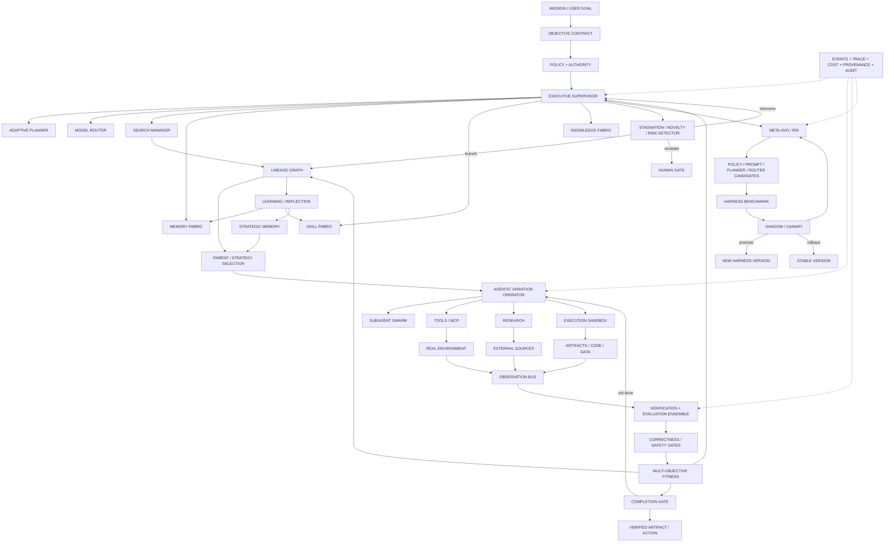

---

# 78. Bottom-Line Architecture

The highest-level architecture can be reduced to one sentence:

> **Build an autonomous agent that treats every task as a measurable search process, treats its own execution history as a source of evidence, treats tools and environments as experimental interfaces, treats evaluators as ground truth, treats memory and skills as reusable knowledge, treats stagnation as a signal for strategic intervention, and treats improvements to its own harness as benchmarked evolutionary candidates rather than unrestricted self-modification.**

The resulting system is not merely a chatbot, workflow engine, coding agent, or swarm. It is a **persistent agentic optimization substrate**.

That is the strongest generalization of the AVO idea for a world-class agent harness.

---

# 79. Research Sources

1. **Terry Chen et al. (NVIDIA), “AVO: Agentic Variation Operators for Autonomous Evolutionary Search,” arXiv:2603.24517, 2026.**
   https://arxiv.org/abs/2603.24517

2. **NVIDIA Developer Blog, “NVIDIA AVO Reaches 100% on ARC-AGI-3, Demonstrating a Frontier-Level General-Purpose Architecture for Long-Horizon Autonomous Agents,” Aug. 21, 2026.**
   https://developer.nvidia.com/blog/nvidia-avo-reaches-100-on-arc-agi-3-demonstrating-a-frontier-level-general-purpose-architecture-for-long-horizon-autonomous-agents/

3. **Google DeepMind, “AlphaEvolve: A Gemini-powered coding agent for designing advanced algorithms,” May 14, 2025.**
   https://deepmind.google/blog/alphaevolve-a-gemini-powered-coding-agent-for-designing-advanced-algorithms/

4. **Alexander Novikov et al., “AlphaEvolve: A coding agent for scientific and algorithmic discovery,” arXiv:2506.13131, 2025.**
   https://arxiv.org/abs/2506.13131

5. **OpenAI, “Harness engineering: leveraging Codex in an agent-first world,” Feb. 11, 2026.**
   https://openai.com/index/harness-engineering/

6. **OpenAI, “The next evolution of the Agents SDK,” Apr. 15, 2026.**
   https://openai.com/index/the-next-evolution-of-the-agents-sdk/

7. **Nous Research, Hermes Agent — architecture and tools documentation, 2026.**
   https://github.com/NousResearch/Hermes-Agent

8. **Hermes Agent, “Skills System” and “Skills vs Memory,” 2026.**
   https://github.com/NousResearch/hermes-agent/blob/main/website/docs/user-guide/features/skills.md
   https://github.com/NousResearch/hermes-agent/blob/main/website/docs/guides/work-with-skills.md

9. **Hermes Agent, “Architecture,” 2026.**
   https://github.com/NousResearch/hermes-agent/blob/main/website/docs/developer-guide/architecture.md

10. **ByteDance, DeerFlow architecture / repository documentation, 2026.**
    https://github.com/bytedance/deer-flow

11. **DeerFlow, “Introduction / Core Concepts,” 2026.**
    https://github.com/bytedance/deer-flow/tree/main/frontend/src/content/en/introduction

12. **Noah Shinn et al., “Reflexion: Language Agents with Verbal Reinforcement Learning,” arXiv:2303.11366, 2023.**
    https://arxiv.org/abs/2303.11366

13. **Guanzhi Wang et al., “Voyager: An Open-Ended Embodied Agent with Large Language Models,” arXiv:2305.16291, 2023.**
    https://arxiv.org/abs/2305.16291

14. **NVIDIA Developer Blog, “Where Security Fits in an AI Agent Stack,” 2026.**
    https://developer.nvidia.com/blog/where-security-fits-in-an-ai-agent-stack/

15. **John Yang et al., “SWE-agent: Agent-Computer Interfaces Enable Automated Software Engineering,” arXiv:2405.15793, 2024.**
    https://arxiv.org/abs/2405.15793

---

# 80. Research Interpretation Notes

- The published NVIDIA AVO paper is the authoritative source for the **core AVO mechanism**.
- The multi-island archive, advanced swarm, meta-AVO, evaluator evolution, RSI promotion pipeline, and many detailed runtime abstractions in this document are **architectural extensions proposed here**, inspired by the cited research rather than claims about NVIDIA's private production system.
- The ARC-AGI-3 result demonstrates transfer of the architecture to a different interactive environment, but it does not by itself prove that every workload benefits equally from AVO-style evolution. [2]
- Strong evaluators remain the limiting factor for many domains. Where objective ground truth is weak, the architecture should increase independent judging, evidence collection, and human verification rather than pretending a subjective scalar score is reliable.
