# Frontier General-Purpose Autonomous AI Agent Harness
## AVO-Inspired Architecture for High-Accuracy, Long-Horizon, Self-Improving Work

> **Purpose:** This document defines a production-grade architecture for building a general-purpose autonomous AI agent that can perform software engineering, research, analysis, document work, browser/computer tasks, data work, planning, automation, and other tool-mediated tasks with strong accuracy and recoverability.
>
> **Important:** This is an **AVO-inspired design**, not a claim that it reproduces NVIDIA's private implementation. NVIDIA describes AVO (Agentic Variation Operators) as a general-purpose agent architecture centered on persistent memory, tools, iterative inspection/planning/implementation/evaluation, external feedback, and supervisory intervention. The design below extends those principles into a broader general-purpose agent harness.

---

## 1. Executive Architecture

The central design principle is:

**Do not build a chatbot with tools. Build an autonomous control system around models.**

The model should be one replaceable reasoning component. The harness should provide:

- persistent state
- task decomposition
- planning
- dynamic mode selection
- tool and skill discovery
- environment observation
- evidence collection
- execution
- verification
- recovery
- candidate generation
- evaluation
- memory
- supervision
- multi-agent delegation
- security and permissions
- observability
- continuous evaluation
- controlled self-improvement

NVIDIA's August 2026 AVO report explicitly emphasizes that long-horizon capability comes from the **complete agent system**—memory, tools, feedback, and recovery—not model capability alone. NVIDIA reports AVO achieving 100% on the public ARC-AGI-3 set and describes the same general agent loop transferring across domains by changing the environment interface and evaluation mechanism.

---

# 2. Design Goals

## Primary goals

1. **General-purpose**
   - coding
   - research
   - browser tasks
   - computer interaction
   - data analysis
   - writing
   - planning
   - automation
   - DevOps
   - file manipulation
   - API workflows
   - multi-agent projects
   - long-running autonomous work

2. **High accuracy**
   - evidence before conclusions
   - explicit uncertainty
   - independent verification
   - tests and validators
   - contradiction detection
   - source quality scoring
   - result comparison
   - regression testing

3. **Long-horizon autonomy**
   - hours/days/weeks of progress
   - checkpoints
   - resumable state
   - durable memory
   - recovery after failures
   - supervisor intervention

4. **Adaptive intelligence**
   - dynamically select model
   - dynamically select tools
   - dynamically select skills
   - dynamically select planning depth
   - dynamically select number of agents
   - dynamically choose serial vs parallel execution
   - dynamically choose verification intensity

5. **Self-improvement without uncontrolled self-modification**
   - evaluate before changing
   - create candidate improvement
   - sandbox it
   - benchmark it
   - compare against baseline
   - promote only if better
   - maintain rollback

6. **Safety**
   - capability boundaries
   - permissions
   - approval gates
   - sandboxing
   - secrets isolation
   - audit logs
   - action risk scoring

---

# 3. Reference Architecture

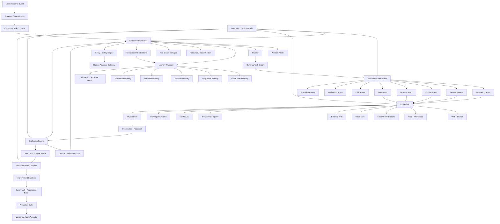

---

# 4. Core AVO-Inspired Control Loop

The heart of the system should be a closed-loop autonomous controller.

```text
INPUT
  ↓
Understand
  ↓
Build Problem Model
  ↓
Plan
  ↓
Select Strategy
  ↓
Select Tools / Skills / Models
  ↓
Act
  ↓
Observe
  ↓
Evaluate
  ↓
Critique
  ↓
Recover / Repair / Re-plan
  ↓
Verify
  ↓
Commit Result
  ↓
Record Learning
  ↓
Determine:
    ├── Continue
    ├── Re-plan
    ├── Spawn specialist
    ├── Explore alternative
    ├── Ask human
    └── Finish
```

The loop must **not** assume that the first plan is correct.

A robust agent treats every action as an experiment:

```text
Hypothesis
    ↓
Action
    ↓
Observation
    ↓
Evidence
    ↓
Evaluation
    ↓
Belief Update
    ↓
Next Action
```

This is one of the most important principles for long-horizon autonomy.

---

# 5. Executive Supervisor

The Executive Supervisor is the highest-level controller.

It should not perform every task itself.

Its responsibility is to decide:

- what the actual goal is
- what success means
- what constraints exist
- what must be researched
- what must be delegated
- what mode is appropriate
- how much reasoning is necessary
- which tools are appropriate
- whether parallel execution is useful
- when to verify
- whether progress is real
- whether to recover
- whether to ask the user
- when the task is complete

## Supervisor state

```yaml
supervisor_state:
  objective:
  constraints:
  assumptions:
  success_criteria:
  current_phase:
  active_tasks:
  blocked_tasks:
  completed_tasks:
  confidence:
  risk_level:
  budget:
  deadline:
  evidence_coverage:
  unresolved_questions:
  failure_count:
  improvement_opportunities:
```

## Supervisor decision cycle

```text
Observe global state
        ↓
Assess progress
        ↓
Detect bottleneck
        ↓
Choose next strategy
        ↓
Allocate resources
        ↓
Execute / delegate
        ↓
Inspect outcome
        ↓
Update global state
```

---

# 6. Problem Model

Before serious execution, construct a structured representation of the problem.

```yaml
problem_model:
  objective:
  desired_outcome:
  task_type:
  domain:
  entities:
  constraints:
  assumptions:
  known_facts:
  unknowns:
  dependencies:
  risks:
  success_metrics:
  verification_methods:
  required_tools:
  required_skills:
  relevant_memory:
  external_sources:
```

The problem model should be continuously updated.

Never treat the original user prompt as the complete state of the task.

---

# 7. Dynamic Task Graph

Use a dynamic DAG rather than a static workflow.

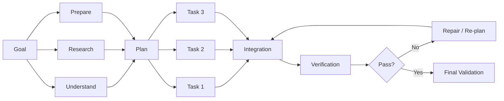

Tasks should have:

```yaml
task:
  id:
  parent:
  objective:
  inputs:
  outputs:
  dependencies:
  agent_type:
  tools:
  skills:
  model:
  priority:
  risk:
  budget:
  timeout:
  success_criteria:
  verification:
  state:
```

The graph must be mutable.

New information can:

- create tasks
- delete tasks
- merge tasks
- split tasks
- reprioritize tasks
- change dependencies
- spawn specialists
- trigger verification

---

# 8. Dynamic Mode Selection

Do not force users to manually select:

- plan mode
- research mode
- coding mode
- deep reasoning
- browser mode
- swarm mode
- verification mode

The supervisor should automatically select them.

## Example policy

```text
Simple factual question
    → Direct Answer

Unknown / changing information
    → Research Mode

Complex project
    → Planning Mode

Large coding task
    → Coding + Research + Test + Review

High-risk operation
    → Plan + Policy + Approval + Execute + Verify

Uncertain solution
    → Multi-hypothesis Exploration

Large independent workload
    → Parallel Swarm

Long-running optimization
    → Evolutionary / AVO Mode

Repeated failure
    → Recovery Mode

Low confidence
    → Verification / Critic Mode
```

---

# 9. Reasoning Architecture

Use multiple reasoning tiers.

## Tier 0 — Fast response

For:

- trivial transformations
- simple questions
- deterministic operations

## Tier 1 — Standard reasoning

For:

- normal coding
- normal research
- ordinary planning

## Tier 2 — Deep reasoning

For:

- architecture
- debugging
- complex analysis
- difficult coding

## Tier 3 — Deliberative reasoning

For:

- high-risk decisions
- ambiguous problems
- major architectural changes
- difficult multi-step problems

## Tier 4 — Search / Evolution

For:

- optimization
- unknown solution spaces
- repeated experimentation
- benchmark-driven improvement

The model router selects the cheapest model that can satisfy the quality target.

---

# 10. Model Router

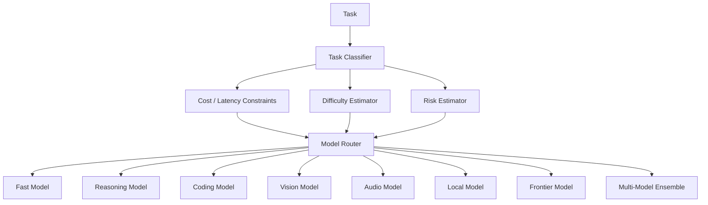

The router should consider:

```yaml
routing_features:
  task_complexity:
  required_context:
  modality:
  tool_requirements:
  latency_budget:
  token_budget:
  monetary_budget:
  reliability_requirement:
  model_history:
  domain:
  privacy_requirement:
```

---

# 11. Model Ensemble

For high-value tasks, use multiple independent attempts.

```text
Problem
   ├── Model A → solution A
   ├── Model B → solution B
   ├── Model C → solution C
   └── Specialist → solution D
              ↓
          Critic
              ↓
        Evidence Check
              ↓
       Consensus / Ranking
              ↓
          Final Result
```

Do not blindly vote on generated text.

Vote on:

- evidence
- tests
- constraints
- measurable outcomes
- logical consistency

---

# 12. Tool Fabric

The tool system should be treated as an operating system for the agent.

```text
Tool Registry
├── Search
├── Browser
├── Computer
├── Shell
├── Python
├── Files
├── Git
├── Database
├── HTTP/API
├── Containers
├── Cloud
├── Messaging
├── Scheduling
├── Image
├── Audio
├── Video
├── OCR
├── Vision
├── MCP
└── A2A
```

Each tool should expose:

```yaml
tool:
  name:
  description:
  input_schema:
  output_schema:
  capabilities:
  permissions:
  risk_level:
  cost:
  latency:
  reversibility:
  side_effects:
  sandbox_required:
  verification:
```

---

# 13. Tool Selection

Never expose every tool blindly.

Use capability retrieval.

```text
Task
 ↓
Capability Search
 ↓
Candidate Tools
 ↓
Permission Check
 ↓
Risk Assessment
 ↓
Cost / Latency Ranking
 ↓
Tool Selection
 ↓
Execution
```

Example:

```yaml
required_capabilities:
  - web_search
  - pdf_extraction
  - source_comparison
  - citation_generation
```

Then retrieve tools that satisfy those capabilities.

---

# 14. Skill System

Skills are reusable procedural knowledge.

Example:

```text
skills/
├── research/
│   ├── deep-research
│   ├── source-validation
│   ├── academic-search
│   └── competitive-analysis
│
├── coding/
│   ├── debugging
│   ├── architecture
│   ├── testing
│   ├── refactoring
│   └── code-review
│
├── data/
│   ├── sql
│   ├── statistics
│   └── visualization
│
├── operations/
│   ├── git
│   ├── deployment
│   └── monitoring
│
└── creative/
    ├── writing
    ├── image
    ├── video
    └── presentation
```

The agent should:

1. detect needed capabilities
2. search available skills
3. load only relevant skills
4. execute
5. record which skills worked
6. update skill quality metrics

---

# 15. Memory Architecture

Use multiple memory types.

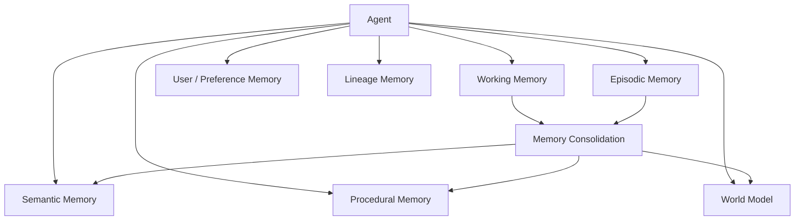

## Working memory

Current task state.

## Episodic memory

What happened during previous executions.

Example:

```yaml
episode:
  task:
  actions:
  observations:
  failures:
  successful_actions:
  final_result:
  confidence:
```

## Semantic memory

Facts and concepts.

## Procedural memory

How to perform tasks.

## World model

Persistent representation of the environment.

## Lineage memory

Critical for AVO-style evolution.

```yaml
candidate:
  id:
  parent_ids:
  hypothesis:
  changes:
  experiments:
  results:
  score:
  failure_modes:
  lessons:
```

---

# 16. Memory Retrieval

Memory retrieval should be task-aware.

```text
Current Task
 ↓
Retrieve relevant memories
 ↓
Rank by:
   semantic similarity
   recency
   reliability
   task similarity
   success history
 ↓
Context compression
 ↓
Inject into reasoning
```

Do not dump the entire memory database into context.

---

# 17. Context Engineering

Context should be assembled dynamically.

```text
SYSTEM POLICY
+
TASK OBJECTIVE
+
PROBLEM MODEL
+
CURRENT STATE
+
RELEVANT MEMORY
+
RELEVANT DOCUMENTS
+
RELEVANT TOOL DEFINITIONS
+
RELEVANT SKILLS
+
EVIDENCE
+
FAILURE HISTORY
+
SUCCESS CRITERIA
```

Use a context budget.

Priority:

```text
1. Safety constraints
2. Current objective
3. Current state
4. Success criteria
5. Critical evidence
6. Relevant memory
7. Tool/skill information
8. Background context
```

---

# 18. Research Engine

Research should be an autonomous subsystem.

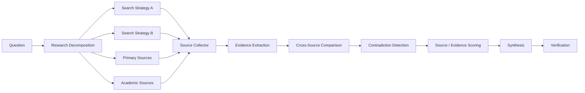

Research agent should automatically:

- identify unknowns
- search multiple queries
- find primary sources
- inspect documents
- compare sources
- identify conflicts
- timestamp information
- assess source quality
- record citations
- distinguish facts from inference

---

# 19. Evidence Matrix

Every important claim should be traceable.

```yaml
claim:
  id:
  statement:
  source_ids:
  evidence:
  confidence:
  freshness:
  source_quality:
  contradictory_sources:
  verification_status:
```

Example:

| Claim | Evidence | Source Quality | Confidence | Verified |
|---|---|---:|---:|---|
| X supports feature Y | Official documentation | High | 0.97 | Yes |
| Z is faster | Benchmark | High | 0.91 | Yes |
| Community prefers A | Discussions | Medium | 0.70 | Partial |

---

# 20. Observation Layer

The agent must distinguish:

```text
Intent
Observation
Interpretation
Hypothesis
Action
Result
```

Never collapse these into one memory.

Example:

```yaml
observation:
  source: test_runner
  raw_result: "17 passed, 2 failed"

interpretation:
  likely_issue: database migration mismatch

hypothesis:
  migration_003_is_missing: 0.73
```

---

# 21. Environment Interface

Every environment should expose:

```text
observe()
act(action)
evaluate()
reset()
checkpoint()
restore()
```

This makes the core agent domain-independent.

For coding:

```text
observe → repository state
act → edit/run commands
evaluate → tests/lint/build
```

For browser:

```text
observe → page/UI state
act → click/type/navigation
evaluate → task completion
```

For data analysis:

```text
observe → dataset/schema
act → transformation/query
evaluate → statistical/validation checks
```

For games:

```text
observe → game state
act → game action
evaluate → reward
```

---

# 22. Candidate / Hypothesis System

For uncertain tasks, do not immediately commit to one solution.

Maintain candidates.

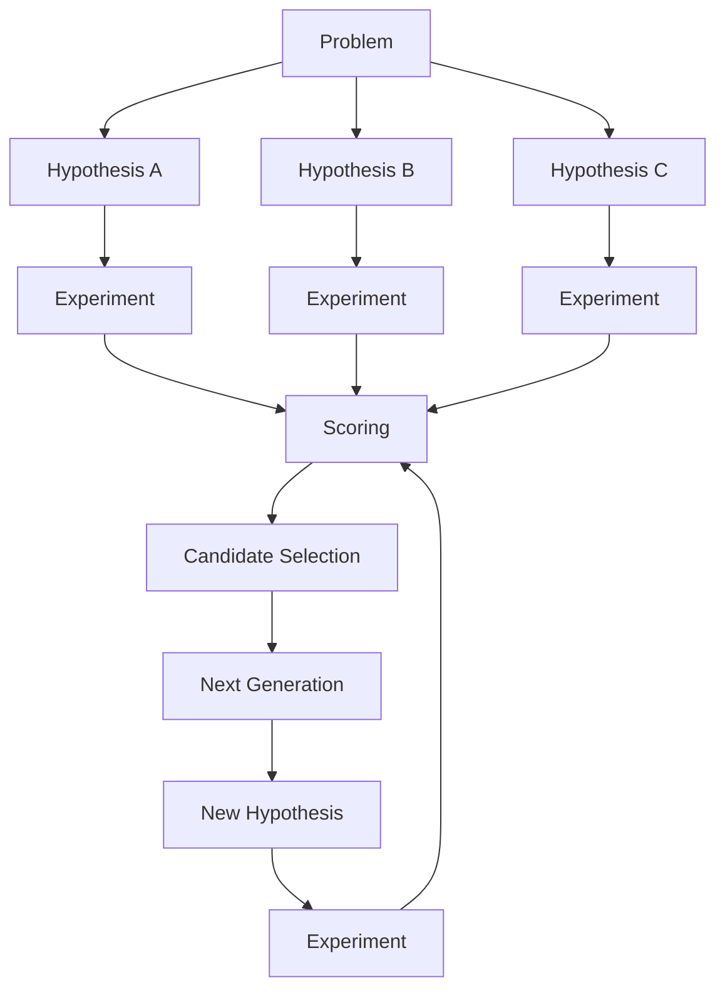

This is the generalized AVO idea.

---

# 23. AVO-Style Evolution Engine

The evolution engine should replace fixed mutation heuristics with an autonomous agent.

## Core loop

```text
Population / Candidate Set
        ↓
Select promising candidates
        ↓
Inspect lineage
        ↓
Retrieve domain knowledge
        ↓
Generate hypothesis
        ↓
Modify candidate
        ↓
Run experiment
        ↓
Measure result
        ↓
Critique failure
        ↓
Repair
        ↓
Score
        ↓
Update lineage
        ↓
Generate next candidate
```

The AVO paper describes this approach as elevating the agent from a candidate generator to the **variation operator itself**.

---

# 24. Candidate Population

```yaml
population:
  candidate_id:
  parent:
  generation:
  strategy:
  implementation:
  benchmark:
  score:
  confidence:
  status:
    - active
    - promising
    - rejected
    - champion
    - archived
```

Maintain:

- champion
- promising alternatives
- unexplored regions
- failed approaches
- known regressions

---

# 25. Exploration vs Exploitation

The supervisor should continuously balance:

```text
EXPLOIT
Improve best-known solution

vs

EXPLORE
Search unknown strategies
```

Possible policy:

```yaml
exploration:
  increase_when:
    - progress_stalls
    - confidence_low
    - local_optimum_detected
    - repeated_failures
    - candidate_diversity_low

exploitation:
  increase_when:
    - clear_best_candidate
    - benchmark_gain_consistent
    - risk_high
    - deadline_near
```

---

# 26. Verification Architecture

Verification must be a first-class system.

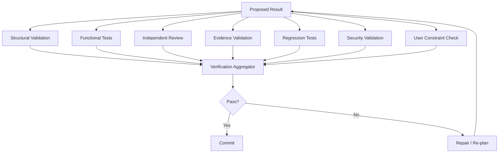

---

# 27. Confidence System

Never expose a single arbitrary confidence number without evidence.

Use:

```yaml
confidence:
  factual:
  procedural:
  execution:
  verification:
  source:
  overall:
```

Example:

```text
Factual confidence:       0.94
Execution confidence:     0.88
Verification confidence:  0.96
Source confidence:        0.91
Overall:                  0.92
```

Confidence should be derived from observable signals.

---

# 28. Critic System

Use independent critics.

Critic types:

- logical critic
- factual critic
- code critic
- security critic
- UX critic
- evidence critic
- requirement critic
- regression critic
- adversarial critic

The critic should receive:

```text
Objective
Candidate
Evidence
Tests
Constraints
Known failures
```

and return:

```yaml
critique:
  errors:
  omissions:
  risks:
  contradictions:
  improvements:
  verification_requirements:
```

---

# 29. Recovery Engine

Failure is expected.

The agent must classify failures.

```text
Failure
 ↓
Classify
 ├── Tool failure
 ├── Environment failure
 ├── Planning failure
 ├── Reasoning failure
 ├── Knowledge failure
 ├── Permission failure
 ├── Resource failure
 ├── Verification failure
 └── Unknown failure
```

Then choose:

```text
Retry
Repair
Alternative Tool
Alternative Model
Alternative Plan
Spawn Specialist
Rollback
Ask Human
Abort
```

Do not blindly retry.

---

# 30. Failure Memory

Every meaningful failure becomes structured data.

```yaml
failure:
  task:
  action:
  environment:
  error:
  root_cause:
  recovery:
  successful_fix:
  prevention:
```

Future tasks should retrieve similar failures.

---

# 31. Multi-Agent Swarm

Use agents when parallelism creates genuine value.

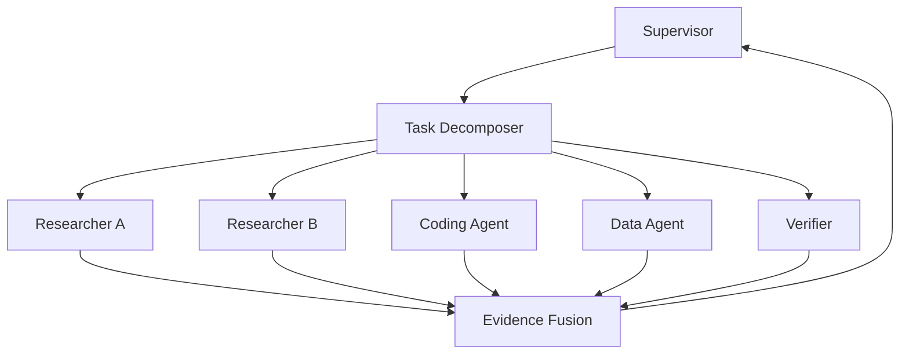

Do not spawn agents merely because "more agents" sounds advanced.

Use swarm execution when:

- tasks are independent
- expertise differs
- independent verification is valuable
- latency matters
- search space is broad

---

# 32. Agent-to-Agent Protocol

Each agent should advertise:

```yaml
agent_card:
  id:
  name:
  capabilities:
  input_schema:
  output_schema:
  tools:
  skills:
  authentication:
  trust_level:
  cost:
  latency:
  reliability:
```

Support:

- MCP for tools/context
- A2A for agent-to-agent communication
- internal RPC for local agents

NVIDIA's current NeMo Agent Toolkit supports both MCP and A2A, and provides framework-agnostic instrumentation, evaluation, profiling, prompt optimization, and agent performance primitives.

---

# 33. Parallel Execution

The orchestrator should dynamically choose:

```text
Serial
Parallel
Speculative
Competitive
Hierarchical
Map-Reduce
Pipeline
Debate
Ensemble
Evolutionary
```

Example:

```text
Research 10 independent sources
       ↓
Parallel collection
       ↓
Central evidence fusion
       ↓
Contradiction analysis
       ↓
Synthesis
```

---

# 34. Speculative Execution

For expensive or uncertain decisions:

```text
Current state
    ├── Strategy A
    ├── Strategy B
    └── Strategy C

Run cheaply/parallel
       ↓
Evaluate early
       ↓
Kill weak branches
       ↓
Invest resources in winner
```

This prevents committing too early.

---

# 35. Budget Manager

Every autonomous run needs a budget.

```yaml
budget:
  max_time:
  max_tokens:
  max_model_calls:
  max_tool_calls:
  max_parallel_agents:
  max_money:
  max_storage:
  max_external_actions:
```

The budget manager dynamically reallocates resources.

---

# 36. Risk Engine

Every action receives a risk score.

```yaml
risk:
  reversibility:
  externality:
  financial_impact:
  privacy_impact:
  security_impact:
  destructive_potential:
  uncertainty:
  authorization:
```

Risk classes:

```text
R0 — Read-only
R1 — Local reversible
R2 — External reversible
R3 — Important external action
R4 — Destructive / financial / sensitive
R5 — Critical action
```

Require progressively stronger verification and approval.

---

# 37. Policy Engine

Policy must operate outside the model.

```text
Model says:
    "execute X"

Policy engine checks:
    permissions
    user authorization
    tool scope
    secrets
    environment
    risk
    safety
    organizational rules

Then:
    allow
    deny
    require approval
    restrict
```

Never rely solely on prompting for security.

---

# 38. Sandboxed Execution

Use isolated environments for:

- code execution
- unknown scripts
- package installation
- browser automation
- self-improvement
- untrusted files
- model-generated programs

Recommended layers:

```text
Agent
 ↓
Policy
 ↓
Sandbox
 ↓
Tool
 ↓
Environment
```

---

# 39. Checkpointing

Long-running tasks require durable checkpoints.

```yaml
checkpoint:
  task_state:
  plan:
  graph:
  memories:
  candidates:
  metrics:
  environment_snapshot:
  tool_state:
  pending_actions:
  last_verified_result:
  timestamp:
```

If the process crashes:

```text
Restore checkpoint
 ↓
Validate environment
 ↓
Reconstruct context
 ↓
Continue
```

---

# 40. Transactional Actions

For consequential tasks:

```text
Prepare
 ↓
Preview
 ↓
Validate
 ↓
Commit
 ↓
Verify
```

Where possible:

- dry-run
- staging
- rollback
- idempotency
- transaction logs

---

# 41. Self-Improvement Architecture

Self-improvement should operate as a separate subsystem.

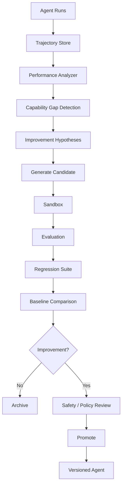

---

# 42. What Can Self-Improve?

Potential targets:

- prompts
- routing policies
- tool selection
- planning heuristics
- skill procedures
- memory retrieval
- context compression
- verification policies
- retry policies
- task decomposition
- agent collaboration
- code
- evaluation datasets
- benchmark suites

Do not allow uncontrolled changes to:

- security policy
- authentication
- approval rules
- audit system
- core sandbox boundaries

Those should require explicit governance.

---

# 43. Agent Genome

Represent the agent configuration as a versioned genome.

```yaml
agent_genome:
  system_policy_version:
  planner_version:
  router_version:
  tool_policy_version:
  memory_policy_version:
  verification_policy_version:
  skill_versions:
  prompt_versions:
  model_policy_version:
  swarm_policy_version:
```

Every experiment creates:

```text
parent genome
      ↓
mutation
      ↓
candidate genome
      ↓
benchmark
      ↓
promotion / rejection
```

---

# 44. Evaluation System

Never improve an agent without benchmarks.

Use:

## Offline tests

Fixed tasks with known expected outcomes.

## Online evaluation

Real task performance.

## Regression tests

Previously solved tasks.

## Adversarial tests

Designed to expose failure.

## Long-horizon tests

Hours/days of autonomous execution.

## Capability tests

Measure individual skills.

---

# 45. Agent Scorecard

```yaml
score:
  task_success:
  factual_accuracy:
  tool_accuracy:
  execution_success:
  verification_quality:
  efficiency:
  latency:
  cost:
  safety:
  recovery:
  autonomy:
  user_satisfaction:
```

Weighted score:

```text
Total =
  success
+ accuracy
+ verification
+ reliability
+ efficiency
+ safety
+ recovery
```

Weights should be task-dependent.

---

# 46. Trajectory Evaluation

Evaluate not only the final answer.

Evaluate:

```text
Goal understanding
Planning
Tool choice
Evidence quality
Actions
Intermediate results
Error recovery
Verification
Final output
```

A wrong answer reached efficiently is still wrong.

A correct answer reached through unsafe actions may also be unacceptable.

---

# 47. Observability

Trace every execution.

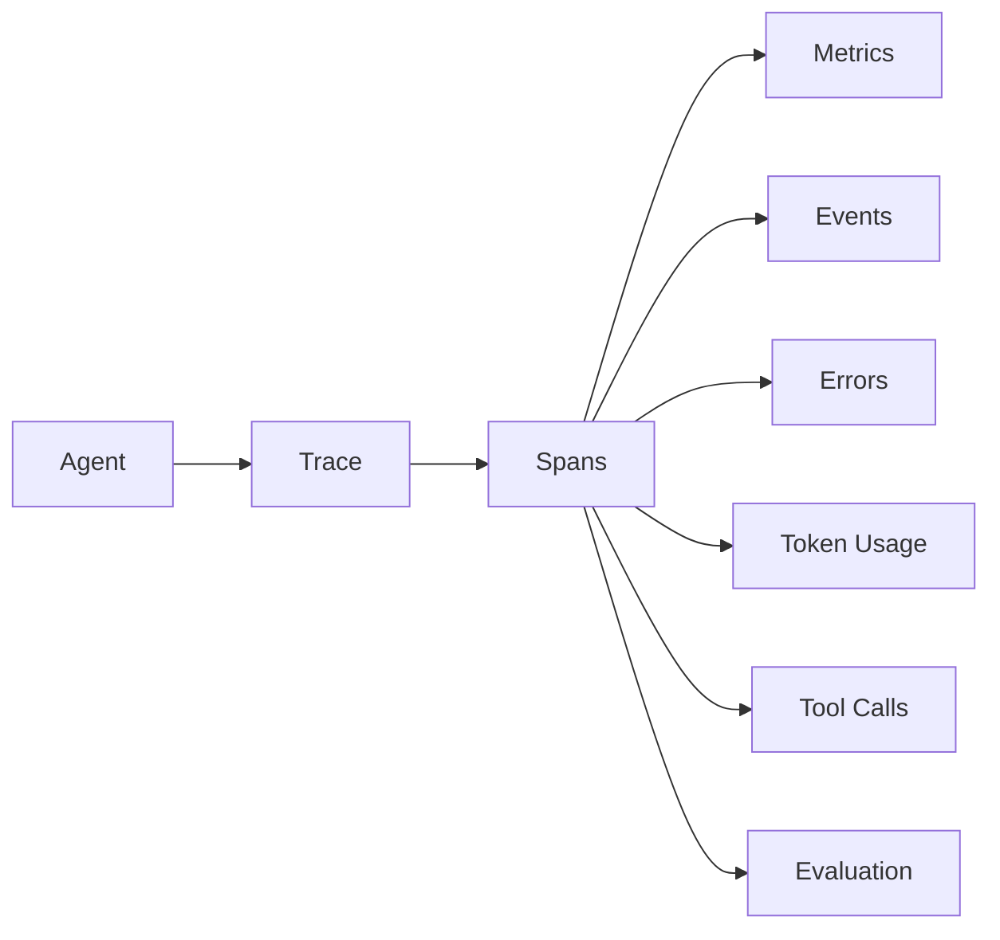

Track:

- latency
- model calls
- token usage
- tool calls
- failures
- retries
- task progress
- evidence
- confidence
- cost
- benchmark scores

Use OpenTelemetry-compatible tracing where practical.

---

# 48. Event Log

Use an append-only event stream.

```yaml
event:
  timestamp:
  run_id:
  task_id:
  actor:
  type:
  input:
  output:
  evidence:
  risk:
  status:
```

Examples:

```text
TASK_CREATED
PLAN_CREATED
TOOL_SELECTED
TOOL_STARTED
TOOL_COMPLETED
OBSERVATION_RECEIVED
HYPOTHESIS_CREATED
EXPERIMENT_STARTED
EXPERIMENT_COMPLETED
FAILURE_DETECTED
RECOVERY_STARTED
VERIFICATION_STARTED
VERIFICATION_PASSED
COMMIT
CHECKPOINT
HUMAN_APPROVAL
```

---

# 49. Storage Architecture

Recommended logical stores:

```text
PostgreSQL
    → transactional state

Redis
    → ephemeral state / queues / locks

Object Storage
    → files / artifacts / trajectories

Vector Database
    → semantic memory

Graph Database
    → relationships / world model / lineage

Time-Series Store
    → metrics

Event Store
    → audit / trajectory

Git
    → code / agent artifacts / versions
```

For a lightweight local deployment, these can initially be consolidated.

---

# 50. Queue / Scheduler

The scheduler manages:

- priorities
- dependencies
- retries
- deadlines
- resource limits
- parallelism
- fairness
- cancellation

Example:

```yaml
job:
  priority: high
  dependencies:
  concurrency_limit: 4
  retry_policy:
    max_attempts: 3
    strategy: exponential_backoff
  timeout:
  deadline:
```

---

# 51. Human-in-the-Loop

Human involvement should be **adaptive**, not mandatory for every action.

Ask the user when:

- ambiguity materially changes outcome
- authorization is required
- action is high-risk
- evidence conflicts
- budget is exceeded
- policy requires approval

Do not ask when:

- the task is routine
- reversible
- low risk
- objective is clear
- policy permits autonomy

---

# 52. Approval Gateway

```text
Agent proposes action
       ↓
Risk engine
       ↓
Policy engine
       ↓
Approval threshold
       ├── Auto approve
       ├── Request user
       └── Deny
```

The agent should explain:

```text
Action
Reason
Risk
Expected outcome
Rollback
Evidence
```

---

# 53. User Intent Compiler

The first user prompt should be enough to initiate the system.

Convert natural language into:

```yaml
intent:
  objective:
  desired_output:
  constraints:
  preferences:
  deadline:
  budget:
  autonomy_level:
  risk_tolerance:
```

Then automatically infer:

```text
task type
required skills
required tools
research requirement
verification requirement
agent count
model tier
execution strategy
```

The user should not have to manually invoke every mode.

---

# 54. Slash Commands

Slash commands should be optional shortcuts, not required workflow controls.

Examples:

```text
/plan
/research
/deep-research
/code
/debug
/test
/review
/verify
/browser
/swarm
/parallel
/evolve
/benchmark
/checkpoint
/resume
/status
/explain
/rollback
```

Internally, the supervisor can invoke the same capabilities automatically.

---

# 55. Agent Operating Modes

```text
DIRECT
PLAN
RESEARCH
DEEP_RESEARCH
CODE
DEBUG
BROWSER
COMPUTER
DATA
SWARM
DEBATE
VERIFY
RECOVER
EVOLVE
OPTIMIZE
BACKGROUND
DAEMON
```

Mode selection should be policy-driven.

---

# 56. Background / Daemon Mode

For long-running work:

```text
Task Queue
 ↓
Scheduler
 ↓
Supervisor
 ↓
Agents
 ↓
Checkpoint
 ↓
Sleep
 ↓
Wake
 ↓
Observe
 ↓
Continue
```

Support:

- scheduled tasks
- event-triggered tasks
- monitoring
- periodic research
- repository monitoring
- benchmark monitoring
- autonomous maintenance

---

# 57. Continuous Company / Organization Mode

A higher-level system can model an organization:

```text
CEO / Executive Agent
        ↓
Strategy
        ↓
Departments
 ├── Engineering
 ├── Research
 ├── Product
 ├── Marketing
 ├── Finance
 ├── Operations
 └── QA / Security
```

Each department can be represented by specialized agents.

The executive supervisor maintains:

- company objectives
- projects
- budgets
- KPIs
- dependencies
- risks
- priorities

---

# 58. Knowledge Graph

Build a persistent world model.

```text
Entity
 ├── people
 ├── projects
 ├── repositories
 ├── documents
 ├── companies
 ├── technologies
 ├── tasks
 ├── agents
 └── environments

Relations
 ├── depends_on
 ├── created_by
 ├── contradicts
 ├── supports
 ├── derived_from
 ├── succeeded_by
 └── failed_because
```

This enables long-term reasoning beyond vector similarity.

---

# 59. Artifact System

Every major task should produce versioned artifacts.

Examples:

```text
research-report
code-change
dataset
analysis
document
presentation
configuration
benchmark
agent-skill
agent-policy
```

Artifact metadata:

```yaml
artifact:
  id:
  version:
  parent:
  creator:
  task:
  evidence:
  validation:
  checksum:
  status:
```

---

# 60. Reproducibility

Every result should ideally be reproducible from:

```text
Task
+
Agent version
+
Model
+
Prompt/policy version
+
Tool versions
+
Environment
+
Input artifacts
+
Random seeds
+
Configuration
```

This is essential for debugging autonomous behavior.

---

# 61. Security Architecture

Use defense in depth.

```text
User Authentication
       ↓
Authorization
       ↓
Agent Identity
       ↓
Policy Engine
       ↓
Tool Permissions
       ↓
Sandbox
       ↓
Secrets Broker
       ↓
External System
```

Never expose secrets directly to the model when avoidable.

Use scoped credentials.

---

# 62. Secret Management

Agents should receive:

```text
capability token
```

rather than:

```text
raw API key
```

Prefer:

```text
Agent
 ↓
Secret Broker
 ↓
Scoped credential
 ↓
Tool
```

Audit every secret-backed action.

---

# 63. Prompt Injection Defense

Untrusted content includes:

- webpages
- documents
- emails
- source code
- tool outputs
- PDFs
- databases
- external APIs

Treat them as **data**, not instructions.

Pipeline:

```text
External content
 ↓
Content isolation
 ↓
Instruction classification
 ↓
Trust labeling
 ↓
Policy filtering
 ↓
Reasoning
```

---

# 64. Source Trust Levels

```text
T0 — User-controlled trusted instruction
T1 — Verified internal system
T2 — Official external documentation
T3 — Reputable external source
T4 — Unknown source
T5 — Untrusted generated content
```

Trust should affect how strongly information influences decisions.

---

# 65. Data Provenance

Every important piece of knowledge should carry:

```yaml
provenance:
  source:
  timestamp:
  author:
  extraction_method:
  transformation:
  confidence:
  trust_level:
```

---

# 66. Context Firewall

Before information enters high-trust reasoning:

```text
External Data
 ↓
Sanitizer
 ↓
Parser
 ↓
Trust Label
 ↓
Evidence Store
 ↓
Context Builder
```

This reduces prompt injection and accidental instruction execution.

---

# 67. Computer Use Architecture

For GUI tasks:

```text
Vision
 ↓
UI State Representation
 ↓
Action Planner
 ↓
Policy Check
 ↓
Mouse / Keyboard Action
 ↓
Observation
 ↓
Verification
```

Never rely only on the model saying "click succeeded."

Observe the resulting UI state.

---

# 68. Browser Agent

Browser subsystem:

```text
Browser Controller
├── navigation
├── DOM extraction
├── screenshot
├── accessibility tree
├── click
├── type
├── scroll
├── download
└── state verification
```

Use multiple observations:

```text
DOM
+
Screenshot
+
Accessibility tree
+
URL
+
Network/result state
```

---

# 69. Coding Agent Architecture

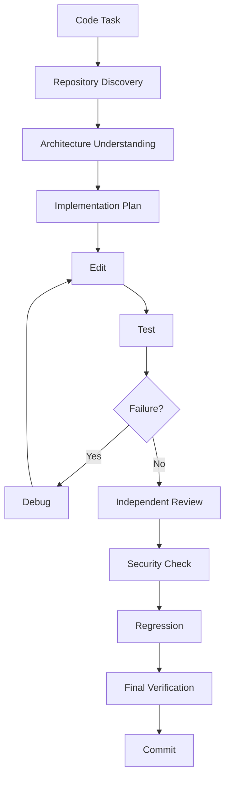

Include:

- repository map
- dependency analysis
- static analysis
- tests
- lint
- type check
- build
- security scan
- diff review
- regression suite

---

# 70. Research + Coding Combined Workflow

For difficult implementation tasks:

```text
User Goal
 ↓
Research existing approaches
 ↓
Inspect current code
 ↓
Build architecture model
 ↓
Plan
 ↓
Implement
 ↓
Test
 ↓
Research failures
 ↓
Repair
 ↓
Review
 ↓
Benchmark
 ↓
Document
```

This prevents premature coding.

---

# 71. Deep Research Mode

A high-quality research run should have multiple passes.

### Pass 1 — Discovery

Find terminology and major sources.

### Pass 2 — Primary-source collection

Prefer:

- official documentation
- papers
- source repositories
- standards
- original announcements

### Pass 3 — Verification

Cross-check important claims.

### Pass 4 — Contradiction analysis

Identify disagreements.

### Pass 5 — Synthesis

Build conclusions.

### Pass 6 — Gap analysis

Find unanswered questions.

### Pass 7 — Final verification

Validate critical claims.

---

# 72. Planning Quality

A plan should contain:

```yaml
plan:
  objective:
  assumptions:
  phases:
  tasks:
  dependencies:
  tools:
  agents:
  risks:
  verification:
  rollback:
  success_criteria:
```

Do not consider "I'll do X then Y" sufficient for complex work.

---

# 73. Stop Conditions

Autonomous agents often fail by continuing indefinitely.

Define:

```text
SUCCESS
FAILURE
BLOCKED
NO_PROGRESS
BUDGET_EXCEEDED
RISK_EXCEEDED
HUMAN_REQUIRED
```

Stop when:

```text
success criteria satisfied
AND
verification passed
AND
no critical unresolved issues
```

---

# 74. Progress Detection

Measure actual progress.

```yaml
progress:
  tasks_completed:
  objective_distance:
  evidence_coverage:
  quality_score:
  benchmark_score:
  unresolved_count:
  repeated_action_count:
```

Detect loops such as:

```text
same tool
same input
same failure
same result
```

Then force strategy change.

---

# 75. Stagnation Detector

Trigger recovery when:

```text
N iterations without improvement
OR
quality decreases
OR
same failure repeats
OR
candidate diversity collapses
OR
resource consumption grows without progress
```

Recovery:

```text
change model
change plan
change tool
spawn critic
search external knowledge
restore checkpoint
explore alternative
ask human
```

---

# 76. Self-Debugging

The agent should debug its own trajectory.

```text
Failure
 ↓
Replay trajectory
 ↓
Find first divergence
 ↓
Identify bad assumption
 ↓
Generate correction
 ↓
Re-run from checkpoint
 ↓
Verify
```

The key is finding the **first incorrect assumption**, not merely patching the final error.

---

# 77. Counterfactual Reasoning

For important decisions:

```text
What if strategy A?
What if strategy B?
What if assumption X is false?
What if tool result is wrong?
What if source is stale?
```

Use counterfactual branches before irreversible actions.

---

# 78. Adversarial Verification

Before finalizing:

```text
Assume the solution is wrong.
Try to disprove it.
```

Ask:

- What could invalidate this?
- Which requirement is missing?
- Which source might be wrong?
- What edge case breaks this?
- What test was not run?
- What assumption is unsupported?

---

# 79. Final Answer Compiler

The final output should be generated from verified state.

```text
Raw trajectory
 ↓
Verified facts
 ↓
Verified artifacts
 ↓
Evidence matrix
 ↓
User requirements
 ↓
Output compiler
 ↓
Final answer
```

Do not simply ask the model to summarize its own trajectory.

---

# 80. Architecture for Any Task

Universal pipeline:

```text
USER
 ↓
INTENT
 ↓
PROBLEM MODEL
 ↓
CONTEXT
 ↓
PLAN
 ↓
TASK GRAPH
 ↓
RESOURCE ROUTING
 ↓
AGENTS
 ↓
TOOLS
 ↓
ENVIRONMENT
 ↓
OBSERVATION
 ↓
EVALUATION
 ↓
CRITIQUE
 ↓
RECOVERY / ITERATION
 ↓
VERIFICATION
 ↓
COMMIT
 ↓
MEMORY
 ↓
FINAL OUTPUT
 ↓
POST-RUN LEARNING
```

---

# 81. Recommended Core Services

```text
gateway-service
supervisor-service
planner-service
task-graph-service
agent-runtime
model-router
tool-runtime
skill-runtime
memory-service
research-service
browser-service
computer-use-service
code-execution-service
evaluation-service
verification-service
critic-service
recovery-service
policy-service
approval-service
checkpoint-service
artifact-service
telemetry-service
self-improvement-service
scheduler-service
```

---

# 82. Logical Repository Structure

```text
agent/
├── core/
│   ├── supervisor/
│   ├── planner/
│   ├── state/
│   ├── context/
│   └── lifecycle/
│
├── runtime/
│   ├── executor/
│   ├── scheduler/
│   ├── sandbox/
│   └── checkpoints/
│
├── agents/
│   ├── research/
│   ├── coding/
│   ├── browser/
│   ├── data/
│   ├── critic/
│   └── verifier/
│
├── models/
│   ├── router/
│   ├── providers/
│   └── ensembles/
│
├── tools/
│   ├── registry/
│   ├── browser/
│   ├── shell/
│   ├── filesystem/
│   ├── database/
│   └── mcp/
│
├── skills/
│
├── memory/
│   ├── working/
│   ├── episodic/
│   ├── semantic/
│   ├── procedural/
│   └── lineage/
│
├── research/
│
├── evaluation/
│
├── verification/
│
├── safety/
│   ├── policy/
│   ├── permissions/
│   └── secrets/
│
├── evolution/
│   ├── candidates/
│   ├── benchmarks/
│   ├── mutation/
│   └── promotion/
│
├── observability/
│
└── interfaces/
    ├── api/
    ├── cli/
    ├── ui/
    └── a2a/
```

---

# 83. Technology Strategy

A practical implementation can use a polyglot architecture.

## Python

Best suited for:

- orchestration
- agents
- ML
- evaluation
- research
- data
- model integrations

## TypeScript

Best suited for:

- desktop UI
- web UI
- browser automation
- frontend
- Electron
- developer tooling

## Rust / Go

Optional for:

- high-performance runtime
- sandboxing
- networking
- low-level infrastructure

Do not force everything into one language.

---

# 84. Framework Strategy

The architecture should remain framework-agnostic.

Potential building blocks include:

- LangGraph / Deep Agents
- NVIDIA NeMo Agent Toolkit
- MCP
- A2A
- OpenTelemetry
- container runtimes
- vector databases
- PostgreSQL
- Redis
- object storage

NVIDIA's NeMo Agent Toolkit is explicitly framework-agnostic and currently provides agent instrumentation, observability, offline evaluation, prompt optimization, reinforcement-learning support, parallel/speculative execution primitives, MCP, and A2A support.

---

# 85. NVIDIA-Inspired Stack Mapping

```text
YOUR AGENT
│
├── Executive Harness
│
├── Reasoning Models
│   └── Nemotron / other providers / local models
│
├── Agent Runtime
│   └── custom runtime + optional NeMo Agent Toolkit
│
├── Inference
│   └── NIM / vLLM / other serving
│
├── Tool Protocol
│   └── MCP
│
├── Agent Protocol
│   └── A2A
│
├── Observability
│   └── OpenTelemetry + agent traces
│
├── Evaluation
│   └── benchmark + regression suite
│
├── Safety
│   └── policy + guardrails + sandbox
│
└── Infrastructure
    └── local GPU / cloud GPU / CPU
```

NVIDIA currently describes NeMo, NIM, and Blueprints as core building blocks for agentic AI, while its broader stack also includes optimized inference infrastructure.

---

# 86. General-Purpose Environment Adapter

The most important abstraction is:

```python
class Environment:
    def observe(self):
        ...

    def act(self, action):
        ...

    def evaluate(self):
        ...

    def checkpoint(self):
        ...

    def restore(self, checkpoint):
        ...
```

Then:

```python
class CodingEnvironment(Environment):
    ...

class BrowserEnvironment(Environment):
    ...

class ResearchEnvironment(Environment):
    ...

class DataEnvironment(Environment):
    ...

class DesktopEnvironment(Environment):
    ...

class SimulationEnvironment(Environment):
    ...
```

The reasoning engine remains mostly unchanged.

This is how a single core agent can transfer across domains.

---

# 87. Universal Agent Loop

```python
while not supervisor.finished():

    state = supervisor.observe_global_state()

    problem = supervisor.update_problem_model(state)

    context = memory.build_context(problem, state)

    strategy = supervisor.select_strategy(
        problem=problem,
        context=context,
        risk=state.risk,
        budget=state.budget,
    )

    tasks = planner.expand(strategy, state)

    assignments = router.allocate(tasks)

    results = executor.run(assignments)

    observations = environment.collect_observations(results)

    evaluation = evaluator.evaluate(
        objective=problem.objective,
        results=results,
        observations=observations,
        criteria=problem.success_criteria,
    )

    critique = critic.inspect(
        state=state,
        results=results,
        evaluation=evaluation,
    )

    memory.record(
        state=state,
        results=results,
        evaluation=evaluation,
        critique=critique,
    )

    if evaluation.passed:
        supervisor.consider_commit()

    elif critique.recoverable:
        supervisor.replan()

    elif supervisor.should_explore():
        supervisor.spawn_alternative()

    elif supervisor.requires_human():
        supervisor.request_approval()

    else:
        supervisor.abort_or_escalate()
```

---

# 88. Important Architectural Principle

Do not create a giant monolithic "super agent".

Use:

```text
One executive controller
+
Many replaceable specialists
+
One shared state model
+
One policy layer
+
One evaluation layer
+
One memory system
+
One tool fabric
```

This gives you:

- modularity
- debugging
- replacement
- experimentation
- scalability
- safer self-improvement

---

# 89. Accuracy Optimization Stack

For maximum accuracy, use multiple layers:

```text
MODEL QUALITY
    ↓
CONTEXT QUALITY
    ↓
TOOL QUALITY
    ↓
EVIDENCE QUALITY
    ↓
PLANNING QUALITY
    ↓
EXECUTION QUALITY
    ↓
OBSERVATION QUALITY
    ↓
VERIFICATION QUALITY
    ↓
RECOVERY QUALITY
    ↓
MEMORY QUALITY
```

Improving only the model leaves large sources of failure untouched.

---

# 90. Reliability Formula

A useful conceptual model:

```text
Agent Reliability
≈
Model
× Context
× Tools
× Planning
× Execution
× Observation
× Verification
× Recovery
× Memory
× Safety
```

This is not a scientific equation; it is an architectural heuristic.

If any multiplier is weak, the whole system becomes fragile.

---

# 91. Minimum Viable Frontier Architecture

Do not build every component at once.

### Phase 1

```text
Supervisor
Planner
Tool Runtime
Memory
Basic Verification
Checkpoint
```

### Phase 2

```text
Research Engine
Critic
Recovery
Dynamic Routing
Task Graph
```

### Phase 3

```text
Multi-Agent
A2A
MCP
Advanced Evaluation
Observability
```

### Phase 4

```text
Evolution Engine
Candidate Lineage
Self-Improvement
Benchmark Automation
```

### Phase 5

```text
Long-running Autonomous Operations
Organization Mode
Advanced World Model
Continuous Learning
```

---

# 92. Recommended Development Order

```text
1. State machine
2. Supervisor
3. Tool registry
4. Task graph
5. Planner
6. Executor
7. Observation layer
8. Verification
9. Memory
10. Recovery
11. Research
12. Multi-agent
13. Evaluation
14. Observability
15. Self-improvement
16. Evolution
```

Do not start with self-improvement.

First make the base agent observable and measurable.

---

# 93. First Benchmark Suite

Create at least:

```text
10 research tasks
10 coding tasks
10 debugging tasks
10 browser tasks
10 data tasks
10 document tasks
10 multi-step tasks
10 long-horizon tasks
10 adversarial tasks
10 recovery tasks
```

Then track every version.

---

# 94. Long-Horizon Benchmark

Example:

```text
Task:
"Build feature X in repository Y."

Expected autonomous trajectory:

1. inspect repo
2. understand architecture
3. inspect dependencies
4. research relevant approach
5. create plan
6. implement
7. test
8. encounter failure
9. diagnose
10. repair
11. run full suite
12. review diff
13. security check
14. benchmark
15. document
16. commit
17. verify final state
```

This tests the actual harness, not merely language generation.

---

# 95. Agent Evolution Benchmark

Run:

```text
Baseline Agent
     ↓
100 tasks
     ↓
Trajectory Analysis
     ↓
Identify failures
     ↓
Generate improvement
     ↓
Candidate Agent
     ↓
100 identical tasks
     ↓
Compare
```

Promote only when:

```text
new_score > old_score
AND
no critical regression
AND
safety unchanged/improved
```

---

# 96. Champion / Lineage System

Maintain:

```text
Champion
 ├── Candidate A
 │    ├── A1
 │    └── A2
 │
 ├── Candidate B
 │    └── B1
 │
 └── Candidate C
```

Each candidate has:

- parent
- mutation
- hypothesis
- benchmark
- score
- failure modes

This makes autonomous evolution inspectable.

---

# 97. Continuous Learning Without Catastrophic Drift

Use:

```text
New Experience
 ↓
Candidate Memory
 ↓
Validation
 ↓
Consolidation
 ↓
Long-Term Memory
```

Never automatically promote every experience into permanent truth.

Memory should have:

```text
confidence
source
freshness
validation count
contradictions
```

---

# 98. Knowledge Revalidation

Facts should expire when appropriate.

```yaml
knowledge:
  created:
  last_verified:
  expiration_policy:
  freshness_class:
```

Examples:

```text
software version → rapidly expires
API behavior → medium
mathematical theorem → stable
company information → changes
personal preference → user-controlled
```

---

# 99. Agent Constitution

Create an immutable high-level constitution.

Example principles:

```text
1. Understand before acting.
2. Preserve user intent.
3. Do not fabricate evidence.
4. Distinguish observation from inference.
5. Verify consequential work.
6. Prefer reversible actions.
7. Minimize unnecessary cost.
8. Recover intelligently from failure.
9. Ask for authorization when required.
10. Never silently weaken safety controls.
11. Record important decisions.
12. Stop when the objective is actually complete.
```

---

# 100. Final Architecture

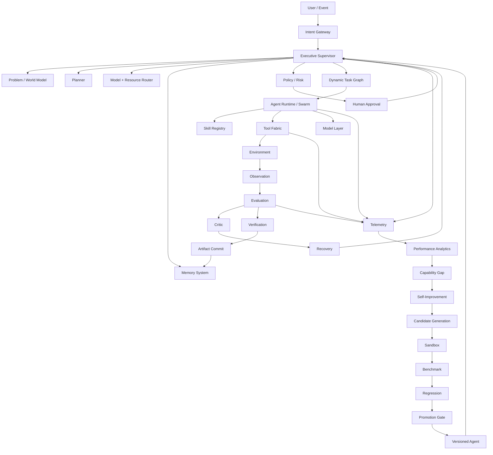

---

# 101. The Key Difference From a Normal AI Agent

A conventional agent:

```text
Prompt
 ↓
LLM
 ↓
Tool
 ↓
Answer
```

A frontier autonomous harness:

```text
Goal
 ↓
Intent Compiler
 ↓
Problem Model
 ↓
Executive Supervisor
 ↓
Dynamic Plan
 ↓
Task Graph
 ↓
Model Routing
 ↓
Skill Discovery
 ↓
Tool Discovery
 ↓
Multi-Agent Execution
 ↓
Environment Interaction
 ↓
Observation
 ↓
Evidence
 ↓
Evaluation
 ↓
Critique
 ↓
Recovery
 ↓
Verification
 ↓
Commit
 ↓
Memory
 ↓
Trajectory Analysis
 ↓
Self-Improvement
 ↓
Benchmark
 ↓
Promotion
 ↓
Better Agent
```

That is the architecture to target.

---

# 102. Relationship to NVIDIA AVO

NVIDIA's published AVO architecture provides the most important conceptual foundation:

```text
Persistent Memory
       +
Tools / Environment
       +
Agentic Loop
       +
Execution Feedback
       +
Candidate / Lineage Management
       +
Supervision
```

The AVO research describes autonomous agents inspecting context, planning, implementing changes, evaluating outcomes, consulting domain knowledge and lineage, and repeatedly revising candidates. NVIDIA's August 2026 report further describes AVO as a general-purpose architecture whose core loop can transfer across domains by changing the environment tools and evaluation mechanism.

This design generalizes those ideas into a complete agent operating system by adding:

- universal intent compilation
- dynamic task graphs
- model routing
- skill routing
- multi-agent orchestration
- research/evidence infrastructure
- explicit verification
- policy and security
- durable checkpointing
- observability
- benchmark-driven self-improvement
- candidate promotion
- organization/daemon modes

---

# 103. Practical North Star

The final system should behave like this:

```text
User:
"Build X."

Agent:

1. Understands X.
2. Determines what it does not know.
3. Researches automatically.
4. Builds a problem model.
5. Creates a plan.
6. Selects the required skills.
7. Selects the required tools.
8. Selects appropriate models.
9. Splits the work.
10. Runs independent work in parallel where useful.
11. Maintains durable state.
12. Observes every meaningful result.
13. Tests its assumptions.
14. Detects failures.
15. Recovers instead of blindly retrying.
16. Uses critics and independent verification.
17. Explores alternatives when uncertain.
18. Commits only verified results.
19. Records what worked and failed.
20. Measures its own performance.
21. Generates possible improvements.
22. Tests improvements in a sandbox.
23. Runs regression benchmarks.
24. Promotes only demonstrably better versions.
25. Continues until the success criteria are satisfied.
26. Stops cleanly.
27. Produces the final verified artifact.
```

That is the target architecture for a genuinely autonomous, general-purpose agent harness.

---

# 104. Sources

1. NVIDIA Developer Blog — **“NVIDIA AVO Reaches 100% on ARC-AGI-3, Demonstrating a Frontier-Level General-Purpose Architecture for Long-Horizon Autonomous Agents”**, Aug. 21, 2026.
   https://developer.nvidia.com/blog/nvidia-avo-reaches-100-on-arc-agi-3-demonstrating-a-frontier-level-general-purpose-architecture-for-long-horizon-autonomous-agents/

2. NVIDIA / arXiv — **“AVO: Agentic Variation Operators for Autonomous Evolutionary Search”**, Mar. 25, 2026.
   https://arxiv.org/abs/2603.24517

3. NVIDIA — **AI Agents: Built to Reason, Plan, Act**.
   https://www.nvidia.com/en-us/ai/

4. NVIDIA — **NeMo Agent Toolkit**.
   https://github.com/NVIDIA/NeMo-Agent-Toolkit

5. NVIDIA — **NVIDIA NIM / AI platform**.
   https://www.nvidia.com/en-in/ai/

6. NVIDIA — **Isaac GR00T / general-purpose robotics platform**.
   https://developer.nvidia.com/isaac/gr00t

---

## Final implementation principle

**The model should generate intelligence.  
The harness should generate reliability.  
The environment should generate feedback.  
The evaluator should generate truth signals.  
The memory should preserve learning.  
The supervisor should generate persistence.  
The evolution engine should generate improvement.**

The combination—not the model alone—is the agent.
