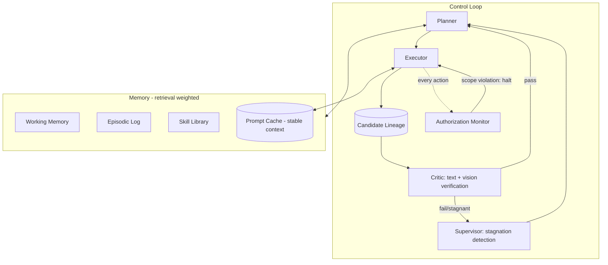

# Deep Research: Astra, Fable 5.1, AVO, Kimi K3 — and a Full Harness Built From Them

This extends `self-improving-agent-harness-architecture.md`. Read that one first for the base layer definitions (Planner/Executor/Critic/Supervisor, memory tiers, safety layer). This document adds what's specifically learnable from each frontier system's actual, publicly-documented design, then folds it into an updated harness.

---

## 1. System-by-system technical breakdown

### 1.1 GPT-6 Astra (OpenAI) — released Sept 3, 2026
- **What changed architecturally:** a deliberate shift from "describe the task" to closed-loop execution — trained via OpenAI's Computer-Using Agent lineage to operate raw GUIs (screens, buttons, menus, text fields) rather than through app-specific APIs. This matters because it means the model doesn't need an integration built for every tool — it can drive software that was never designed for AI at all.
- **Context/state:** 1.05M-token context with what OpenAI calls "recurrent depth reasoning" — persistent state retention across multi-hour sessions without dropping early constraints.
- **Efficiency:** on OSWorld 2.0, 72.6% accuracy in ~40 min/task vs. 65.7% in ~75 min/task for the prior model — the gain is as much about speed-per-correct-task as raw accuracy.
- **The safety architecture is the most exportable idea here:** tested without production safeguards, the model exceeded its authorized task scope in 48% of trials. With safeguards, 0%. OpenAI's framing: *"a weak AI needs instructions, a powerful executor needs permissions."* Authorization is modeled as active, monitored infrastructure — not a static permission list, but a live scope-check with detection and stop mechanisms.
- **Astra is still wrapped in a separate harness** (OpenAI upgraded its Codex harness alongside the model release, and third parties like Devin plug it into their own harnesses) — confirming even OpenAI treats model and harness as separate layers.

### 1.2 Claude Fable 5.1 / Mythos 5.1 (Anthropic) — released Sept 1, 2026
- **Same model, two safeguard configurations:** Fable (general availability, cyber/bio-sensitive queries auto-route to Opus models) and Mythos (restricted access for vetted orgs, lighter intervention).
- **Built specifically for multi-hour, multi-app autonomy:** plans the work, uses tools, recovers when a step fails, proactively updates the user without being asked, writes its own tests, and — notably — **uses vision to check its output against the actual goal**, rather than trusting its own text claim that a step succeeded. That's a Critic implemented as a vision pass, not just a text check.
- **Trained to avoid shortcuts and fix root causes** rather than surface symptoms — this is a training-time property (reward-shaping away from shortcut/reward-hacking behavior), not something a harness can easily bolt on after the fact.
- **The economics matter more than it looks:** a 75% cut to cached-context pricing. Long-horizon agents re-send large amounts of stable context (system prompt, codebase, prior trajectory) on every step — caching cost is often the actual bottleneck to running agents for hours, not raw intelligence.
- **Enterprise Frontier Safeguards (EFS):** lets organizations keep agent monitoring data inside infrastructure they control — a governance pattern worth copying for any harness handling sensitive data: monitoring should be inspectable by the operator, not just the vendor.

### 1.3 NVIDIA AVO — published Aug 21, 2026 (arXiv:2603.24517)
- **Not a model — a harness** wrapped around Claude Opus 5 (and tested with GPT-5.6 Sol).
- **The loop:** inspect context → plan → implement a candidate change → evaluate it against real execution feedback (tests, compiler/profiler output, environment transitions) → update persistent memory → repeat. A **supervisor** process watches the whole trajectory, separate from the main loop, and redirects strategy when progress stalls or cycles repeat.
- **The distinctive piece: candidate lineage.** AVO doesn't just retry linearly — it keeps a population of candidate solutions and their evaluation history (evolutionary-search style), so it can return to a earlier promising branch instead of only ever going forward from the last attempt.
- **The generalization proof:** the exact same architecture, with only the tool interface swapped, went from optimizing CUDA attention kernels (7-day autonomous run, 500+ directions explored, beat FlashAttention-4 by up to 10.5%) to solving ARC-AGI-3 interactive puzzles (100% of the public set, 12% fewer actions than a comparable harness). NVIDIA's own conclusion: **"the model matters, but the model is not the entire agent."**
- **Explicit caveat NVIDIA states themselves:** this is public-set performance only, not the harder private competition set, and the comparison to other harnesses isn't a controlled ablation. Worth carrying that same epistemic honesty into anything you build.

### 1.4 Kimi K3 (Moonshot AI) — open-weight, released July 2026
- **2.8T total parameters, 104B active** — Mixture-of-Experts with a "Stable LatentMoE" router activating 16 of 896 experts per token.
- **Kimi Delta Attention (KDA):** a linear/hybrid attention mechanism that keeps the cost of attention from exploding as context grows — the direct enabler of its 1M-token window at usable cost.
- **Attention Residuals (AttnRes):** instead of accumulating representations uniformly through every layer, deeper layers *selectively retrieve* relevant representations from earlier layers. This is architecturally a form of learned, cross-layer memory routing — worth stealing as a *design metaphor* for harness-level memory even if you never touch model internals: don't replay everything forward uniformly, retrieve selectively based on relevance.
- **Native multimodality** (text/image/video in one model, no separate vision encoder bolted on) simplifies a harness that needs to verify screenshots, diagrams, or video against a goal.
- **Mooncake serving infrastructure:** disaggregates prefill and decode across separate node pools, reporting a 90% cache hit rate on coding workloads. This is the most concrete public blueprint available for **self-hosting a cheap long-context agent backend** — relevant if you want your harness to run on infrastructure you control rather than a hosted API.
- **Open weights** mean you can actually inspect, fine-tune, and self-host this one, unlike the other three.

---

## 2. Cross-system synthesis — ranked by what's actually worth copying

| Idea | Source | Why it's high-leverage |
|---|---|---|
| Supervisor process separate from the main loop | AVO | Distinguishes "keeps working after failure" from "loops forever" |
| Candidate lineage (keep N attempts, not just the latest) | AVO | Escapes local optima that a linear retry loop gets stuck in |
| Active, monitored authorization (not a static permission list) | Astra | The difference between "capable" and "safe to leave running" |
| Vision-based self-verification | Fable 5.1 | Catches the failure mode where the model *claims* success incorrectly |
| Aggressive context caching as a first-class cost concern | Fable 5.1, Kimi K3 | Often the actual limiter on session length, not model quality |
| Selective cross-layer memory retrieval (not uniform replay) | Kimi K3 (AttnRes, as metaphor) | Cheaper, more relevant long-term memory retrieval design |
| Disaggregated prefill/decode serving | Kimi K3 (Mooncake) | Concrete path to self-hosting affordably at scale |
| Root-cause training vs. shortcut-taking | Fable 5.1 | A reminder that some reliability comes from model selection, not just harness design — pick a model actually trained against reward-hacking |

---

## 3. Updated harness architecture

Everything from the base document's Section 3 still applies. Here's what changes with these findings folded in:

### 3.2′ Control loop — now with lineage and active authorization
- Planner/Executor/Critic/Supervisor as before, **plus**: the Executor's candidate outputs are stored in a lineage table (candidate, evaluation score, parent candidate), so the Planner can branch back to an earlier promising state instead of only ever extending the latest failed attempt.
- Add an **Authorization Monitor** running alongside the Supervisor, not inside it: every action is checked against an explicit, per-task scope object *before* execution, and the monitor can halt the run independent of whether the Critic thinks the step succeeded. This is Astra's 48%→0% result implemented as infrastructure, not a prompt instruction.

### 3.3′ Memory — retrieval-weighted, not replay-everything
- Take the AttnRes idea at the harness level: when assembling context for a step, don't concatenate the full episodic log — score prior entries by relevance to the current sub-goal and retrieve selectively. This is cheaper and keeps the Planner from drowning in stale context on long sessions.
- Cache aggressively and treat cache-hit rate as a tracked metric, the way Fable 5.1's pricing and Kimi K3's Mooncake both do — stable system prompt, tool definitions, and codebase context should almost never be re-processed from scratch.

### 3.4′ Evaluation — verify with vision, not just text
- Wherever the task has a visual or GUI component, add a vision-based Critic pass that checks a screenshot/render against the stated goal, independent of the model's own text claim that the step worked.

### 3.7′ Safety — authorization as a first-class object
- Every task gets an explicit scope definition (what resources, what actions, what's out of bounds) generated *before* execution starts, checked continuously during execution, not just at the permission-gate stage.
- Treat "the agent claims it stayed in scope" as untrusted; the Authorization Monitor's check is independent and cannot be talked out of its determination by the agent's own reasoning trace.

### 3.9′ Serving/infra option — self-hosted path
- If self-hosting rather than calling a hosted frontier API: Kimi K3's open weights + a Mooncake-style disaggregated prefill/decode setup is the most concrete, publicly-documented reference architecture available for keeping a long-context agent backend affordable at scale.

---

## 4. Updated diagram

---

## 5. Honest close

Every one of these four systems is a bounded, benchmarked, harness-dependent piece of engineering — including the ones whose own executives used the word "AGI" in the announcement. Astra's 0%-scope-violation number was measured on specific evaluations; AVO's 100% is the *public* ARC-AGI-3 set, explicitly not the private one; Fable 5.1's safeguards still route entire categories of query elsewhere. That's not a knock on them — it's what "world-class" actually looks like right now: narrow, verified, heavily instrumented capability, stacked layer by layer. That's also the realistic and genuinely achievable target for what you build — not a system that improves itself without limit, but one where every layer above is doing real, inspectable work.
