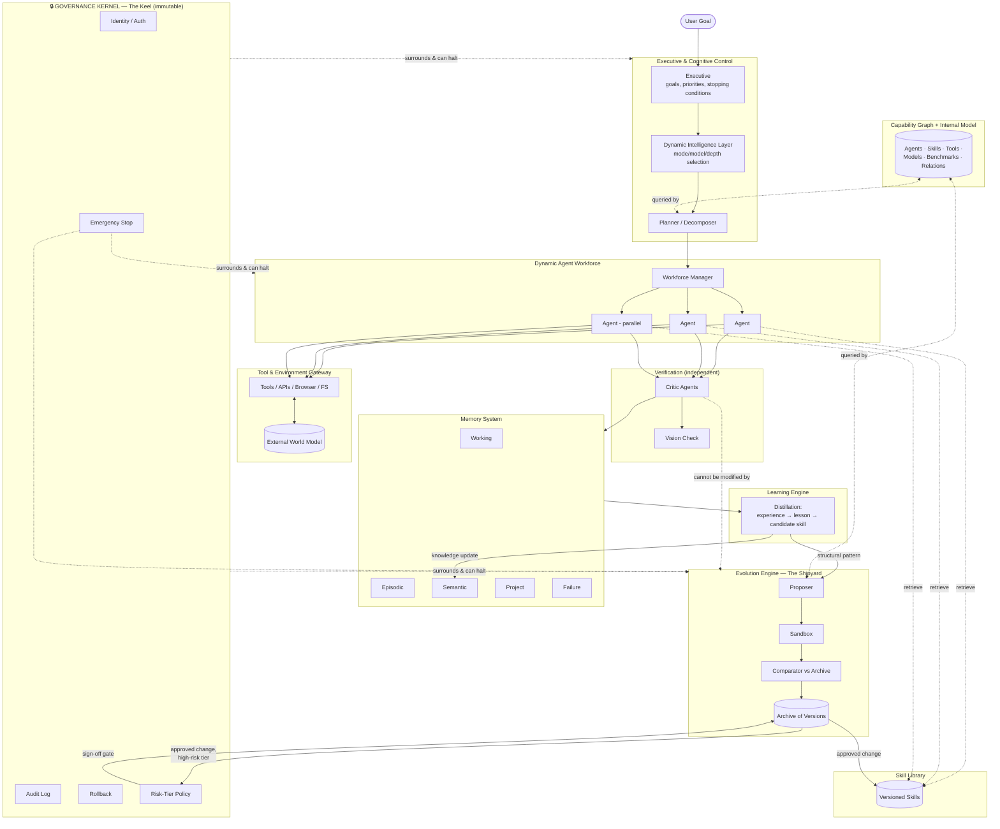

# The Keel Architecture
*A conceptual design for a self-hosted autonomous agent harness with controlled recursive self-improvement*

---

## 1. Vision

A person states a goal in plain language. Everything after that — what the goal actually requires, what needs research, what skills and tools apply, how the work should be split and parallelized, how results get checked, how failures get diagnosed, and how the system itself gets better at all of this over time — is the system's job, not the user's. The user owns the *what*. The architecture owns the *how*, and owns getting better at the *how* without needing to be rebuilt by hand every time.

---

## 2. Architectural Philosophy

Four commitments shape every decision below:

1. **Dynamic inside, stable underneath.** The parts that decide *how* to do things — planners, skills, workflows, agent topology — should be free to change, be tested, and be replaced. The parts that guarantee *what the system is allowed to do* should not move.
2. **Capability and trustworthiness are separate axes.** A more capable system is not automatically a safer one to leave unsupervised — they have to be engineered and verified independently, at every stage, not assumed to travel together.
3. **Nothing self-certifies.** No component decides on its own that it succeeded, that it's an improvement, or that it's safe to keep. Verification always comes from something the thing being verified cannot influence.
4. **Archive, don't overwrite.** Every version of every evolvable component — a skill, a plan, a workforce configuration — is kept, not replaced in place. This is what makes rollback trivial and improvement genuinely cumulative instead of a gamble on the last edit.

---

## 3. Core Mental Model — The Keel

Picture a ship built to sail into water it has never charted, sometimes for months at a time, sometimes refitting parts of itself mid-voyage.

- **The Keel** is the single structural member everything else is built on: identity, authorization, audit, the emergency stop, rollback capability, the fundamental constraints on what the ship is allowed to do. It is not clever. It does no reasoning. It is simply never allowed to fail, and nothing built above it is permitted to modify it.
- **The Hull and Frame** are the Executive and Cognitive Control — the structure that holds shape under load: understanding the goal, planning, prioritizing, deciding how work is decomposed.
- **The Crew** is the dynamic Agent Workforce — specialists brought aboard, reassigned, or released depending on what the current voyage needs, not a fixed roster.
- **The Rigging and Sails** are the Tool and Environment interface — what catches the available wind (APIs, browsers, filesystems, compute) and can be swapped for different conditions.
- **The Charts and Manuals** are the Skill Library — procedural knowledge, versioned, improved between voyages.
- **The Log and Cargo Hold** are Memory — the episodic record of what happened, the semantic charts of known waters, the current cargo of in-progress project state.
- **The Lookout and Navigator** are Observation and Verification — a role deliberately separate from the helm, whose only job is to check the ship's actual position against where it's supposed to be, independent of what the helmsman believes.
- **The Voyage Debrief** is Learning — how a completed voyage's log becomes an update to the charts and manuals for next time.
- **The Shipyard** is the Evolution/RSI subsystem — where refits to the ship itself are proposed, built, and sea-trialed before being adopted, with the scope of what can be refit strictly tiered.
- **The Classification Society** is the Governance Kernel — an authority external to the ship's own crew that certifies which refits are routine and which require independent sign-off before the ship sails again.

Every section below is this same structure, named formally.

---

## 4. Overall Architecture

At the highest level, intelligence flows in one direction and accountability flows in the other:

```
GOAL → EXECUTIVE → COGNITIVE CONTROL → AGENT WORKFORCE → SKILLS → TOOLS/ENVIRONMENT → RESULT
                         ▲                                                      │
                         └──────────── MEMORY · EVALUATION · LEARNING ◄─────────┘
                                              │
                                        EVOLUTION (Shipyard)
                                              │
                                   GOVERNANCE KERNEL (Keel)
                        (surrounds and constrains every layer above)
```

Work flows forward through planning and execution. Experience flows backward through evaluation and learning. Evolution sits below that, consuming accumulated experience to propose structural improvements. The Governance Kernel doesn't sit *in* this flow — it surrounds all of it, with the authority to halt, roll back, or require sign-off at any point.

---

## 5. Major Components

| Component | Role |
|---|---|
| **Executive** | Interprets the goal, sets top-level priorities, owns stopping conditions |
| **Cognitive Control** | Planning, decomposition, mode selection, delegation |
| **Dynamic Intelligence Layer** | Chooses which mode/model/planner/verification depth fits the moment |
| **Agent Workforce Manager** | Spawns, specializes, combines, and retires agents |
| **Skill Library** | Versioned, composable units of procedural intelligence |
| **Tool & Environment Gateway** | Mediates all contact with the outside world |
| **Memory System** | Working, episodic, semantic, procedural, and project memory |
| **Verification System** | Independent checking, separate from the executor at every level |
| **Learning Engine** | Distills experience (success and failure) into candidate knowledge |
| **Evolution Engine (Shipyard)** | Proposes, tests, and adopts/rejects structural improvements |
| **Capability Graph** | Live map of what the system can do and with what |
| **World Model** | External (environment) and internal (self-capability) state |
| **Governance Kernel (Keel)** | Immutable safety, identity, authorization, audit, e-stop, rollback |

---

## 6. Intelligence Flow

A single request moves through four nested loops that operate at different speeds and never bypass each other:

- **Task Loop** (fastest): understand → plan → delegate → execute → observe → verify → deliver.
- **Learning Loop**: completed task loops → distilled into candidate lessons and skill updates.
- **System Improvement Loop**: accumulated lessons → proposed changes to workflows, planners, routing.
- **Architectural Evolution Loop** (slowest): sustained patterns across many system-improvement cycles → proposed changes to the workforce topology or subsystem design itself.

Each loop only writes to its own tier of memory and can only affect the loop above it *through* the Evaluation and Governance layers — never directly. This is what keeps a slow architectural change from silently overriding an instant safety decision, and what keeps a single bad task from permanently corrupting long-term knowledge.

---

## 7. Agent Workforce

There is no fixed org chart. For each task, the Workforce Manager queries the Capability Graph — *what kind of intelligence does this actually require?* — and assembles a crew accordingly: specialists pulled from a library of agent archetypes, combined when a task spans domains, or synthesized as a new archetype when no existing combination fits.

Agents move through a real lifecycle: **spawned** for a specific task → **active** → **paused** (context preserved, resumable) → **promoted** to a reusable archetype if the combination proves broadly useful → **retired** if superseded. A Cognitive Control supervisor decides which spawned agents can run in parallel (genuinely independent subtasks) versus which must be sequenced (shared state or dependency), and watches the overall trajectory for stagnation the way a ship's officer watches for a becalmed crew — redirecting strategy rather than letting agents cycle uselessly.

---

## 8. Skills

A skill is not a prompt file. It's a versioned unit of intelligence carrying: the procedure itself, the reasoning strategy behind it, which tools it depends on, worked examples, known constraints, a validation method, documented failure patterns, and live performance statistics against those validations.

Skills move through their own lifecycle: **discovered** (distilled from a novel, successful trajectory) → **composed** (combined with other skills for a broader capability) → **improved** (revised by the Evolution Engine and re-validated) → **specialized** (forked for a narrower, higher-performing niche) → **deprecated** (superseded, archived, never silently deleted). Every skill is a node in the Capability Graph, so both planning and evolution can query "what exists, how reliable is it, what does it require."

---

## 9. Memory

Memory is several distinct cognitive systems, not one store:

- **Working memory** — current task's live state, cleared per task.
- **Episodic memory** — the full trajectory log of what actually happened.
- **Semantic memory** — durable facts and world knowledge distilled from episodes.
- **Procedural memory** — the Skill Library itself.
- **Project memory** — accumulated state and decisions specific to one ongoing effort.
- **Failure memory** — diagnosed root causes, kept distinct so they're never silently overwritten by newer successes.
- **Evaluation memory** — the history of what was checked, how, and with what result.
- **Improvement memory** — the Shipyard's own archive of attempted, accepted, and rejected changes.

Information moves in one consistent direction: *experience → observation → lesson → semantic knowledge → candidate skill → benchmark validation → future behavior.* Retrieval into working memory is relevance-weighted, not a full replay of everything accumulated — a long-running system that reloads its entire history every step drowns in its own context long before it runs out of things to learn.

---

## 10. Environment

The system maintains a live model of everything it can act on or observe: files, repositories, websites, APIs, databases, applications, the operating system, cloud services, other agents, and external events it didn't cause. This is treated as a genuine external world model, continuously updated by observation — not a static assumption formed once at planning time. When the environment changes mid-task (a file changes underneath it, an API's behavior shifts, another agent's output arrives), that's a first-class trigger for replanning, not an edge case handled by exception.

---

## 11. Evaluation

Verification is not the last step of execution — it's an independent, standing intelligence that runs continuously, asking:

- Did we actually understand the goal correctly?
- Is the current plan still valid given what we now know?
- Is this intermediate result correct — and what's the evidence, not just the claim?
- What assumption, if wrong, would silently invalidate this result?

This is implemented as independent critic agents, deliberately given different context and incentives than the executor they're checking — an agent should never be the sole judge of its own success. Where the task is visual or GUI-based, verification includes checking a rendered result against the stated goal directly, not just trusting a textual claim of completion. Evaluation output feeds two places: the immediate task Gate (did this step actually work) and the Learning Engine (what does this outcome teach us, regardless of pass or fail).

---

## 12. Learning

Two complementary flows:

**Failure-driven:** failure → observation → diagnosis → root cause → lesson → improvement hypothesis → experiment → result → knowledge. Failure is treated as the highest-density source of learning signal the system has, not a dead end to route around.

**Success-driven distillation:** a trajectory that solved something well is abstracted into a candidate pattern, checked for generality (does it work outside the exact case it arose from), and — if it holds up — proposed as a new or improved skill.

Learning is scoped to *this system's existing capabilities getting sharper*. When a pattern of lessons points toward a change in the system's own structure rather than its knowledge, that's handed off — deliberately, as a distinct step — to the Evolution Engine.

---

## 13. Recursive Self-Improvement

The right question isn't "should the agent edit its own code" — it's **what should an intelligent agent be allowed to improve about itself, and under what conditions.** Different levels warrant different degrees of freedom:

| Level | What it covers | Evolvability |
|---|---|---|
| Behavioral | Prompts, reasoning patterns, individual decisions | Freely evolvable, auto-validated |
| Procedural | Skills, workflows | Freely evolvable, sea-trial required before archive |
| Cognitive | Planning and delegation strategies | Sea-trial required, monitored rollout |
| Operational | Tool routing, execution policy | Sea-trial required |
| Structural | Agent topology, workforce composition | Requires sign-off — affects system-wide behavior |
| Software | Harness code and configuration | Requires sign-off, sandboxed testing mandatory |
| Evaluation | Benchmarks and tests themselves | Requires sign-off *always* — a system may never approve changes to its own grading criteria unsupervised |
| Architectural | Subsystem design and organization | Requires sign-off; rare, deliberate, heavily reviewed |
| *(Model weights)* | *Base reasoning model retraining* | *Outside this architecture's scope entirely — a different risk category, not a higher tier of the same one* |

The evolution loop itself: **observe → evaluate → identify a weakness → generate candidate ideas → experiment in the Shipyard (sandboxed) → compare against the full archive, not just the immediately preceding version → learn from the comparison → adopt or reject → repeat.**

What makes this *genuinely* recursive rather than a single self-improvement pass: the Shipyard's own idea-generation and comparison methods are themselves entries in the evolvable shell — the process that designs refits can itself be refit. What keeps this from spiraling is structural, not aspirational: the Shipyard can improve *how it proposes and tests changes*, but it can never touch the Keel, and it can never approve a change to the Evaluation subsystem or to itself crossing into higher-sign-off tiers without independent review — those two constraints are what keep "recursive" from becoming "unbounded."

---

## 14. Governance

Governance is operational, not just architectural. The Executive must be able to conclude, in the middle of ordinary operation:

- *"This task is too high-risk to execute without a human checkpoint."*
- *"More research is needed before acting — the plan is confident but the evidence isn't there."*
- *"This proposed improvement is promising but hasn't earned enough validation yet."*

To make this real rather than aspirational, the system needs explicit internal machinery for: priority arbitration between competing goals, resource allocation and budget caps, confidence and risk scoring attached to every plan and every proposed change, defined escalation paths, a permissions model tool-by-tool, and clean stopping conditions that don't require guessing at the system's internal state to invoke. The Governance Kernel is where categories of change are pre-classified — auto-approved, sea-trial-required, or sign-off-required — as a standing policy the system itself cannot edit, exactly like a classification society's rules aren't written by the ship being inspected.

---

## 15. Stable Core vs Evolvable Shell

**Immutable Core (the Keel):** identity, security and authorization, audit logging, the emergency stop, rollback mechanics, the fundamental behavioral constraints, and the Governance Kernel's own risk-tier policy. None of this is a target of self-improvement, ever, by design rather than by convention.

**Evolvable Shell:** skills, planners, workflows, prompts, agent strategies, model routing, tools, non-safety-critical code, optimization strategies.

This separation exists for one reason: **if the thing that decides whether a change is safe can itself be casually changed by the process being evaluated, every other safety property in the system is decorative.** A system that reliably self-improves everything except its own judge of what counts as improvement is a fundamentally different, much safer thing than one that doesn't draw this line.

---

## 16. Capability Graph

A living graph, queried constantly by both planning and evolution:

**Nodes:** agents, skills, tools, models, workflows, environments, benchmarks.
**Representative edges:** Agent —uses→ Skill · Skill —requires→ Tool · Tool —requires→ Permission · Model —performs→ Task Type · Skill —validated by→ Benchmark · Agent —specializes in→ Domain · Improvement —supersedes→ Skill/Workflow · Agent —spawned from→ Archetype.

Planning queries it to answer *"what do we have for this, what's missing, what would need to be built."* Evolution queries it to answer *"where is the graph thin, unreliable, or redundant — where should effort go next."* It is the single shared source of truth both systems reason over, rather than each maintaining a private, drifting picture of what the system can do.

---

## 17. World Model

Two models, reasoned over together, never conflated:

- **External World Model** — what exists outside the system: *"the repository has a failing test," "the API's rate limit changed," "another agent just published a result."*
- **Internal System Model** — what the system currently knows about itself: *"the coding agent currently succeeds on 62% of this benchmark class," "this skill has failed three times in this exact context," "this tool has an unresolved permission gap."*

Sound decisions require both. A plan that's correct about the external world but ignores a known internal limitation will fail in a way that looks, from outside, like the world was unpredictable — when in fact the system had the information and didn't use it.

---

## 18. Multi-Timescale Intelligence

| Timescale | Handles | Writes to |
|---|---|---|
| Instant | Reactive/safety decisions (e.g., halting on a scope violation) | Audit log only |
| Short-term | Current task planning | Working memory |
| Medium-term | Project-level optimization | Project memory |
| Long-term | Skill and knowledge improvement across projects | Semantic + procedural memory |
| Evolutionary | Architecture and strategy evolution | Improvement memory, pending Governance review |

These communicate without becoming chaotic because of one rule: **a slower timescale can only affect a faster one by first passing through Evaluation and Governance** — never directly. An evolutionary-timescale change cannot silently alter an instant safety reaction; an instant reaction cannot permanently rewrite long-term knowledge without first being distilled through the Learning Loop. Speed and authority are deliberately decoupled.

---

## 19. Alternative Architectures

| | A. Central Executive | B. Hierarchical Multi-Agent | C. Distributed Mesh | D. Cognitive OS | E. Evolutionary Platform |
|---|---|---|---|---|---|
| Autonomy | Moderate | High | High | High | Very high |
| Reliability | High | High | Moderate | Moderate | Low without heavy gating |
| Complexity | Low | Moderate | High | High | High |
| Scalability | Poor | Good | Excellent | Good | Good |
| Self-improvement potential | Low | Moderate | Moderate | High | Very high |
| Debugging difficulty | Low | Moderate | High | High | High |
| Cost | Low | Moderate | Moderate–High | Moderate | High (parallel trials) |
| Safety | Easiest to reason about | Good, clear accountability | Hardest — no single point of control | Depends entirely on kernel design | Requires strict archive/gating discipline |
| Local/self-hosted fit | Excellent | Excellent | Difficult (coordination overhead) | Good | Good, if compute allows |

No single one is right for the whole system — they're right for different *layers* of it.

---

## 20. Recommended Hybrid Architecture

**The Keel Architecture** doesn't pick one pattern — it assigns each pattern to the layer it's actually good at:

- **Centralized (A)** for everything Governance-related: identity, authorization, the risk-tier policy. This must have one unambiguous source of truth — a mesh here means no one can say with confidence what the system is and isn't allowed to do.
- **Hierarchical (B)** for the Executive and Cognitive Control layers: goal understanding, delegation, accountability for *why* a plan was chosen. This is where debuggability matters most, and hierarchy gives a clean chain of responsibility.
- **Mesh-style parallelism (C)**, scoped narrowly, inside the Agent Workforce layer only: independent subtasks run concurrently without a central bottleneck, but always under the Hierarchical layer's supervision, not as a free-standing peer network.
- **Evolutionary/archive-based (E)**, scoped narrowly, inside the Shipyard only: this is exactly where population-based search earns its cost — proposing and comparing many candidate improvements — without letting that same population-based, less-predictable process run ordinary task execution.
- **Cognitive-OS framing (D)** as the connective tissue: the Capability Graph and World Model function like a kernel's process/resource tables, giving every other layer a shared, queryable picture of state rather than private, drifting assumptions.

The result: centralize what must be accountable, hierarchically structure what must be coordinated, mesh what's genuinely independent, and evolve — carefully, archivally, and only in one clearly bounded subsystem — what benefits from trial and comparison.

---

## 21. Full Architecture Diagram



---

## 22. Core Design Principles

- **Dynamic inside, stable underneath** — the evolvable shell moves; the Keel does not.
- **Capability ≠ trustworthiness** — engineer and verify them on separate axes, always.
- **Nothing self-certifies** — verification is structurally independent of what it verifies.
- **Archive over overwrite** — every version is kept; rollback is a lookup, not a recovery project.
- **The evaluator is never a target of unsupervised self-improvement** — the one invariant everything else depends on.
- **Speed and authority are decoupled** — faster timescales cannot be silently overridden by slower ones or vice versa.
- **Every plan carries its own evidence** — a claimed success without checkable evidence is treated as unverified, not true.
- **Always stoppable, always explainable** — if the system can't currently produce a reason for what it's doing, that's itself a signal to pause.

---

## 23. What Makes This Architecture Different

Most agent frameworks treat self-improvement as something bolted onto an execution engine after the fact — a fine-tuning job, a prompt-optimization script, run separately from the "real" system. The Keel Architecture makes the Capability Graph and World Model the *shared substrate* that both ordinary planning and self-improvement query — so evolution isn't guessing at what the system can do, it's reading the same live picture the planner uses. It also treats the tiering of *what's allowed to change* (Section 13's table) as a structural property enforced by where components sit relative to the Keel, not as a policy that a sufficiently capable system could reason its way around — the constraint is architectural, not persuasive. And the multi-timescale layering (Section 18) directly targets a common, under-discussed failure mode: systems where a slow, well-intentioned optimization process gradually and invisibly degrades a fast safety reaction, because nothing separated their write access.

---

## 24. Future Evolution Path

| Tier | Capability | Gating |
|---|---|---|
| 0 | Manual harness, fixed workforce, no self-modification | — |
| 1 | Dynamic workforce + live Capability Graph | Human-reviewed rollout |
| 2 | Bounded skill evolution (Section 13, Procedural tier) | Sea-trial + archive |
| 3 | Workflow and planner evolution (Cognitive/Operational tiers) | Sea-trial + monitored rollout |
| 4 | Structural self-tuning (workforce topology) | Sign-off required, rare and deliberate |
| *5 (not a target)* | *Unsupervised architectural or evaluation self-redesign* | *Remains an open safety-research problem industry-wide — this design deliberately stops before it, per the boundary detailed in the companion RSI research document* |

Each tier should be operated for long enough to generate real calibration data before advancing — exactly the discipline the Shipyard itself is built to require of every change it proposes.
