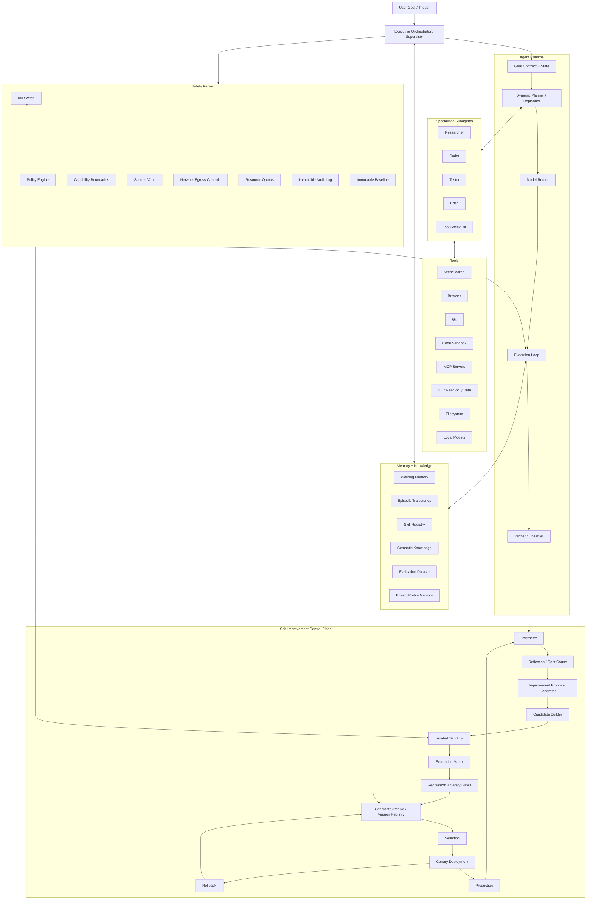

# Recursive Self-Improving AI Agent Harness — Research & Build Architecture

> **Purpose:** A practical architecture for a self-hosted AI agent that can observe its own failures, discover improvement opportunities, generate candidate changes, test them in isolation, select only empirically superior candidates, and safely promote improvements over time.
>
> **Core thesis:** Do not build a system that can arbitrarily rewrite itself and immediately replace production. Build a **versioned evolutionary harness** around the agent, where every improvement is a candidate artifact that must pass explicit evaluations, regression checks, security gates, and deployment controls before promotion.

---

## 1. Executive summary

Current research shows several complementary patterns for self-improving agents:

- **Self-Refine:** iterative generation → feedback → refinement can improve outputs without model retraining. [Madaan et al., 2023](https://arxiv.org/abs/2303.17651)
- **Reflexion:** agents can store linguistic feedback in episodic memory and use it on later attempts instead of changing model weights. [Shinn et al., 2023](https://arxiv.org/abs/2303.11366)
- **Voyager:** an agent can accumulate a reusable skill library and automatically expand its competence through an automatic curriculum. [Wang et al., 2023](https://arxiv.org/abs/2305.16291)
- **STOP:** a scaffolding program can use an LLM to improve the scaffolding program itself, demonstrating a form of recursive improvement at the harness/code level. The authors explicitly distinguish this from full model self-improvement. [Zelikman et al., 2023](https://arxiv.org/abs/2310.02304)
- **AI Scientist:** an autonomous loop can generate ideas, write code, run experiments, produce reports, and use an evaluator to select promising outputs. [Lu et al., 2024](https://arxiv.org/abs/2408.06292)
- **AIDE:** treating engineering as search over candidate code solutions can outperform single-shot generation by reusing and refining promising branches. [Jiang et al., 2025](https://arxiv.org/abs/2502.13138)
- **Darwin Gödel Machine (DGM):** self-modifying coding agents can be evolved as an archive/tree of candidates, with changes empirically evaluated before they become better agents. The paper reports substantial benchmark gains and used sandboxing and human oversight in its experiments. [Zhang et al., 2025](https://arxiv.org/abs/2505.22954)
- **Agent0:** a curriculum generator and executor can co-evolve, creating a self-reinforcing loop that produces harder tasks as capabilities improve. [Xia et al., 2025](https://arxiv.org/abs/2511.16043)
- **Prime Agent:** a current open-source example treats prompts, skills, memory, and subagents as mutable harness state, and uses recursive language-model calls to work over long contexts. [Prime Intellect, 2026](https://www.primeintellect.ai/blog/prime-agent)

The architecture recommended in this document combines those ideas into a controlled loop:

```text
OBSERVE → DIAGNOSE → PROPOSE → BUILD CANDIDATE → SANDBOX → EVALUATE
    ↑                                                    ↓
    └──────────── TELEMETRY ← DEPLOY / CANARY ← SELECT ──┘
```

The most important architectural rule is:

> **The agent may improve candidate copies of itself, but it must never directly overwrite the protected production baseline.**

---

## 2. What “recursive self-improvement” should mean in a practical agent

There are several different things people may call self-improvement. They should be separated explicitly.

| Level | What changes? | Example | Difficulty | Recommended |
|---|---|---|---|---|
| L0 | Runtime state | working memory, task state | low | yes |
| L1 | Experience memory | lessons, failure summaries, reusable trajectories | low | yes |
| L2 | Skills | new `SKILL.md`, scripts, workflows | low | **yes** |
| L3 | Prompts / policies | system instructions, routing heuristics, critic rubrics | low–medium | **yes, gated** |
| L4 | Planning strategy | planner algorithm, decomposition policy, search strategy | medium | **yes, gated** |
| L5 | Tool layer | new tools/MCP servers/adapters | medium | **yes, strongly gated** |
| L6 | Harness code | orchestration/runtime code | high | **yes, sandboxed + gated** |
| L7 | Model configuration | model choice, quantization, routing, LoRA adapter | high | **yes, evaluated** |
| L8 | Model weights | fine-tune / continued training / post-training | very high | later |
| L9 | Core safety kernel | capability boundary, authentication, audit root, kill switch | extreme | **never autonomous** |

A robust first implementation should focus on **L1–L6**. That gives the system a large improvement surface without requiring the dangerous assumption that the base model itself must rewrite its own weights.

This matches the practical distinction seen in STOP and Reflexion: significant improvement can arise from changing the **scaffold, memory, feedback loop, and search process**, even when the underlying foundation model stays fixed. [STOP](https://arxiv.org/abs/2310.02304), [Reflexion](https://arxiv.org/abs/2303.11366)

---

## 3. Research synthesis: the important design patterns

### 3.1 Self-Refine: local iterative improvement

Self-Refine uses a single model as generator, feedback provider, and refiner, iterating until the result improves according to task feedback. The important architectural idea is not the exact prompting scheme; it is the separation of **produce → critique → revise**. [Madaan et al.](https://arxiv.org/abs/2303.17651)

**Agent-harness implication:**

```text
Draft
  ↓
Evaluator / Critic
  ↓
Failure list
  ↓
Repair
  ↓
Re-evaluate
  ↓
Stop when improvement plateaus or budget expires
```

This should be the inner loop of ordinary task execution.

### 3.2 Reflexion: learn from failure without weight updates

Reflexion turns feedback into natural-language reflections stored in episodic memory and reused on subsequent attempts. [Shinn et al.](https://arxiv.org/abs/2303.11366)

**Agent-harness implication:** store structured experience, not just chat history.

Recommended record:

```yaml
experience_id: exp_2026_09_15_00123
problem_signature: "pytest_timeout_after_db_migration"
action_sequence: [...]
observed_failure: "connection pool exhaustion"
root_cause: "pool lifecycle mismatch"
lesson: "dispose async engine during worker shutdown"
confidence: 0.86
validated_by:
  - test: "worker_shutdown_regression"
    result: pass
reusable_for:
  - "fastapi"
  - "sqlalchemy"
  - "async workers"
```

### 3.3 Voyager: skill accumulation and automatic curriculum

Voyager demonstrated a different improvement substrate: an agent keeps a growing skill library and selects skills as reusable building blocks. [Wang et al.](https://arxiv.org/abs/2305.16291)

**Agent-harness implication:** your skill system should be:

- discoverable;
- load-on-demand;
- versioned;
- testable;
- linked to evidence;
- able to be deprecated and rolled back.

Modern Agent Skills implementations follow the same broad idea. Anthropic-originated Agent Skills uses a folder containing `SKILL.md`, with optional scripts/references/assets, and progressive disclosure so the agent need not load every skill in full context. [Agent Skills specification](https://agentskills.io/) and [Open format reference](https://github.com/syntax-syndicate/agentskills-Spec)

### 3.4 STOP: recursive improvement of the improver

STOP is especially important for your question because it explicitly experiments with a language-model-infused program improving the program that improves other programs. The paper reports that the improved scaffolding can perform better on downstream tasks, while emphasizing that this is not full recursive self-improvement of the model weights. [Zelikman et al.](https://arxiv.org/abs/2310.02304)

**Core architectural pattern:**

```text
Seed Improver
   ↓
propose modification to improver
   ↓
build candidate improver
   ↓
run utility/evaluation function
   ↓
keep candidate only if utility improves
   ↓
repeat
```

This is almost exactly the **meta-loop** your harness needs.

### 3.5 AI Scientist: automated experiment lifecycle

The AI Scientist combines idea generation, implementation, experiments, visualization, paper/report generation, and automated reviewing. [Lu et al.](https://arxiv.org/abs/2408.06292)

**Harness implication:** an improvement proposal should be treated as an **experiment package**, not a free-form code edit.

Every candidate should contain:

```text
candidate/
├── manifest.yaml
├── hypothesis.md
├── change.patch
├── expected_gain.md
├── benchmark_plan.md
├── tests/
├── evaluator/
├── security_notes.md
└── evidence/
```

### 3.6 AIDE: search over solution space

AIDE frames engineering as search over candidate code solutions. [Jiang et al.](https://arxiv.org/abs/2502.13138)

**Harness implication:** do not evaluate only one self-improvement idea. Maintain a **candidate population/tree** and spend compute on promising branches.

Useful strategies:

- best-first search;
- beam search;
- mutation + selection;
- branch-and-bound;
- tournament selection;
- novelty-aware exploration;
- exploit/explore scheduling.

### 3.7 Darwin Gödel Machine: open-ended candidate evolution

DGM is the closest published research pattern to the architecture requested here. It repeatedly modifies the agent code, evaluates the new version, and maintains an archive of agents. The reported implementation improves coding performance through changes such as stronger editing, long-context management, and peer-review mechanisms. The authors also explicitly discuss sandboxing and human oversight. [Zhang et al.](https://arxiv.org/abs/2505.22954)

The critical idea is **archive-based evolution**:

```text
                 ┌──── candidate A ──── candidate A2
baseline ────────┼──── candidate B ──── candidate B2
                 └──── candidate C ──── candidate C2
```

Do not assume the latest candidate is always the best. A historically older candidate may be more reliable, cheaper, or safer.

### 3.8 Agent0: evolve the evaluator/curriculum too

Agent0 uses a curriculum agent and an executor agent in a self-reinforcing cycle. Harder tasks are created as the executor improves. [Xia et al.](https://arxiv.org/abs/2511.16043)

**Harness implication:** static benchmarks eventually become too easy or overfit. The system should generate or discover **new challenge tasks** while maintaining a protected held-out suite.

```text
Capability rises
      ↓
Current evals become easier
      ↓
Curriculum generator creates harder variants
      ↓
Agent attempts them
      ↓
Failures become new training/evaluation material
```

### 3.9 Prime Agent: harness state as an improvement surface

Prime Agent's current design treats prompts, skills, memory, and subagents as mutable parts of the harness, while using recursive model calls to manage long-lived context. [Prime Intellect](https://www.primeintellect.ai/blog/prime-agent)

That strongly supports the architecture decision to make the **harness itself a first-class, versioned object**.

### 3.10 OpenAI-style harness engineering: optimize the environment, not only the prompt

OpenAI's 2026 harness-engineering writeup describes an agent-first software process where repository structure, documentation, architecture constraints, tests, observability, and feedback loops become the main engineering leverage. The article emphasizes that humans steer while agents execute, and reports long-running agent runs operating in a structured repository with mechanical checks and accumulated knowledge. [OpenAI, Harness engineering](https://openai.com/index/harness-engineering/)

**Harness implication:** repository legibility, executable invariants, and structured knowledge are themselves part of agent intelligence.

---

## 4. Recommended architecture


### Mermaid architecture



---

## 5. Separate the system into two planes

This is one of the most important implementation decisions.

### 5.1 Execution plane

This is the part that works on user tasks.

Responsibilities:

1. understand goal;
2. build a goal contract;
3. plan;
4. route models and tools;
5. spawn subagents;
6. execute actions;
7. observe results;
8. verify completion;
9. record trajectory and evidence.

### 5.2 Self-improvement control plane

This plane does not directly serve normal user requests. It watches the execution plane and periodically asks:

> “What systematic improvement would most increase measured utility without violating constraints?”

Responsibilities:

1. collect telemetry;
2. detect repeated failure patterns;
3. cluster failures;
4. identify bottlenecks;
5. generate hypotheses;
6. build candidates;
7. evaluate candidates;
8. compare against baseline;
9. reject regressions;
10. promote winners;
11. monitor canary performance;
12. rollback if needed.

This separation makes it much easier to stop an evolutionary experiment without destroying the running assistant.

---

## 6. The core recursive loop

### 6.1 Runtime task loop

```text
Goal
 ↓
Goal Contract
 ↓
Context / Memory Retrieval
 ↓
Planner
 ↓
Task Graph
 ↓
Agent / Tool Execution
 ↓
Evidence Collection
 ↓
Verifier
 ├── pass → final result
 └── fail → diagnose → replan → retry
```

### 6.2 Self-improvement loop

```text
Telemetry
  ↓
Failure mining
  ↓
Root-cause analysis
  ↓
Improvement hypothesis
  ↓
Candidate generation
  ↓
Candidate build
  ↓
Static checks
  ↓
Sandbox execution
  ↓
Evaluation matrix
  ↓
Safety / regression gate
  ├── fail → archive as rejected
  └── pass → candidate ranking
                    ↓
                canary run
                    ↓
           production telemetry
                    ↓
              promote / rollback
```

### 6.3 Meta-recursive loop

The most advanced version allows the system to improve the **improver** itself.

```text
           ┌─────────────────────────────────┐
           │       IMPROVEMENT ENGINE         │
           │                                  │
           │ propose → build → eval → select  │
           └───────────────┬──────────────────┘
                           │
                           ▼
              candidate improvement engine
                           │
                           ▼
              evaluate improvement quality
                           │
                           ▼
                    keep / reject
                           │
                           └───────↺
```

The key is that the improvement engine must itself remain subject to **an even more stable gate**. Otherwise recursive improvement can create a feedback loop that gradually weakens its own checks.

---

## 7. Define a “self” object

Your agent should not be one opaque process. Define its identity as a versioned manifest.

```yaml
agent:
  id: prem-agent
  version: 0.1.0
  parent: baseline-0001

runtime:
  orchestrator: executive-v3
  planner: planner-v5
  verifier: verifier-v4
  router: router-v2

models:
  primary: qwen3-or-equivalent
  fast: local-small-model
  critic: local-or-remote-critic

skills:
  registry_version: 12
  enabled:
    - coding
    - research
    - git
    - browser

memory:
  episodic_schema: 2
  semantic_schema: 4
  retrieval_policy: memory-router-v3

policies:
  safety: immutable-policy-v1
  allowed_network: allowlist-v4
  tool_permissions: capability-set-7

self_improvement:
  enabled: true
  mode: candidate-only
  max_generation_depth: 3
  min_eval_delta: 0.02
  canary_required: true
  human_approval_required_for:
    - safety_policy_changes
    - secrets_policy_changes
    - permission_expansion
    - core_runtime_changes
```

This manifest allows you to reproduce, compare, and roll back an agent version.

---

## 8. Improvement surfaces

The self-improvement system should not search the entire universe of changes at once. Divide it into surfaces.

### Surface A — Prompt evolution

Examples:

- better task framing;
- better verification instructions;
- stronger tool-use rules;
- better decomposition heuristics;
- shorter or more targeted context policies.

Evaluation:

- task success;
- tool accuracy;
- token cost;
- latency;
- regression rate.

### Surface B — Skill evolution

The agent can create or revise:

```text
skills/<name>/SKILL.md
skills/<name>/scripts/*
skills/<name>/references/*
skills/<name>/tests/*
```

The agent should only promote a skill after:

1. schema validation;
2. linting;
3. execution tests;
4. task benchmark gain;
5. security scan;
6. no regression on protected tasks.

### Surface C — Tool evolution

The agent can propose:

- MCP adapters;
- CLI wrappers;
- parsers;
- browser actions;
- database readers;
- file transformers.

Tool changes must be more tightly gated than prompt changes because tools expand the **action surface**.

MCP's current architecture explicitly emphasizes host-controlled permissions and isolation between servers; use that separation rather than allowing arbitrary tool processes to see all context. [MCP Architecture, 2026-07-28](https://github.com/modelcontextprotocol/modelcontextprotocol/blob/main/docs/specification/2026-07-28/architecture/index.mdx)

### Surface D — Planner evolution

Candidate planners can vary:

- hierarchical planning;
- graph planning;
- beam search;
- best-first search;
- adaptive replanning;
- parallel subgoal expansion;
- critic-guided planning.

### Surface E — Model routing evolution

Optimize routing rather than always using the strongest model.

```text
task complexity
      ↓
classifier
      ↓
┌───────────────┬─────────────┬──────────────┐
│ fast local    │ strong local│ remote model │
│ low cost      │ medium cost │ high quality │
└───────────────┴─────────────┴──────────────┘
```

Measure quality **per unit cost**, not quality alone.

### Surface F — Harness code

The agent can propose code changes to its orchestration runtime, but the policy should be:

```text
production runtime
      ≠
mutable workspace
```

Instead:

```text
protected source tree
       ↓ branch
candidate workspace
       ↓ modify
build + tests
       ↓
benchmark
       ↓
security gates
       ↓
review/canary
       ↓
new production version
```

### Surface G — Model adaptation

Later, you can add:

- LoRA/PEFT adapters;
- supervised fine-tuning;
- preference data;
- RL environments;
- synthetic training data;
- continued pretraining.

This should be a **separate training plane**, not something the live agent performs directly against production weights.

Prime Intellect's open-source ecosystem currently reflects this separation through environments/evals plus training infrastructure. Their Verifiers framework defines datasets, harnesses, tools/sandboxes, and reward/rubric functions as reusable environments for evaluation and training. [Prime Verifiers](https://docs.primeintellect.ai/verifiers/overview)

---

## 9. Failure mining: how the agent discovers what to improve

The improvement engine should never ask only “What can I improve?” That is too unconstrained.

Instead, compute a ranked improvement queue.

### 9.1 Telemetry schema

```json
{
  "run_id": "run_2026_09_15_0123",
  "task_type": "coding",
  "task_signature": "fastapi-alembic-migration",
  "agent_version": "0.8.4",
  "planner_version": "p5",
  "model_route": ["local-main", "critic-local"],
  "success": false,
  "attempts": 4,
  "tool_errors": 2,
  "verification_failures": 1,
  "latency_ms": 184000,
  "token_input": 42000,
  "token_output": 13000,
  "cost": 0.02,
  "failure_class": "integration",
  "root_cause": "missing transaction boundary",
  "evidence_refs": ["trace:...", "test:..." ]
}
```

### 9.2 Improvement priority score

A useful starting formula is:

```text
priority =
    frequency
  × impact
  × recurrence
  × confidence
  × expected_gain
  ÷ estimated_cost
```

Where:

- **frequency** = how often the failure happens;
- **impact** = user/task damage;
- **recurrence** = whether it keeps returning after retries;
- **confidence** = confidence in diagnosis;
- **expected_gain** = expected improvement if fixed;
- **estimated_cost** = compute/time/risk to test.

### 9.3 Failure clustering

Group failures into classes:

```text
planning
├── incomplete decomposition
├── wrong dependency ordering
└── premature termination

execution
├── tool misuse
├── malformed command
└── timeout

context
├── missing document
├── context overflow
└── retrieval miss

verification
├── weak test
├── false positive
└── incomplete evidence

safety
├── permission violation
├── secret exposure attempt
└── policy conflict
```

This converts thousands of trajectories into a manageable improvement backlog.

---

## 10. Improvement proposal format

Every self-improvement candidate should be represented as a typed proposal.

```yaml
proposal_id: imp_00421
base_agent: 0.8.4
surface: planner
hypothesis: |
  Add dependency-aware topological ordering before parallelizing subgoals.
problem_evidence:
  incidents: 17
  affected_tasks: 11
expected_change:
  success_rate: +0.04
  latency: -0.05
  cost: +0.01
risk_level: medium
changes:
  - src/planner/dependency_graph.ts
  - prompts/planner.md
  - tests/planner_dependency_order.test.ts
benchmark:
  required:
    - protected_coding_suite
    - planner_regression_suite
  optional:
    - long_horizon_suite
rollback:
  strategy: git_revert
```

The proposal generator should output **hypotheses**, not automatically accepted truth.

---

## 11. Candidate generation strategies

A strong system should support multiple strategies and learn which strategies produce useful improvements.

### 11.1 Mutation

Take one known-good version and mutate one component.

```text
v8
 ├─ change prompt
 ├─ change planner
 ├─ change verifier
 └─ change memory retrieval
```

### 11.2 Crossover

Combine useful components from two candidates.

```text
candidate A = planner-v7 + verifier-v5
candidate B = planner-v9 + verifier-v4

child = planner-v9 + verifier-v5
```

### 11.3 Critic-guided repair

Ask critics to identify the smallest change likely to remove a measured bottleneck.

### 11.4 Search

Treat each candidate as a node in a tree.

```text
                  root
             /      |      \
           A        B        C
         / | \     / \      / \
       A1 A2 A3   B1 B2   C1 C2
```

Rank nodes using:

```text
score = performance - α*cost - β*risk + γ*novelty
```

### 11.5 Diversity preservation

Avoid converging every branch on the same strategy.

Track:

- planner family;
- prompt family;
- model route;
- tool strategy;
- architecture fingerprint.

This is one of the useful lessons from open-ended evolutionary systems: a diverse archive gives the system alternative stepping stones rather than one brittle line of descent. [DGM](https://arxiv.org/abs/2505.22954)

---

## 12. Candidate evaluation architecture

Never use one score.

### 12.1 Evaluation matrix

```text
                     candidate
                         │
     ┌───────────────────┼───────────────────┐
     ▼                   ▼                   ▼
 capability           reliability          safety
     │                   │                   │
     ├─ task success     ├─ variance         ├─ policy tests
     ├─ quality         ├─ crash rate       ├─ permission tests
     └─ generalization  └─ regression       └─ security tests
                         │
                         ▼
                    efficiency
                         │
                    cost / latency
```

### 12.2 Recommended score

Use a vector first, aggregate second.

```text
M(candidate) = {
  capability,
  reliability,
  safety,
  cost,
  latency,
  maintainability,
  novelty
}
```

Only promote a candidate when it satisfies hard constraints and improves the required dimensions.

Example:

```text
HARD GATES
- security = pass
- policy = pass
- regression = pass
- crash rate <= baseline + 0.5%

SOFT OBJECTIVE
maximize
  capability
  + reliability
  + maintainability
  - cost
  - latency
```

### 12.3 Evaluation suites

Use layers:

1. **unit tests** — local correctness;
2. **integration tests** — subsystem behavior;
3. **agent behavior tests** — tool and planning behavior;
4. **protected regression suite** — stable historical tasks;
5. **held-out suite** — hidden or rotated tasks to resist overfitting;
6. **adversarial/safety suite** — policy and security failures;
7. **long-horizon suite** — multi-step autonomous tasks;
8. **canary production suite** — real usage under tight limits.

OpenAI's SWE-bench Verified illustrates the value of combining tests that must newly pass with tests that must remain passing, guarding against fixing one issue while breaking unrelated behavior. [SWE-bench Verified](https://openai.com/index/introducing-swe-bench-verified/)

Prime Intellect's Verifiers similarly treats an evaluation environment as a combination of task inputs, harness/tools/sandbox, and a reward/rubric function, which is a useful abstraction for this control plane. [Verifiers overview](https://docs.primeintellect.ai/verifiers/overview)

---

## 13. The evaluator problem

A recursive system can game its evaluator.

This is one of the deepest design risks.

Bad architecture:

```text
Agent → changes evaluator → gets higher score → declares victory
```

Correct architecture:

```text
protected evaluator
      │
      ├── candidate evaluator
      ├── hidden tests
      └── independent sanity checks
```

### Evaluator hierarchy

Use multiple independent evaluators:

```text
                 ┌───────────────┐
                 │  deterministic│
                 │  tests        │
                 └───────┬───────┘
                         │
                 ┌───────▼───────┐
                 │  static /     │
                 │  security     │
                 └───────┬───────┘
                         │
            ┌────────────▼────────────┐
            │   independent LLM       │
            │   critic / judge        │
            └────────────┬────────────┘
                         │
                 ┌───────▼───────┐
                 │ held-out tasks │
                 └───────┬───────┘
                         │
                 ┌───────▼───────┐
                 │ human sample  │
                 └───────────────┘
```

Do not let the agent rewrite the protected evaluation definitions without an external gate.

---

## 14. Sandbox architecture

Self-improving agents will eventually generate code. Treat generated code as untrusted.

### Recommended isolation layers

```text
Host OS
  │
  ├── Control Plane
  │     ├── agent registry
  │     ├── evaluator
  │     └── audit
  │
  └── Execution Sandbox
        ├── container / VM
        ├── separate workspace
        ├── restricted network
        ├── resource limits
        ├── ephemeral secrets
        └── timeouts
```

Docker's current documentation describes rootless mode for running the daemon/containers without root privileges and seccomp profiles for limiting available system calls. [Docker rootless](https://docs.docker.com/engine/security/rootless/) and [Docker seccomp](https://docs.docker.com/engine/security/seccomp/)

For higher-risk experiments, a microVM boundary can be appropriate. Firecracker documents layered isolation using KVM, seccomp, cgroups, namespaces, and a jailer process. [Firecracker design](https://github.com/firecracker-microvm/firecracker/blob/main/docs/design.md)

### Suggested sandbox tiers

| Tier | Use | Network | Secrets | Persistence |
|---|---|---|---|---|
| S0 | pure tests | off | none | ephemeral |
| S1 | package/build | allowlisted | none | ephemeral |
| S2 | research/browser | restricted | scoped | ephemeral |
| S3 | integration | restricted | temporary scoped | disposable volume |
| S4 | live canary | controlled | production proxy only | audited |

### Non-negotiable sandbox controls

- no host filesystem write by default;
- no host Docker socket;
- no unrestricted network;
- no inherited shell credentials;
- no unrestricted secret environment;
- bounded CPU/RAM/time;
- explicit process tree cleanup;
- immutable audit record;
- disposable workspace.

---

## 15. Security kernel

The self-improvement layer should be structurally unable to modify its own safety root.

### Immutable components

```text
SAFETY_KERNEL
├── capability policy
├── identity/authentication
├── secret broker
├── network policy
├── audit writer
├── kill switch
└── production admission controller
```

### Mutable components

```text
EVOLUTION_SPACE
├── prompts
├── skills
├── planners
├── tools
├── routing
├── memory policy
└── application logic
```

The only legal path between them is:

```text
candidate → gate → admission controller
```

not:

```text
candidate → direct filesystem replacement
```

NIST's 2026 concept paper on software/AI-agent identity and authorization emphasizes that agents need explicit identification and authorization controls because they can act across datasets, tools, and applications. [NIST](https://csrc.nist.gov/pubs/other/2026/02/05/accelerating-the-adoption-of-software-and-ai-agent/ipd)

---

## 16. Capability-based tool permissions

Every tool call should be checked before execution.

```yaml
capability:
  name: github.write
  actions:
    - create_branch
    - create_commit
  scope:
    repositories:
      - owner/project
  conditions:
    requires_clean_worktree: true
    requires_tests_passed: true
    requires_user_approval: false
```

For high-risk actions:

```yaml
requires_human:
  - change_production_policy
  - rotate_credentials
  - expand_network_scope
  - modify_safety_kernel
  - deploy_external_side_effect
```

MCP's current architecture similarly puts the host in a coordinating role, with clients/servers separated and servers receiving only necessary context. [MCP architecture](https://github.com/modelcontextprotocol/modelcontextprotocol/blob/main/docs/specification/2026-07-28/architecture/index.mdx)

---

## 17. Memory architecture for self-improvement

Use multiple memories rather than a single vector database.

### 17.1 Working memory

Current context only.

### 17.2 Episodic memory

Past trajectories and lessons.

```json
{
  "episode": "ep-9281",
  "task": "deploy_service",
  "actions": [...],
  "outcome": "failed",
  "reflection": "health check ran before migration completed",
  "lesson": "gate deployment on migration completion",
  "evidence": [...]
}
```

### 17.3 Semantic memory

Stable facts:

- architecture;
- repository structure;
- user/project preferences;
- domain knowledge;
- tool documentation.

### 17.4 Procedural memory

Skills and workflows.

### 17.5 Evaluation memory

Past benchmark runs, scores, failures, and candidate lineage.

### 17.6 Evolution memory

The genealogy of the agent itself.

```text
agent-001
 ├── agent-002
 │    ├── agent-005
 │    └── agent-006
 └── agent-003
      └── agent-007
```

This lineage is essential for debugging “why did the agent get worse?”

---

## 18. Event-sourced execution

Use append-only events as the backbone.

OpenHands' current SDK architecture is a useful reference here: its event system is immutable and append-only, and events act as both agent memory and an integration point for supporting services. [OpenHands Events](https://docs.openhands.dev/sdk/arch/events)

Recommended event types:

```text
RunStarted
GoalCompiled
PlanCreated
TaskSpawned
ModelCalled
ToolRequested
ToolExecuted
ObservationRecorded
VerificationStarted
VerificationPassed
VerificationFailed
ReflectionCreated
ImprovementProposed
CandidateBuilt
CandidateTested
CandidateRejected
CandidatePromoted
CanaryStarted
CanaryFailed
RollbackExecuted
RunCompleted
```

This gives you:

- replay;
- audit;
- debugging;
- offline evaluation;
- training data generation;
- causal analysis.

---

## 19. Observability

Instrument the agent as a distributed system.

Recommended telemetry:

```text
trace_id
run_id
agent_version
model
prompt_version
tool
skill
subagent
latency
tokens
cost
error_type
verification_result
evaluation_score
security_decision
```

OpenTelemetry now has GenAI semantic conventions covering agent identification, evaluation scores, workflows, plans, and tool execution spans. [OpenTelemetry GenAI conventions](https://opentelemetry.io/docs/specs/semconv/registry/attributes/gen-ai/) and [agent/framework spans](https://github.com/open-telemetry/semantic-conventions-genai/blob/main/docs/gen-ai/gen-ai-agent-spans.md)

Recommended stack for a self-hosted deployment:

```text
OpenTelemetry
    ↓
OTel Collector
    ├── Prometheus
    ├── Loki
    └── Tempo / Jaeger
          ↓
      Grafana
```

Store raw trajectory/evidence separately from metrics.

---

## 20. Data model for the evolutionary archive

### Agent version

```yaml
agent_version:
  id: agent-00142
  parent: agent-00137
  generation: 8
  created_at: ...
  components:
    runtime: sha256:...
    prompts: sha256:...
    skills: sha256:...
    tools: sha256:...
    policies: sha256:...
  benchmarks:
    coding: 0.71
    research: 0.79
    planning: 0.83
    safety: 0.99
    cost: 0.42
  status: candidate
```

### Candidate record

```yaml
candidate:
  id: cand-00481
  parent: agent-00142
  mutation:
    component: planner
    strategy: dependency-aware-parallel
  hypothesis: ...
  evidence:
    baseline_runs: [...]
    candidate_runs: [...]
  results:
    mean_delta: +0.041
    ci_low: +0.019
    regression_rate: 0.001
  gates:
    unit: pass
    integration: pass
    security: pass
    heldout: pass
  disposition: promote
```

---

## 21. Selection policy

Do not choose candidates using “highest raw score” alone.

Use a constrained multi-objective selection policy.

### Example

```python
PROMOTE iff
    safety_pass
and regression_pass
and protected_suite_pass
and heldout_pass
and confidence_lower_bound > 0
and cost_delta <= max_cost_delta
and operational_risk <= max_risk
```

Then rank surviving candidates by:

```text
utility =
    0.40 * capability
  + 0.25 * reliability
  + 0.15 * generalization
  + 0.10 * efficiency
  + 0.10 * maintainability
```

Tune weights by actual project goals.

---

## 22. Canary deployment

Never go directly from candidate → production.

### Recommended pipeline

```text
candidate
  ↓
offline eval
  ↓
staging
  ↓
shadow traffic
  ↓
1% canary
  ↓
5%
  ↓
25%
  ↓
50%
  ↓
100%
```

At every step track:

- task success;
- user correction rate;
- tool failure rate;
- safety events;
- latency;
- cost;
- crash rate;
- unexpected behavior.

Rollback should be automatic for hard safety signals and configurable for quality regressions.

---

## 23. Preventing self-improvement collapse

Recursive systems have several failure modes.

### 23.1 Evaluator hacking

The candidate learns how to score well rather than perform well.

**Defense:** hidden/held-out tests, multiple evaluators, external sanity checks.

### 23.2 Regression accumulation

A sequence of individually “small” changes eventually damages reliability.

**Defense:** fixed protected suite + periodic full-suite requalification.

### 23.3 Capability drift

An optimization for coding breaks research or planning.

**Defense:** multi-domain benchmark vector.

### 23.4 Cost explosion

The system gets better by using ten times more tokens.

**Defense:** quality-per-dollar and latency as explicit objectives.

### 23.5 Skill pollution

The agent creates hundreds of low-value skills.

**Defense:** skill utility, usage counts, duplicate detection, deprecation, garbage collection.

### 23.6 Memory poisoning

A false lesson becomes persistent knowledge.

**Defense:** memory confidence + evidence requirements + decay + cross-validation.

### 23.7 Recursive destabilization

The improver changes the evaluator, planner, and safety policy together.

**Defense:** staged mutation; one surface per experiment initially.

### 23.8 Mode collapse

Evolution repeatedly selects the same strategy.

**Defense:** novelty bonus and archive diversity.

### 23.9 Goodhart effects

The system optimizes whatever metric is easiest to increase.

**Defense:** multi-metric score + hard constraints + rotating benchmark slices + human audit.

### 23.10 Infinite improvement loop

The agent keeps “improving” after useful gains have stopped.

**Defense:** stop conditions.

---

## 24. Stop conditions

A mature system needs explicit stopping rules.

```text
STOP when:

- objective achieved;
- no candidate improves confidence-adjusted utility;
- evaluation budget exhausted;
- risk threshold exceeded;
- safety invariant violated;
- improvement plateau detected;
- canary drift exceeds threshold;
- human approval required;
- emergency kill switch triggered.
```

A simple plateau detector:

```text
best_score[t] - best_score[t-k] < ε
```

for `k` generations.

---

## 25. Automatic curriculum generation

Borrow the co-evolution idea from Agent0.

### Curriculum levels

```text
L0  single-step
L1  multi-tool
L2  multi-file
L3  multi-agent
L4  long-horizon
L5  adversarial
L6  ambiguous / noisy
L7  novel domain
L8  self-referential engineering tasks
```

The curriculum generator should generate tasks just beyond the current competence frontier.

```text
difficulty ≈ current_success_rate 60–85%
```

Avoid making every task difficult. Keep easy regression tasks too.

---

## 26. Self-generated benchmark construction

The agent can create new tests from observed failures.

Example:

```text
observed incident
      ↓
extract general failure pattern
      ↓
generate minimal reproducible task
      ↓
add regression test
      ↓
validate task quality
      ↓
add to protected / rotating suite
```

This converts incidents into permanent institutional knowledge.

Important: the agent should propose benchmark changes, but a **separate benchmark admission gate** should validate whether the new test is non-trivial, non-duplicative, correctly scored, and not accidentally leaking the answer.

---

## 27. Multi-agent architecture

Do not make every subagent equally autonomous.

### Recommended hierarchy

```text
                   EXECUTIVE
                       │
             ┌─────────┼─────────┐
             │         │         │
          PLANNER   RESEARCHER   REVIEWER
             │         │         │
        ┌────┴────┐    │      ┌──┴──┐
        │         │    │      │     │
      CODER     TESTER │   CRITIC  SAFETY
        │         │    │      │     │
        └─────────┴────┴──────┴─────┘
```

Use specialized roles because the orchestrator-workers pattern is particularly useful when the set of subtasks depends on the specific task. Anthropic documents this pattern alongside evaluator-optimizer workflows. [Anthropic](https://www.anthropic.com/engineering/building-effective-agents)

### Self-improvement roles

Add separate meta-agents:

```text
Failure Miner
     ↓
Root Cause Analyst
     ↓
Improvement Scientist
     ↓
Candidate Builder
     ↓
Evaluator
     ↓
Selection Judge
     ↓
Release Manager
```

These can share one underlying model or use different models.

---

## 28. Model routing architecture

A self-improving agent should optimize not only **what** it thinks, but **which model performs which operation**.

### Example router

```text
                 task
                  │
             task classifier
                  │
       ┌──────────┼───────────┐
       ▼          ▼           ▼
    simple      normal       hard
       │          │           │
    local-fast local-strong remote/large
       │          │           │
       └──────────┼───────────┘
                  ▼
              verifier
```

Log router outcomes so the self-improvement engine can discover policies such as:

- “use small model for tool argument normalization”;
- “use stronger model only for ambiguous planning”;
- “run two critics on high-risk code changes”;
- “use local model for cheap candidate search, remote model for final judging.”

---

## 29. Skills as executable institutional knowledge

Each skill should contain:

```text
skill/
├── SKILL.md
├── scripts/
├── references/
├── tests/
├── examples/
└── metadata.yaml
```

Example metadata:

```yaml
name: postgres-migration
version: 2.1.0
owner: agent-generated
created_from:
  failures: [exp-221, exp-244]
usage_count: 182
success_rate: 0.93
last_validated: 2026-09-14
deprecated: false
```

Agent Skills' progressive disclosure model is especially suitable for a self-improving harness because the system can keep a large skill inventory without injecting every skill's full instructions into every context. [Agent Skills](https://agentskills.io/)

---

## 30. Research and browsing layer

For a self-hosted system, make research modular.

```text
Research Manager
 ├── search provider
 ├── browser
 ├── page extractor
 ├── PDF parser
 ├── citation manager
 ├── source credibility scorer
 └── knowledge synthesizer
```

Every research item should produce:

```yaml
source_id: src-0012
url: ...
title: ...
author: ...
published: ...
accessed: ...
claim: ...
quote_hash: ...
credibility: 0.87
supports: [...]
contradicts: [...]
```

This makes “deep research” reproducible and allows the self-improvement engine to analyze where research failures come from.

---

## 31. MCP integration

Use MCP as a capability boundary, not just a convenience protocol.

Recommended structure:

```text
Agent Host
  │
  ├── MCP client: filesystem
  ├── MCP client: GitHub
  ├── MCP client: database
  ├── MCP client: browser
  └── MCP client: research
          │
          ▼
     separate servers
```

Keep credentials and data scope at the server boundary.

The July 2026 MCP specification moved to a stateless protocol core and strengthened routing/authorization capabilities; it also continues to emphasize separation between host, client, and server responsibilities. [MCP 2026-07-28](https://blog.modelcontextprotocol.io/posts/2026-07-28/) and [Architecture](https://github.com/modelcontextprotocol/modelcontextprotocol/blob/main/docs/specification/2026-07-28/architecture/index.mdx)

---

## 32. Recommended self-hosted technology stack

The exact stack depends on hardware, but a practical open stack is:

### Core runtime

```text
Python / TypeScript
```

Python is convenient for research/evaluation; TypeScript is convenient for application/runtime integrations. A mixed architecture is reasonable.

### Orchestration

Choose one primary runtime rather than stacking many overlapping frameworks.

Potential foundations:

- LangGraph / Deep Agents for stateful, durable agent execution;
- OpenHands SDK patterns for event-driven agent runtime;
- Hermes-style skills/plugins for modular capabilities;
- a custom minimal control plane for the self-improvement subsystem.

LangChain's current Deep Agents documentation describes built-in planning, filesystem context management, subagent spawning, long-term memory, and a LangGraph runtime for durable execution and human-in-the-loop. [Deep Agents](https://docs.langchain.com/oss/python/deepagents/overview)

OpenHands documents a stateless, event-driven reasoning/action loop with context management and security validation. [OpenHands Agent](https://docs.openhands.dev/sdk/arch/agent)

Hermes' current open-source documentation demonstrates skills, plugins, lifecycle hooks, and extensibility without editing core code. [Hermes skills](https://github.com/NousResearch/hermes-agent/blob/main/website/docs/user-guide/features/skills.md), [Hermes plugins](https://github.com/NousResearch/hermes-agent/blob/main/website/docs/user-guide/features/plugins.md)

### Storage

```text
PostgreSQL / SQLite
        +
vector index
        +
object storage
        +
Git
```

Suggested separation:

- PostgreSQL: metadata, runs, candidates, scores;
- vector store: semantic retrieval;
- object storage: logs, artifacts, reports;
- Git: code/prompt/skill versioning.

### Cache / queue

```text
Redis / Valkey
```

### Sandbox

```text
Docker rootless
        or
Firecracker microVM
```

### Observability

```text
OpenTelemetry + Prometheus + Grafana + Loki + Tempo
```

### Model serving

For local models, use an OpenAI-compatible local inference layer and keep the provider adapter pluggable. This lets the same harness route between local and optional remote models without changing the control plane.

---

## 33. Suggested repository layout

```text
self-improving-agent/
│
├── apps/
│   ├── cli/
│   ├── gateway/
│   └── dashboard/
│
├── core/
│   ├── orchestrator/
│   ├── planner/
│   ├── router/
│   ├── executor/
│   ├── verifier/
│   └── events/
│
├── agents/
│   ├── researcher/
│   ├── coder/
│   ├── tester/
│   ├── critic/
│   └── safety/
│
├── skills/
│   ├── coding/
│   ├── research/
│   ├── git/
│   └── ...
│
├── tools/
│   ├── filesystem/
│   ├── browser/
│   ├── github/
│   └── mcp/
│
├── memory/
│   ├── working/
│   ├── episodic/
│   ├── semantic/
│   └── procedural/
│
├── evals/
│   ├── protected/
│   ├── heldout/
│   ├── safety/
│   ├── long_horizon/
│   └── generated/
│
├── evolution/
│   ├── telemetry/
│   ├── failure_miner/
│   ├── proposals/
│   ├── candidates/
│   ├── evaluators/
│   ├── archive/
│   ├── selector/
│   └── release/
│
├── safety/
│   ├── policy/
│   ├── capabilities/
│   ├── sandbox/
│   ├── secrets/
│   └── audit/
│
├── models/
│   ├── routing/
│   └── adapters/
│
├── docs/
│   ├── architecture/
│   ├── operations/
│   └── decisions/
│
└── agent.yaml
```

---

## 34. End-to-end execution example

Suppose the user says:

```text
“Fix this repository's failing API tests and improve the agent so this class of failure is less likely next time.”
```

The system should automatically do the following:

### Phase A — task solving

```text
1. Compile goal contract.
2. Inspect repository.
3. Run tests.
4. Classify failures.
5. Plan fixes.
6. Spawn coder/tester/critic agents.
7. Apply patch.
8. Re-run targeted tests.
9. Run full regression.
10. Produce evidence.
```

### Phase B — extract learning

```text
11. Record trajectory.
12. Identify failure pattern.
13. Summarize root cause.
14. Check whether an existing skill already covers it.
15. If not, propose a skill/prompt/planner improvement.
```

### Phase C — evolve the harness

```text
16. Build candidate skill.
17. Add regression test from incident.
18. Run sandbox evaluation.
19. Compare to baseline.
20. Run held-out suite.
21. Run security checks.
22. Archive candidate.
```

### Phase D — deployment

```text
23. Promote to staging.
24. Shadow live tasks.
25. Canary.
26. Monitor.
27. Promote or rollback.
```

The user should not have to manually issue dozens of commands. The one user goal can trigger the complete lifecycle, while the system uses its internal planner/skills/tools automatically.

---

## 35. Natural-language command surface

Even in a highly autonomous system, keep a small set of explicit control commands.

Suggested commands:

```text
/status
/plan
/research
/skills
/tools
/agents
/evaluate
/benchmark
/evolve
/candidates
/archive
/diff
/promote
/canary
/rollback
/audit
/memory
/trace
/safety
/kill
```

However, the default behavior can be **automatic mode**:

```text
user goal
   ↓
autonomous planner
   ↓
choose mode automatically
   ↓
select skills
   ↓
select tools
   ↓
select subagents
   ↓
research when needed
   ↓
verify
   ↓
learn
   ↓
propose improvement when justified
```

The commands then become overrides/diagnostics rather than mandatory workflow steps.

---

## 36. Automatic mode-selection policy

Use a meta-router to decide which operating mode is needed.

```yaml
mode_selector:
  signals:
    - task_complexity
    - uncertainty
    - novelty
    - external_information_need
    - code_change_scope
    - risk
    - time_budget
    - evidence_requirement

  modes:
    simple_answer:
      threshold: low
    research:
      condition: "external_facts OR high_uncertainty"
    planning:
      condition: "multi_step"
    swarm:
      condition: "parallelizable AND high_complexity"
    deep_execution:
      condition: "long_horizon OR codebase_change"
    self_improvement:
      condition: "recurring_failure OR measurable_bottleneck"
```

This is how you get the “user only writes the first prompt; everything else is automatic” behavior without hardcoding every route.

---

## 37. Self-improvement trigger policy

Do not run expensive evolution after every task.

Triggers can be:

### Reactive

```text
same failure ≥ N times
```

### Statistical

```text
metric drops > threshold
```

### Opportunity-based

```text
high-frequency bottleneck discovered
```

### Scheduled

```text
nightly evolution window
```

### Milestone-based

```text
100 tasks completed
1000 tasks completed
new model installed
new tool added
```

### User-triggered

```text
/evolve
```

---

## 38. Evolution budget

Self-improvement needs a budget controller.

```yaml
budget:
  max_candidates_per_cycle: 8
  max_generations: 4
  max_parallel_evals: 4
  max_cpu_hours: 4
  max_gpu_hours: 2
  max_network_requests: 500
  max_candidate_disk_gb: 20
```

The system should treat compute as a scarce resource and select experiments using expected value.

```text
experiment_value = expected_gain × probability_of_success / compute_cost
```

---

## 39. Quality of evidence

Every “improvement” should include an evidence packet.

```text
evidence/
├── baseline.json
├── candidate.json
├── benchmark_results.json
├── regression_results.json
├── security_scan.json
├── trace_sample.jsonl
├── diff.patch
├── evaluator_notes.md
└── decision.md
```

Decision file example:

```yaml
decision: promote
confidence: 0.93
why:
  - +4.1% task success
  - no protected regressions
  - 8% lower latency
  - no new security findings
  - improved held-out score
known_tradeoffs:
  - +3% memory usage
rollback_trigger:
  - safety_event > 0
  - task_success_delta < -0.02
```

---

## 40. Human-in-the-loop policy

“Fully autonomous” should mean the system can **run the workflow automatically**, not that every class of change is allowed without oversight.

### Human review required

- safety kernel;
- identity/authorization model;
- credential scope;
- external financial/legal/physical side effects;
- production infrastructure with broad blast radius;
- evaluator changes affecting protected gates;
- model-weight changes with unclear behavior shifts.

### Autonomous by default

- memory summaries;
- skill drafts;
- test generation;
- prompt candidates;
- local planner candidates;
- non-privileged tool adapters;
- benchmark case generation;
- documentation improvements.

The goal is to keep the **human attention requirement low**, not pretend it is zero.

---

## 41. What “recursive” should mean in your final design

Use three nested loops.

### Loop 1 — task recursion

```text
attempt → verify → repair → retry
```

### Loop 2 — experience recursion

```text
run → reflect → store → reuse
```

### Loop 3 — harness recursion

```text
observe → propose → test → select → deploy → observe
```

Optional Loop 4:

```text
improvement engine → improve improvement engine
```

Only implement Loop 4 after Loops 1–3 are robust.

---

## 42. Recommended implementation phases

### Phase 1 — reliable agent runtime

Build:

- orchestrator;
- planner;
- tool registry;
- verifier;
- event log;
- skill registry;
- memory;
- sandbox.

Success criterion:

> The agent can complete tasks repeatably and produce evidence.

### Phase 2 — evaluation infrastructure

Build:

- protected benchmark;
- held-out benchmark;
- safety tests;
- trajectory recorder;
- evaluation runner;
- score dashboard.

Success criterion:

> You can measure whether a new version is actually better.

### Phase 3 — reflection and learning

Build:

- failure miner;
- reflection engine;
- episodic memory;
- automatic regression test generation;
- skill drafting.

Success criterion:

> Repeated failures become reusable lessons.

### Phase 4 — candidate evolution

Build:

- proposal generator;
- candidate builder;
- archive;
- selection engine;
- canary deployment;
- rollback.

Success criterion:

> The system can improve its harness automatically without destabilizing production.

### Phase 5 — meta-evolution

Build:

- multiple improvement strategies;
- evolutionary population;
- novelty preservation;
- curriculum generation;
- improvement-engine optimization.

Success criterion:

> The system can improve the process used to discover improvements.

### Phase 6 — model adaptation

Build separately:

- training data pipeline;
- RL environments;
- fine-tuning;
- model evals;
- model registry;
- model canaries.

Success criterion:

> Model updates are reproducible, independently evaluated, and reversible.

---

## 43. Minimal viable implementation

Do **not** start by implementing the entire architecture.

The smallest serious version is:

```text
Agent
 ├── planner
 ├── tool loop
 ├── verifier
 ├── event log
 ├── memory
 ├── skill registry
 └── sandbox
       │
       ▼
Evolution Engine
 ├── failure miner
 ├── proposal generator
 ├── candidate builder
 ├── evaluator
 ├── archive
 └── selector
```

The first self-improvement target should be a **skill or prompt**, not the runtime kernel.

---

## 44. First self-improvement experiment to run

A strong initial experiment is:

> **Teach the agent to automatically create regression tests and a skill from repeated tool/implementation failures.**

Workflow:

```text
Repeated failure
      ↓
failure cluster
      ↓
LLM root-cause analysis
      ↓
create minimal regression test
      ↓
create/update skill
      ↓
evaluate on protected + held-out tasks
      ↓
promote if better
```

Why this experiment is a good starting point:

- measurable;
- low blast radius;
- improves future performance;
- creates more evaluation data;
- exercises the full recursive loop;
- does not require model training;
- can be fully sandboxed.

---

## 45. Stronger long-term architecture

The mature system should look like this:

```text
                           ┌───────────────────────────┐
                           │        USER / GOAL        │
                           └─────────────┬─────────────┘
                                         │
                                         ▼
                           ┌───────────────────────────┐
                           │     EXECUTIVE SUPERVISOR  │
                           └─────────────┬─────────────┘
                                         │
                    ┌────────────────────┼────────────────────┐
                    │                    │                    │
                    ▼                    ▼                    ▼
              planner/meta          memory/meta          research/meta
                    │                    │                    │
                    └────────────────────┼────────────────────┘
                                         ▼
                              ┌─────────────────────┐
                              │   TASK EXECUTION    │
                              └──────────┬──────────┘
                                         │
                         ┌───────────────┼───────────────┐
                         │               │               │
                       agents          tools          skills
                         │               │               │
                         └───────────────┼───────────────┘
                                         ▼
                                    verifier
                                         │
                                         ▼
                                    telemetry
                                         │
                 ┌───────────────────────┴───────────────────────┐
                 │                                               │
                 ▼                                               ▼
          normal completion                              self-improvement
                                                                 │
                                                   ┌─────────────┼─────────────┐
                                                   ▼             ▼             ▼
                                               diagnose       propose       explore
                                                   │             │             │
                                                   └─────────────┼─────────────┘
                                                                 ▼
                                                            candidate pool
                                                                 │
                                                                 ▼
                                                            sandbox eval
                                                                 │
                                                                 ▼
                                                          safety/regression
                                                                 │
                                                    ┌────────────┴────────────┐
                                                    │                         │
                                                   reject                    pass
                                                    │                         │
                                                    ▼                         ▼
                                                 archive                  canary
                                                                              │
                                                                      ┌───────┴───────┐
                                                                      ▼               ▼
                                                                  promote          rollback
                                                                      │               │
                                                                      └───────┬───────┘
                                                                              ▼
                                                                         telemetry
                                                                              │
                                                                              └──────↺
```

---

## 46. Key architectural principles

### Principle 1 — immutable core, mutable candidates

The safety boundary should be more stable than the intelligence layer.

### Principle 2 — evidence before promotion

No benchmark evidence, no production promotion.

### Principle 3 — optimize the harness before the model

Prompting, tools, skills, planners, memory, evaluators, and repository structure are often easier and safer to improve than weights.

### Principle 4 — every failure should become an artifact

Failure → trace → diagnosis → regression → knowledge → improvement candidate.

### Principle 5 — every improvement should have lineage

Never lose the parent version or exact component diff.

### Principle 6 — preserve diversity

Do not assume one evolutionary line is globally best.

### Principle 7 — evaluate independently

Candidate generation and candidate judging should be separated as much as practical.

### Principle 8 — use layered autonomy

High autonomy for low-risk operations; progressively stronger gates for high-risk changes.

### Principle 9 — stop deliberately

A system that cannot stop improving is not well controlled.

### Principle 10 — measure generalization

A candidate that improves one benchmark while harming unrelated tasks is not a net improvement.

---

## 47. Research-backed conclusions

1. **Self-improvement does not require immediate weight updates.** Reflexion and Self-Refine show useful gains through feedback and memory at inference time. [Reflexion](https://arxiv.org/abs/2303.11366), [Self-Refine](https://arxiv.org/abs/2303.17651)
2. **The scaffolding program itself can be an optimization target.** STOP directly explores recursive improvement of an LM-based improver. [STOP](https://arxiv.org/abs/2310.02304)
3. **Candidate archives are more robust than a single mutable self.** DGM demonstrates archive-based evolution with empirical evaluation. [DGM](https://arxiv.org/abs/2505.22954)
4. **Search beats blind one-shot editing when the problem has a measurable objective.** AIDE and AlphaEvolve-like systems turn generation into search/evaluation loops. [AIDE](https://arxiv.org/abs/2502.13138), [AlphaEvolve](https://deepmind.google/blog/alphaevolve-a-gemini-powered-coding-agent-for-designing-advanced-algorithms/)
5. **Curriculum evolution matters.** Agent0 shows that evolving the challenge generator can create a stronger self-reinforcing learning loop. [Agent0](https://arxiv.org/abs/2511.16043)
6. **Skills are a practical long-term memory of procedures.** Voyager and current Agent Skills systems support this pattern. [Voyager](https://arxiv.org/abs/2305.16291), [Agent Skills](https://agentskills.io/)
7. **The environment/harness is itself an engineering substrate.** OpenAI's 2026 harness-engineering experience and current agent frameworks emphasize structured repository knowledge, durable execution, tools, skills, evaluation, and observability. [OpenAI](https://openai.com/index/harness-engineering/), [Deep Agents](https://docs.langchain.com/oss/python/deepagents/overview), [OpenHands](https://docs.openhands.dev/sdk/arch/agent)
8. **Safety is a system architecture problem, not just a prompt.** Sandboxing, authorization, resource limits, auditability, and immutable control boundaries are necessary because self-improving agents execute code and call external tools. [Docker](https://docs.docker.com/engine/security/seccomp/), [Firecracker](https://github.com/firecracker-microvm/firecracker/blob/main/docs/design.md), [NIST](https://csrc.nist.gov/pubs/other/2026/02/05/accelerating-the-adoption-of-software-and-ai-agent/ipd)

---

## 48. Final recommended design for a self-hosted autonomous agent

The best practical architecture is **not**:

```text
LLM → edit own code → restart → repeat forever
```

It should be:

```text
                    PROTECTED BASELINE
                           │
                           ▼
                     AGENT RUNTIME
                           │
             ┌─────────────┼─────────────┐
             ▼             ▼             ▼
          tools          memory        skills
             │             │             │
             └─────────────┼─────────────┘
                           ▼
                        verifier
                           │
                           ▼
                       telemetry
                           │
                           ▼
                    failure intelligence
                           │
                           ▼
                    improvement scientist
                           │
                  ┌────────┼────────┐
                  ▼        ▼        ▼
                prompt   skill    code
                  │        │        │
                  └────────┼────────┘
                           ▼
                    candidate archive
                           │
                           ▼
                       sandbox
                           │
                           ▼
                  multi-dimensional eval
                           │
                      ┌────┴────┐
                      │         │
                     fail      pass
                      │         │
                      ▼         ▼
                    reject    canary
                                 │
                              promote
                                 │
                                 ▼
                              runtime
                                 │
                                 └──────→ telemetry → repeat
```

That architecture provides a realistic route from a normal agent to a **continuously self-improving, self-hosted agent harness** while preserving reproducibility, observability, rollback, and safety boundaries.

---

# 49. Source inventory

### Foundational self-improvement research

1. Shinn et al. — *Reflexion: Language Agents with Verbal Reinforcement Learning* — 2023. https://arxiv.org/abs/2303.11366
2. Madaan et al. — *Self-Refine: Iterative Refinement with Self-Feedback* — 2023. https://arxiv.org/abs/2303.17651
3. Wang et al. — *Voyager: An Open-Ended Embodied Agent with Large Language Models* — 2023. https://arxiv.org/abs/2305.16291
4. Zelikman et al. — *Self-Taught Optimizer (STOP): Recursively Self-Improving Code Generation* — 2023. https://arxiv.org/abs/2310.02304
5. Lu et al. — *The AI Scientist: Towards Fully Automated Open-Ended Scientific Discovery* — 2024. https://arxiv.org/abs/2408.06292
6. Jiang et al. — *AIDE: AI-Driven Exploration in the Space of Code* — 2025. https://arxiv.org/abs/2502.13138
7. Zhang et al. — *Darwin Gödel Machine: Open-Ended Evolution of Self-Improving Agents* — 2025. https://arxiv.org/abs/2505.22954
8. Xia et al. — *Agent0: Unleashing Self-Evolving Agents from Zero Data via Tool-Integrated Reasoning* — 2025. https://arxiv.org/abs/2511.16043
9. Zhang, Kraska, Khattab — *Recursive Language Models* — 2025. https://arxiv.org/abs/2512.24601

### Current agent/harness ecosystem

10. OpenAI — *Harness engineering: leveraging Codex in an agent-first world* — 2026. https://openai.com/index/harness-engineering/
11. Anthropic — *Building Effective AI Agents* — workflow patterns including orchestrator-workers and evaluator-optimizer. https://www.anthropic.com/engineering/building-effective-agents
12. LangChain — *Deep Agents overview*. https://docs.langchain.com/oss/python/deepagents/overview
13. OpenHands — *Agent architecture*. https://docs.openhands.dev/sdk/arch/agent
14. OpenHands — *Events architecture*. https://docs.openhands.dev/sdk/arch/events
15. Hermes Agent — *Skills system*. https://github.com/NousResearch/hermes-agent/blob/main/website/docs/user-guide/features/skills.md
16. Hermes Agent — *Plugins*. https://github.com/NousResearch/hermes-agent/blob/main/website/docs/user-guide/features/plugins.md
17. Prime Intellect — *Prime Agent: A self-improving RLM agent*. https://www.primeintellect.ai/blog/prime-agent
18. Prime Intellect — *Verifiers overview*. https://docs.primeintellect.ai/verifiers/overview
19. Prime Intellect — *Verifiers environments*. https://docs.primeintellect.ai/verifiers/environments

### Protocol, observability, and isolation

20. Model Context Protocol — *Architecture, 2026-07-28 specification*. https://github.com/modelcontextprotocol/modelcontextprotocol/blob/main/docs/specification/2026-07-28/architecture/index.mdx
21. Model Context Protocol — *2026-07-28 specification announcement*. https://blog.modelcontextprotocol.io/posts/2026-07-28/
22. Agent Skills — open specification. https://agentskills.io/
23. OpenTelemetry — *GenAI semantic conventions*. https://opentelemetry.io/docs/specs/semconv/registry/attributes/gen-ai/
24. OpenTelemetry GenAI — *agent/framework spans*. https://github.com/open-telemetry/semantic-conventions-genai/blob/main/docs/gen-ai/gen-ai-agent-spans.md
25. Docker — *Rootless mode*. https://docs.docker.com/engine/security/rootless/
26. Docker — *Seccomp profiles*. https://docs.docker.com/engine/security/seccomp/
27. Firecracker — *Design / sandboxing*. https://github.com/firecracker-microvm/firecracker/blob/main/docs/design.md
28. NIST — *Software and AI Agent Identity and Authorization concept paper* — 2026. https://csrc.nist.gov/pubs/other/2026/02/05/accelerating-the-adoption-of-software-and-ai-agent/ipd

### Evaluation references

29. OpenAI — *SWE-bench Verified*. https://openai.com/index/introducing-swe-bench-verified/
30. METR — *RE-Bench*. https://github.com/METR/RE-Bench
31. OpenAI — *Evals*. https://github.com/openai/evals
32. AgentBench — *Evaluating LLMs as Agents*. https://arxiv.org/abs/2308.03688

---

## 50. Bottom line

A high-end self-hosted agent should be designed as an **evolutionary software system with an immutable safety core**.

Its intelligence should exist in multiple layers:

```text
MODEL
  +
REASONING
  +
PLANNING
  +
TOOLS
  +
SKILLS
  +
MEMORY
  +
EVALUATORS
  +
SEARCH
  +
TELEMETRY
  +
SELF-IMPROVEMENT ENGINE
  +
SAFE DEPLOYMENT
```

The recursive loop is:

```text
experience
   ↓
measurement
   ↓
reflection
   ↓
hypothesis
   ↓
candidate
   ↓
experiment
   ↓
evaluation
   ↓
selection
   ↓
deployment
   ↓
new experience
   ↺
```

That is the practical bridge between today's agent harnesses and a much more capable continuously improving system: **not unrestricted self-modification, but measurable, versioned, sandboxed, evidence-driven evolution of the entire agent stack.**

---

*Research status note: this document reflects sources and software documentation checked against the web on September 15, 2026. Research results do not imply that recursive self-improvement is solved; the strongest demonstrated systems still rely on bounded objectives, empirical evaluation, and explicit safety mechanisms.*
