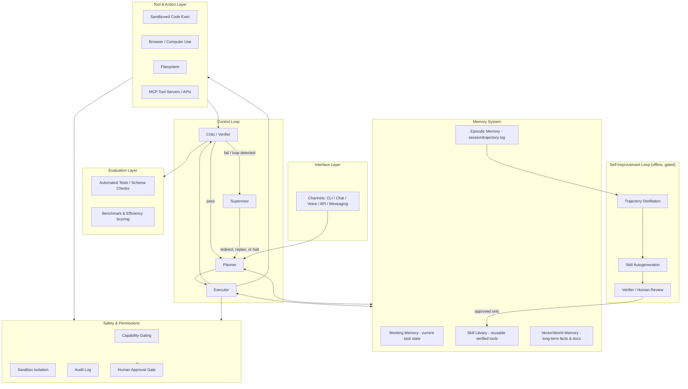

# Self-Improving Agent Harness — Architecture Reference
*A model-agnostic, production-grade design for a general-purpose computer-use agent*

---

## 0. Read this first

"ASI" (artificial superintelligence) isn't a buildable target for a solo project — it isn't a buildable target for anyone yet, including the labs spending billions on it. What *is* real and buildable, and what every system you referenced actually is, is a **harness**: an orchestration layer around a frontier LLM that adds memory, tools, evaluation, and iteration so the *system* performs far above what the raw model can do alone. NVIDIA's AVO result is the cleanest public proof of this: same model (Claude Opus 5), 30% → 100% on ARC-AGI-3, purely from harness quality.

So the honest, high-value version of your ask is: **build the best possible harness.** That's what this document is. It's genuinely ambitious — full computer-use autonomy, persistent memory, a self-improvement loop, multi-agent orchestration — but every component below is something a real system (Hermes Agent, OpenClaw, AVO, Claude Code) already does in production, not speculative capability.

The one place I've deliberately kept things bounded is self-improvement: every design below improves the *skill library and the harness*, never the base model's weights or its own safety constraints, without a human or a hard verifier in the loop. That's not a limitation you should try to engineer around — it's the difference between a powerful tool and something that becomes unmanageable.

---

## 1. Reference systems — what to steal from each

| System | What it actually is | The one idea worth taking |
|---|---|---|
| **Hermes Agent** (Nous Research) | Self-hosted Python agent with a closed learning loop | Skill autogeneration + trajectory logging → the agent writes and saves reusable tools for itself |
| **OpenClaw** | TypeScript multi-channel gateway (~24 surfaces) | Clean separation of *control plane* (gateway) from *agent runtime* — channels are pluggable |
| **NVIDIA AVO** | Research harness: planner–executor–evaluator–supervisor loop with persistent state | The harness, not the model, is the unit of capability. Supervisor intervenes on stagnation/loops. |
| **Claude Code** | Production agentic coding loop | Tight read→act→verify cycles, minimal standing state, strong sandboxing, MCP for tool extension |
| **GPT-6 Astra** | Frontier model tuned for computer/browser use | Model-level gains in screen understanding and long tool-use chains — a reasoning-layer upgrade, not a harness pattern |

The architecture below is the synthesis: OpenClaw's channel separation + Hermes's skill loop + AVO's control loop + Claude Code's tight verification discipline, with any frontier model (Claude, GPT, open-weight) as a swappable reasoning core.

---

## 2. Design philosophy

1. **System > model.** The reasoning layer is a replaceable component. Never hard-code architecture around one model's quirks.
2. **Every action is checked, not trusted.** No step is "done" until a verifier — a test, a schema check, a screenshot diff, a second model pass — confirms it.
3. **Memory is tiered, not monolithic.** Working memory, episodic memory, and long-term skill memory are different systems with different write/eviction rules.
4. **Improvement targets the harness, not the model.** New skills, better prompts, better tool selection — all reversible, all inspectable, all gated.
5. **Capability and permission are decoupled.** The agent can *know how* to do something dangerous without being *allowed* to, by default.

---

## 3. Layered architecture

### 3.1 Reasoning layer (model-agnostic)
- Abstract behind a single interface (`generate(context, tools) -> action`), so Claude, GPT, or an open-weight model can be swapped without touching the harness.
- Route by task: a cheap/fast model for routine tool calls, a frontier reasoning model for planning and hard verification — this alone often beats "always use the biggest model."

### 3.2 Control loop — the core of the harness
This is the single highest-leverage layer, per the AVO result.
- **Planner:** decomposes the goal into sub-goals; re-plans when the Critic rejects a step.
- **Executor:** turns one sub-goal into a concrete tool call.
- **Critic/Verifier:** never trusts the model's own claim of success — runs the actual check (test suite, screenshot diff, output schema, a second independent model pass).
- **Supervisor:** watches for stagnation (repeated failed strategies, loops, budget overrun) and forces a strategy change or halts — this is what separates a harness that "keeps working after the first answer fails" from one that spins.

### 3.3 Memory system — tiered, not monolithic
- **Working memory:** current task's live state; cleared per task.
- **Episodic memory:** full trajectory log (actions, observations, outcomes) per session — the raw material for self-improvement, and for resuming interrupted work.
- **Skill library:** small, named, tested functions/prompts the agent has earned the right to reuse (Hermes Agent's core idea). Each skill has a version, a test, and a provenance record.
- **Vector/world memory:** long-term facts, documents, prior project context — retrieved, not always loaded.
- Rule of thumb: if it doesn't need to survive the task, don't persist it. Unbounded memory growth is where these systems degrade.

### 3.4 Tool & action layer
- **Sandboxed code execution** (containerized, resource-limited, network-egress-restricted by default).
- **Computer/browser use** for GUI-only tasks.
- **Filesystem access**, scoped to explicit working directories.
- **MCP (Model Context Protocol) servers** as the standard extension point — this is what both Hermes Agent and Claude Code converged on, and it's the right call: tools become swappable, versioned services instead of hard-coded functions.

### 3.5 Evaluation layer
- Every completed step gets scored against an objective check, not a vibe: unit tests, schema validation, benchmark tasks, or an efficiency metric like AVO's RHAE (actions-to-solve relative to a baseline).
- This layer is also what feeds the self-improvement loop — a trajectory only becomes a candidate "skill" if it passed real verification, not because the agent said it worked.

### 3.6 Self-improvement loop — bounded, offline, gated
This is the part people oversell. Done right, it's narrow and safe:
1. **Distill** episodic memory into candidate patterns ("this 6-step sequence reliably solves X").
2. **Autogenerate** a named, documented skill from the pattern.
3. **Verify** the skill against held-out test cases — automatically, then optionally by a human for anything touching irreversible actions (payments, deletions, external communication, credentials).
4. **Promote** only verified skills into the shared skill library; everything else is discarded or flagged for review.
This loop improves *what tools and strategies the harness has available* — it never modifies the base model's weights or its safety configuration, and nothing gets promoted without passing a check that isn't self-reported.

### 3.7 Safety & permissions layer
- **Capability gating:** the agent can *know* how to do something without being allowed to — permissions are a separate, explicit allow-list per tool/action class.
- **Layered isolation:** sandbox the executor, segment network access, scope filesystem/API credentials per task (Hermes Agent's seven-layer model and Microsoft's Feb 2026 guidance on OpenClaw's early permissive-default problem are worth reading as case studies in what happens when this layer is skipped).
- **Audit log:** every tool call, input, and output recorded, immutable, queryable.
- **Human approval gate:** required for anything irreversible or high-blast-radius, regardless of how confident the agent is.

### 3.8 Multi-agent orchestration
- For genuinely large tasks, run multiple Executor instances under one Planner/Supervisor, each with a scoped sub-goal and its own sandbox — not because "more agents = more intelligence," but because parallel, isolated execution with a single supervising verifier is more reliable than one long-running monolithic agent.

### 3.9 Interface layer
- Keep this thin and pluggable, à la OpenClaw: CLI, chat, voice, API, messaging surfaces all talk to the same control loop through one internal protocol. Don't let channel-specific logic leak into the planner.

---

## 4. One task, start to finish

1. Request arrives via any channel → normalized into a goal object.
2. Planner checks skill library + vector memory for relevant prior work.
3. Planner decomposes into sub-goals; Supervisor sets a budget (time/steps/cost).
4. Executor performs sub-goal 1 via a tool call (sandboxed).
5. Critic verifies the *actual* result, not the model's claim.
6. Pass → next sub-goal. Fail → Planner replans; repeated fail → Supervisor intervenes.
7. On completion: episodic trajectory logged; if it's a novel and reliably reusable pattern, it's queued for the offline distillation/verification pipeline — it does not affect the current or future live task until it's passed review.

---

## 5. Build roadmap

| Phase | Goal | What "done" looks like |
|---|---|---|
| 1 | MVP control loop | Planner–Executor–Critic working on one tool (code exec), no memory persistence |
| 2 | Add memory tiers | Episodic logging + skill library, still human-reviewed before any skill is reused |
| 3 | Expand tools via MCP | Browser, filesystem, external APIs, each individually sandboxed and permissioned |
| 4 | Add Supervisor | Loop/stagnation detection, budget enforcement, forced replanning |
| 5 | Self-improvement pipeline | Offline distillation → skill autogen → verification gate, fully logged |
| 6 | Multi-agent scaling | Parallel executors under one supervisor for large/parallelizable tasks |
| 7 | Harden safety layer | Full audit trail, approval gates, capability allow-lists, red-team it before trusting it with anything irreversible |

Build and validate each phase before adding the next — the failure mode of these systems is almost always "we added autonomy before we added verification."

---

## 6. Open problems, honestly

- **Long-horizon reliability** past a few hundred steps is still an active research area, not a solved one — AVO's own team is explicit that the public ARC-AGI-3 result doesn't transfer automatically to the harder private set.
- **Recursive self-improvement of the model itself** (not just the skill library) is unsolved and not something to build toward without deep safety infrastructure far beyond a personal project.
- **Benchmark performance ≠ general capability.** Treat every "100%" headline (including AVO's) as a result on a specific, bounded test set, not a claim of general intelligence.
