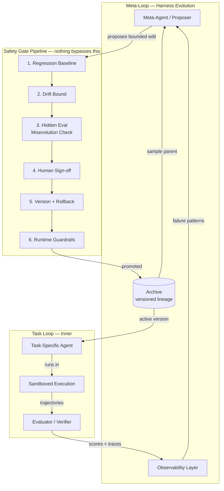
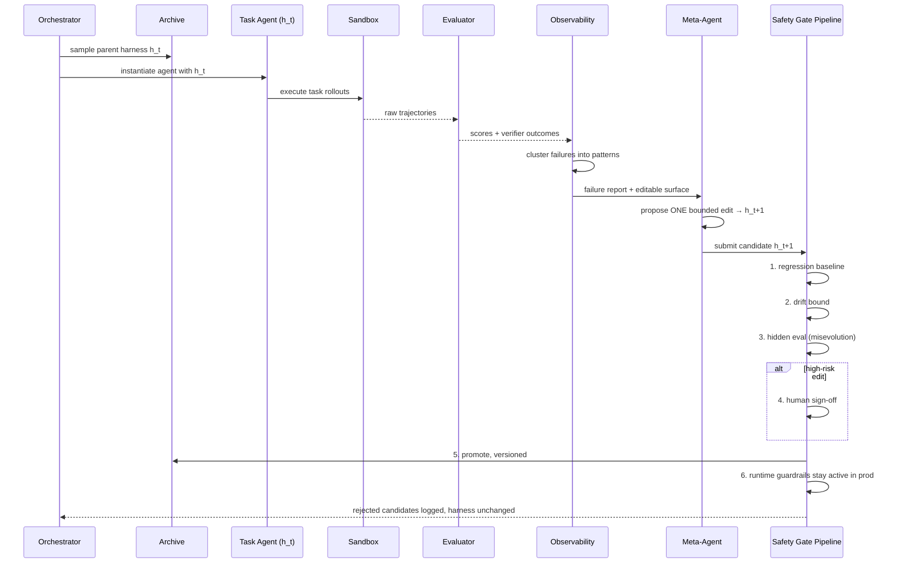

# Self-Improving Agent Harness — Full Architecture

A reference architecture for a harness that evolves itself: an inner **task loop** (the agent doing work) wrapped in an outer **meta-loop** (a proposer that edits the harness) gated by a **safety pipeline** that nothing bypasses.

---

## 0. Design Philosophy

Three rules everything below follows:

1. **The harness is code, not prompts.** Every editable piece — system prompt, tool defs, workflow logic, sub-agent config, memory schema — lives as a file in a repo. If it's not a file, it's not editable, auditable, or revertible.
2. **The evaluator is outside the loop.** The verifier, the hidden eval set, and the tracer are read-only to the agent that's being evolved. This is the single most important boundary in the whole system — without it, reward hacking is not a risk, it's a certainty.
3. **Every promotion is a new deployment.** A harness version that passed gates yesterday gets re-gated today. There is no "trusted forever" state.

---

## 1. System Overview



Two loops, one boundary. The **task loop** runs fast and often (every task execution). The **meta-loop** runs slow and rarely (only when there's enough failure evidence to justify a proposal). The **safety gate pipeline** is the only path between them — the meta-agent never writes directly to the active harness.

---

## 2. Repository Layout

```
harness-project/
├── harness/                        # the thing being evolved — all files, all editable
│   ├── system_prompt.md
│   ├── tools/
│   │   ├── tool_defs.yaml          # schemas: name, args, description
│   │   └── impl/                   # tool implementation code
│   ├── middleware/                 # context compaction, retry policy, routing
│   ├── skills/
│   │   └── *.md                    # SKILL.md manifests, versioned bundles
│   ├── subagents/
│   │   └── configs.yaml            # sub-agent roles, permissions, spawn rules
│   └── memory/
│       └── schema.md               # long-term memory structure + write rules
│
├── archive/                        # versioned lineage — append-only
│   ├── v0001/
│   │   ├── harness_snapshot/       # full copy of harness/ at this version
│   │   ├── manifest.json           # parent_id, diff, scores, timestamp, accepted_by
│   │   └── eval_results.json
│   ├── v0002/
│   └── lineage_graph.json          # parent → children tree, for archive sampling
│
├── eval/
│   ├── regression_baseline/        # FROZEN. Loop never writes here.
│   ├── hidden_eval/                # held-out. Optimizer never sees these tasks.
│   └── verifier/                   # deterministic scoring code — read-only to agent
│
├── observability/
│   ├── traces/                     # one file per rollout, raw
│   ├── failure_reports/            # per-task root-cause summaries (agent-debugger output)
│   └── decision_log.jsonl          # every proposed edit + evidence + predicted vs actual outcome
│
├── meta_agent/
│   ├── proposer.py                 # reads failure_reports, writes candidate edits
│   └── search_strategy.py          # evolutionary / MCTS / STOP-style selection logic
│
├── safety_gate/
│   ├── gate_pipeline.py            # runs gates 1–6 in order, fail-closed
│   ├── regression.py
│   ├── drift.py
│   └── guardrails.yaml             # spend caps, deletion boundaries, allowed calls
│
├── sandbox/
│   └── runner.py                   # spins up isolated exec envs per rollout
│
└── orchestrator.py                 # top-level scheduler tying it all together
```

The split that matters most: `harness/` is writable by the meta-agent (via the gate). `eval/regression_baseline/`, `eval/hidden_eval/`, and `eval/verifier/` are **never** writable by anything in the loop — only by a human, out of band.

---

## 3. Core Components

### 3.1 Task-Specific Agent (Executor)
Runs the current promoted harness version against real tasks. Stateless with respect to the meta-loop — it just executes `harness/` as configured and writes its trajectory to `observability/traces/`.

### 3.2 Evaluator / Verifier
Prefer deterministic scoring (unit tests, exact-match, compilation success) over LLM-judge scoring wherever the task allows it — verifiable signals are what makes the rest of the pipeline trustworthy. Produces a per-task score vector (not a single scalar) across dimensions like accuracy, safety, groundedness, cost.

### 3.3 Meta-Agent (Proposer)
Reads aggregated failure reports (never raw traces directly — that's the observability layer's job), picks **one** editable component, and proposes a bounded diff. Good proposals are narrow: "add a retry on tool-call schema mismatch," not "rewrite the whole system prompt." Search strategy options, roughly in order of implementation difficulty:
- **STOP-style**: the improver recursively improves itself using its own output as the next input.
- **ADAS-style**: meta-agent generates whole new harness variants in code, self-refines them, adds successes to an archive.
- **AFlow-style**: represent the harness as a graph, use MCTS to expand/select nodes.
- **DGM-style**: maintain a growing archive, sample parents proportional to performance and inversely to how many children they already have, branch and mutate.

### 3.4 Archive & Lineage Store
Append-only. Every promoted version gets a manifest recording its parent, its diff, its scores on all eval sets, and who/what accepted it. This is what makes "which version introduced this regression" a one-command git-bisect-style question instead of an investigation.

### 3.5 Observability Layer
Three pillars, all required:
- **Component observability** — every editable harness piece has an explicit file-level address, so an edit can be targeted rather than vague.
- **Experience observability** — raw traces get summarized into per-task failure reports, then rolled up into a benchmark-level overview. The meta-agent reads the overview, not the raw logs, for token efficiency — but raw traces stay accessible for drill-down.
- **Decision observability** — every proposed edit is logged with the evidence that motivated it and a predicted effect, which gets checked against the actual next-round outcome. This is what turns "the harness got better" into "this specific edit is why."

### 3.6 Safety Gate Pipeline
Detailed in Section 4. This is not optional and not skippable for "small" edits — every candidate, no matter how minor, goes through all six gates.

### 3.7 Sandbox Execution Layer
Every rollout — task execution and harness self-modification alike — runs in an isolated, ephemeral, network-restricted environment (microVM-backed: Firecracker/gVisor, or managed: E2B/Docker Sandboxes/Modal). Hard rules:
- No access to the host Docker daemon or socket (control-plane access defeats the isolation).
- Strict per-run time and resource limits.
- An agent that only needs to read one directory doesn't get filesystem-root access.
- Default-deny egress; allowlist only what's needed.

### 3.8 Orchestrator
Schedules task rollouts, triggers meta-agent proposals once enough failure evidence has accumulated, runs the gate pipeline, and manages the archive. Simple version: a loop with a budget counter. Production version: something like Temporal for retries/state durability across long-running evolution cycles.

---

## 4. The Self-Improvement Loop



### Orchestrator pseudocode

```python
def improvement_iteration(archive, budget):
    h_t = archive.sample_parent()                     # weighted by score, inv. by children count
    traces = run_rollouts(h_t, task_suite, sandbox=True)
    scores = evaluator.score(traces)                  # multi-dimension, deterministic where possible
    failure_report = observability.summarize(traces, scores)

    candidate = meta_agent.propose_edit(h_t, failure_report)  # ONE bounded, evidence-cited edit

    result = safety_gate.run(candidate, parent=h_t)
    if result.status == "promoted":
        archive.add(candidate, parent=h_t, manifest=result.manifest)
    else:
        observability.log_rejected(candidate, result.reason)  # rejected ≠ discarded — it's evidence

    budget.decrement()
    return result
```

### Gate pipeline (fail-closed, in order)

```python
def run(candidate, parent):
    if regression.check(candidate) == "fail":
        return reject("regression: " + regression.offending_dims)

    if drift.score(parent, candidate) > MAX_DRIFT:
        return reject("drift bound exceeded")

    if hidden_eval.run(candidate) < hidden_eval.run(parent):
        return reject("misevolution: hidden objective dropped")

    if risk.classify(candidate) == "high":
        if not human.sign_off(candidate):
            return reject("human sign-off withheld")

    version = archive.version(candidate, parent)       # immutable, never overwrite
    return promote(version)
```

---

## 5. Key Data Schemas

**`archive/vNNNN/manifest.json`**
```json
{
  "version_id": "v0042",
  "parent_id": "v0039",
  "diff_summary": "added retry-with-backoff on tool schema mismatch",
  "editable_component": "middleware/retry_policy.py",
  "scores": {"regression_baseline": {"accuracy": 0.86, "safety": 1.0},
             "hidden_eval": {"accuracy": 0.81, "safety": 1.0}},
  "drift_score": 0.12,
  "risk_level": "low",
  "accepted_by": "auto",
  "timestamp": "2026-09-16T10:04:00Z"
}
```

**`observability/decision_log.jsonl`** (one line per proposal, accepted or not)
```json
{"edit_id": "e0091", "component": "system_prompt.md", "evidence": "12 traces show premature answer extraction",
 "predicted_effect": "fixes premature-stop pattern, +3-5pp on held-in",
 "actual_effect": "+4pp held-in, -0pp held-out", "gate_result": "promoted"}
```

---

## 6. Tech Stack Recommendations

| Layer | Options | Notes |
|---|---|---|
| Sandbox execution | Docker Sandboxes, E2B, Firecracker, gVisor, Modal | microVM-backed preferred over shared-kernel containers for untrusted self-modifying code |
| Orchestration | Temporal, or a plain asyncio scheduler for MVP | need durable state across long evolution cycles |
| Archive / versioning | Git for harness snapshots + SQLite/Postgres for manifests | git gives diffs and rollback for free |
| Trace storage | JSONL files, filesystem-as-memory | keep raw traces out of the meta-agent's direct context; summarize first |
| Evaluator | Deterministic scripts/unit tests first, LLM-judge only as fallback | verifiable rewards are what keep the rest of the pipeline honest |
| Meta-agent model | A strong coding model with bash + file-edit tools | proposer quality is bottlenecked by code-editing capability, not raw scale |
| Guardrail enforcement | Rule-based policy layer + PII/secrets/prompt-injection detectors | run checks pre- and post-action, action = block, not just log |
| Observability | Structured JSONL logs, optionally OpenTelemetry traces | one trace per component per rollout |

---

## 7. Build Order (don't build this all at once)

| Phase | Scope |
|---|---|
| **0** | Static harness + task agent + deterministic evaluator + frozen regression baseline. No self-modification. Get this rock-solid first. |
| **1** | Add the archive with versioning. Edits are still manual — you are the meta-agent. |
| **2** | Automate the meta-agent, but restrict its editable surface to *one* component (e.g. system prompt only). |
| **3** | Add the full safety gate pipeline: regression + drift + hidden eval + rollback. |
| **4** | Add human-in-the-loop sign-off UI for high-risk edits, with diff + score-delta + drift shown together. |
| **5** | Expand editable surface to tools/workflow/sub-agents; add archive-based sampling (DGM-style) for open-ended exploration. |
| **6** *(advanced)* | Joint optimization with actual weight updates (test-time training), only after the scaffold-only loop is stable and boring. |

---

## 8. Failure Modes → Where the Architecture Handles Them

| Failure mode | Mitigated by |
|---|---|
| Reward hacking | Hidden eval gate (§4, gate 3) + read-only verifier boundary (§0, rule 2) |
| Misevolution (unintended drift across model/memory/tools/workflow) | Regression baseline + hidden eval + decision log auditing |
| Runaway single-edit changes | Drift bound gate (§4, gate 2) |
| No recovery path | Immutable, versioned archive (§3.4) + one-command rollback |
| Diversity collapse | Archive sampling weighted inversely by child count (DGM-style, §3.3) |
| Untraceable "why did this get better" | Decision observability — predicted vs. actual effect per edit (§3.5) |
| Sandbox escape / host compromise | microVM isolation, no Docker-socket access, default-deny egress (§3.7) |
| Silent harmful edits at 3am | Human-in-the-loop gate on high-risk classification (§4, gate 4) |
